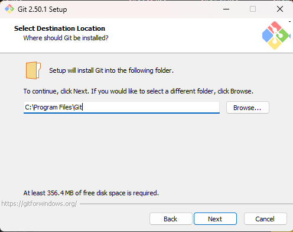
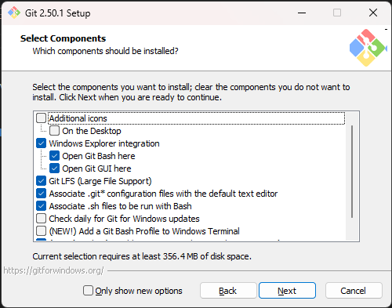
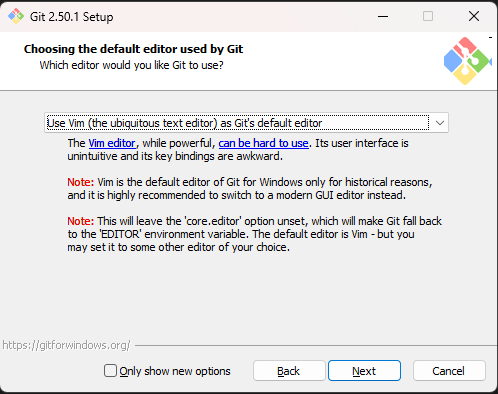
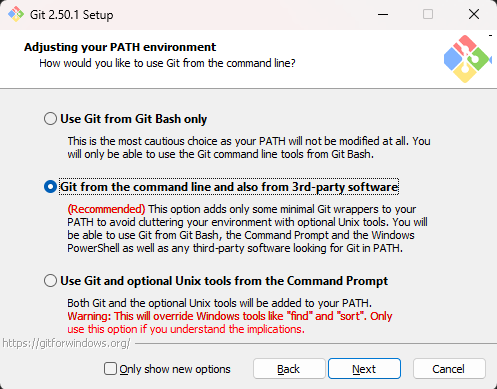
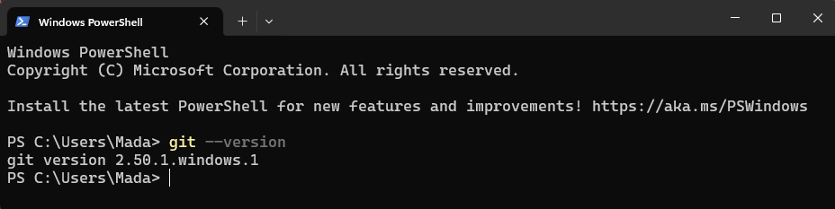
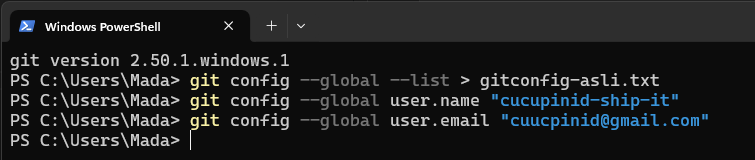

# Git Installation Guide

This guide covers installing Git on **Windows**, **macOS**, and **Ubuntu/Linux**.

---

## 1. Windows

### Option 1 – Git for Windows Installer

1. Visit: [https://git-scm.com/download/win](https://git-scm.com/download/win)
   <p align="left">
     
   </p>

2. Download should start automatically.
   <p align="left">
     
   </p>

3. Run the installer and follow prompts:
   <p align="left">
     
   </p>
   - Accept the license.
   <p align="left">
     
   </p>
   - Choose installation location.
   <p align="left">
     
   </p>
   - Keep default components unless you have special needs.
   <p align="left">
     
   </p>
   - Select the default editor (VS Code is common).
   <p align="left">
     
   </p>
   - Choose _Git from the command line and also from 3rd-party software_.
   <p align="left">
     
   </p>
   - Select HTTPS transport backend as **OpenSSL**.
   - Keep other defaults unless necessary.
4. Click **Finish**.
   <p align="left">
     
   </p>
5. Verify installation:

   ```bash
   git --version

   ```

   <p align="left">
        
      </p>

---

## 2. macOS

### Option 1 – Homebrew (recommended)

1. Install Homebrew (if not installed):
   ```bash
   /bin/bash -c "$(curl -fsSL https://raw.githubusercontent.com/Homebrew/install/HEAD/install.sh)"
   ```
2. Install Git:
   ```bash
   brew install git
   ```
3. Verify:
   ```bash
   git --version
   ```

### Option 2 – Xcode Command Line Tools

1. Open Terminal and run:
   ```bash
   xcode-select --install
   ```
2. Follow prompts to install.
3. Verify:
   ```bash
   git --version
   ```

---

## 3. Ubuntu / Debian Linux

### Using apt

1. Update package list:
   ```bash
   sudo apt update
   ```
2. Install Git:
   ```bash
   sudo apt install git -y
   ```
3. Verify:
   ```bash
   git --version
   ```

---

## Post-Installation Setup (All OS)

After installing Git, configure your username and email so commits are identifiable:

```bash
git config --global user.name "Your Name"
git config --global user.email "your.email@example.com"

```

<p align="left">
        
      </p>

Check your configuration:

```bash
git config --list
```

<p align="left">
        
      </p>

---

**You are now ready to use Git for version control in your ML projects!**
