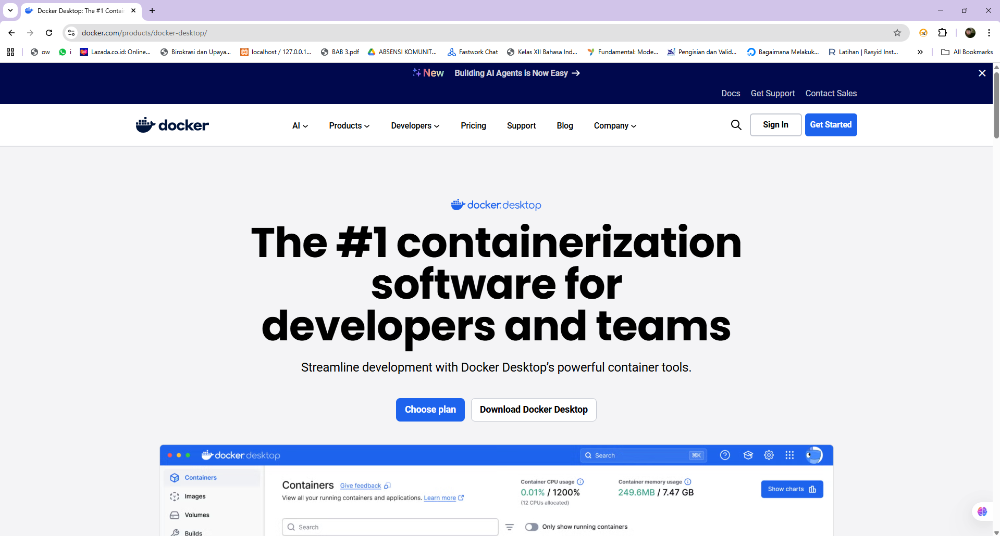
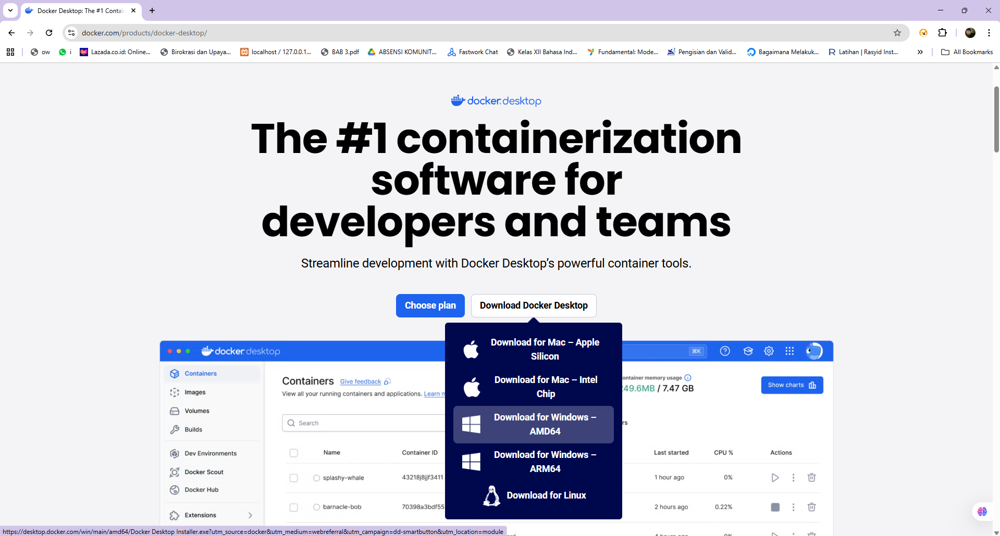
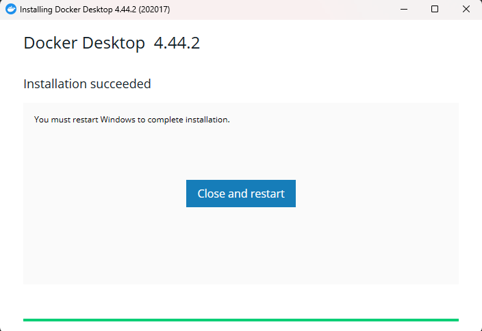
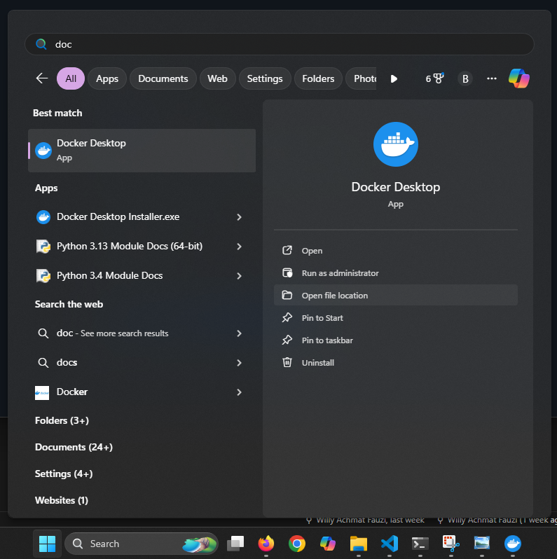
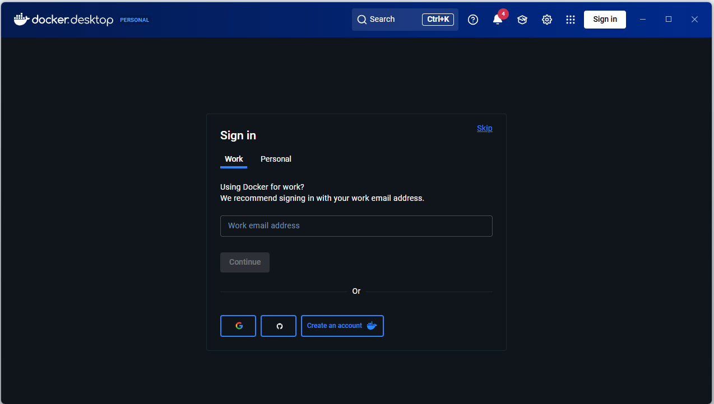
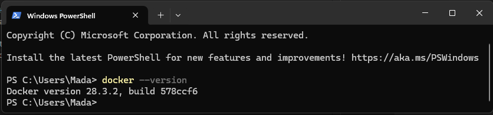
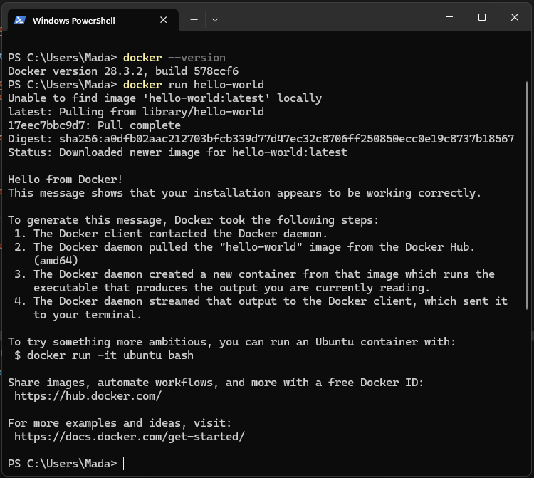

# Docker Installation Guide

This guide covers installing Docker on **Windows**, **macOS**, and **Ubuntu/Linux**.

---

## 1. Windows (Docker Desktop)

1. Go to: [https://www.docker.com/products/docker-desktop/](https://www.docker.com/products/docker-desktop/)
<p align="left">
        
      </p>
2. Download **Docker Desktop for Windows** (choose Windows 10/11 based on your OS).
<p align="left">
        
      </p>
3. Run the installer:
   - Enable **“Use WSL 2 instead of Hyper-V”** (recommended).
   - Follow prompts to complete installation.
4. Restart your computer.
<p align="left">
        
      </p>
5. Launch **Docker Desktop** and wait for it to start.
<p align="left">
        
      </p>
<p align="left">
        
      </p>


6. Verify installation in Command Prompt or PowerShell:

   ```bash
   docker --version
   ```

      <p align="left">
           
         </p>
      docker run hello-world
      <p align="left">
           
         </p>

---

## 2. macOS (Docker Desktop)

1. Download **Docker Desktop for Mac**:  
   [https://www.docker.com/products/docker-desktop/](https://www.docker.com/products/docker-desktop/)
   - Choose **Apple Silicon** (M1/M2) or **Intel** based on your chip.
2. Open the `.dmg` file and drag **Docker.app** into the Applications folder.
3. Launch Docker from Applications.
4. Verify installation in Terminal:
   ```bash
   docker --version
   docker run hello-world
   ```

---

## 3. Ubuntu / Debian Linux

### Using apt

1. Uninstall old versions (optional):
   ```bash
   sudo apt remove docker docker-engine docker.io containerd runc
   ```
2. Update package index:
   ```bash
   sudo apt update
   sudo apt install ca-certificates curl gnupg lsb-release
   ```
3. Add Docker’s official GPG key:
   ```bash
   sudo mkdir -m 0755 -p /etc/apt/keyrings
   curl -fsSL https://download.docker.com/linux/ubuntu/gpg | sudo gpg --dearmor -o /etc/apt/keyrings/docker.gpg
   ```
4. Set up the repository:
   ```bash
   echo      "deb [arch=$(dpkg --print-architecture) signed-by=/etc/apt/keyrings/docker.gpg] https://download.docker.com/linux/ubuntu      $(lsb_release -cs) stable" | sudo tee /etc/apt/sources.list.d/docker.list > /dev/null
   ```
5. Install Docker Engine:
   ```bash
   sudo apt update
   sudo apt install docker-ce docker-ce-cli containerd.io docker-buildx-plugin docker-compose-plugin
   ```
6. Verify installation:
   ```bash
   docker --version
   sudo docker run hello-world
   ```
7. **Optional:** Run Docker without `sudo`:
   ```bash
   sudo groupadd docker
   sudo usermod -aG docker $USER
   newgrp docker
   docker run hello-world
   ```

---

## Post-Installation Setup

- Make sure Docker Desktop (Windows/macOS) is set to start at login.
- On Linux, enable Docker service:
  ```bash
  sudo systemctl enable docker
  sudo systemctl start docker
  ```

---

**You are now ready to use Docker for your ML projects!**
