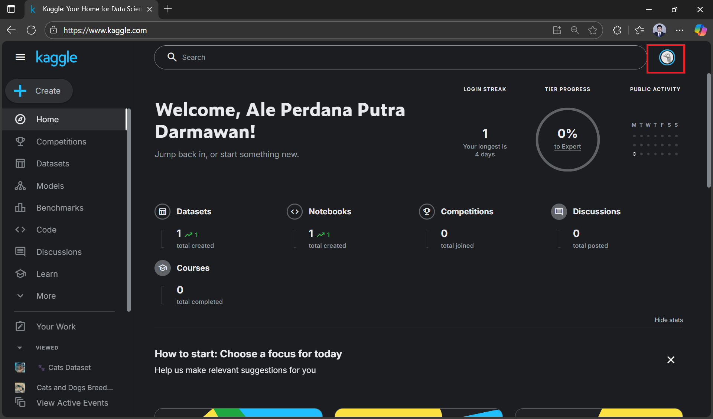

# Kaggle: Registration & API Setup Guide

This guide combines **Kaggle account registration**, **Kaggle API setup**, and **Python `kagglehub` usage** so you can quickly access datasets for your ML projects and workshops.

--- 

## 1. Go to the Kaggle Website
- Open your browser and navigate to:  
  **https://www.kaggle.com**


--- 

## 2. Click **Sign In**
- Located in the top-right corner of the page.  
- You have two main options:
  - **Sign In with Google / Microsoft / Apple**  
  - **Sign In with Email**


---

## 3. Fill in your full name
In this form, you need to fill in your full name.


---

## 4. Agree to Terms and Privacy Policy
- Read Kaggle’s Terms of Service and Privacy Policy.
- Click **I Agree** to accept the terms.


---

## 5. You're Signed Up — Welcome to Your Dashboard
Congratulations — you have successfully created your Kaggle account. Your dashboard is the central place to access everything you need for data science and competitions.

What you can do next:
- Explore the left menu to find Datasets, Competitions, Notebooks, and Learn.
- Visit your profile to update bio, links, and a profile picture so collaborators can recognize you.
- Use the Datasets and Notebooks tabs to discover example projects and starter data for this workshop.


---

## 6. Enable Kaggle API (Create Token)
If you want to download datasets programmatically:
1. Click your profile picture → **Setting** → **Account**.




2. Scroll to **API** section and click **Create New API Token**.


1. This downloads `kaggle.json` — keep it and **do not share**.


---

## 7. Install and Configure Kaggle API (CLI)

### 7.1. Prerequisites
- A Kaggle account (steps above completed).  
- **Python** and **pip** installed on your machine.

### 7.2. Install Kaggle CLI
```bash
pip install kaggle
```


Verify installation:
```bash
kaggle --version
```


### 7.3. Place `kaggle.json` in the Correct Location

**Windows (PowerShell):**
```powershell
mkdir -Force $env:USERPROFILE\.kaggle
Move-Item -Force <path to kaggle.json>\kaggle.json $env:USERPROFILE\.kaggle
```


**macOS / Linux (Terminal):**
```bash
mkdir -p ~/.kaggle
mv ./kaggle.json ~/.kaggle/
chmod 600 ~/.kaggle/kaggle.json
```

> The `chmod 600` command restricts file permissions so only your user can read/write the token.

---

## 8. Test the Kaggle CLI

### 8.1. Search for a dataset
```bash
kaggle datasets list -s titanic
```


### 8.2. Download a competition dataset (example: Titanic)
```bash
kaggle competitions download -c titanic
```


### 8.3. Download a public dataset (example)
```bash
kaggle datasets download -d bhavikjikadara/dog-and-cat-classification-dataset -p datasets/dog-cat --unzip
```


---

## 9. Best Practices
- Keep `kaggle.json` **private** and never commit it to Git.

---

## 10. Download Dataset with `kagglehub` (Python)

> This method is useful if you want to download datasets directly inside a Python script or Jupyter Notebook without using the command line.

### 10.1. Install `kagglehub`
```bash
pip install kagglehub
```


### 10.2. Ensure API Token is Set
- Follow step **6** above to create and download `kaggle.json`.
- Place it in:
  - **Windows**: `%USERPROFILE%\.kaggle\kaggle.json`
  - **macOS/Linux**: `~/.kaggle/kaggle.json`

### 10.3. Example: Download Dataset
```python
import kagglehub

# Download latest version of the dataset
path = kagglehub.dataset_download("bhavikjikadara/dog-and-cat-classification-dataset")

print("Path to dataset files:", path)
```


--- 

✅ **Outcome**
You now have:
- A registered Kaggle account.  
- The Kaggle API installed and configured.  
- Ability to download datasets programmatically using **CLI** or **Python `kagglehub`**.
