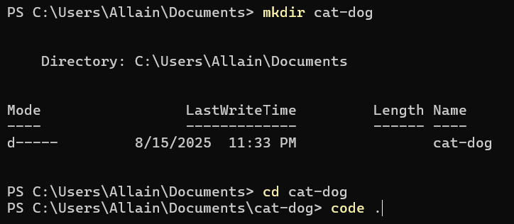

# Cat–Dog Image Classification: Step-by-Step Project Guide
This guide walks you through creating a **minimal, runnable** Python project for classifying **cats vs dogs** using **PyTorch** and **torchvision**. It is designed for workshops and first-time project setup.

---

## 1) Create Project Folder

**macOS / Linux**
```bash
mkdir cat-dog && cd cat-dog
```

**Windows (PowerShell)**
```powershell
mkdir cat-dog; cd cat-dog
```

---

## 2) Initialize Git

```bash
git init
git config user.name  "Your Name"
git config user.email "you@example.com"
```

> If you use SSH for GitHub, ensure your key is loaded: `ssh -T git@github.com`

---

## 3) Create Python Project Boilerplate using VS Code

1. Open **VS Code**.
2. **Open the `cat-dog` directory**  
   `File → Open Folder... → select cat-dog`
3. Inside VS Code, create the following **folder structure**:
   ```plaintext
   cat-dog/
   ├── README.md
   ├── requirements.txt
   ├── src/
   │   └── __init__.py
   └── tests/
   ```
   
4. Minimal **README.md** example:
   ```markdown
   # Cat Dog Workshop PENS

   This project is for practicing Git, Python, and basic ML workflows.
   ```
   
5. Add **requirements.txt** with dependencies for a minimal PyTorch classifier:
   ```txt
   torch
   torchvision
   tqdm
   ```
   ✅ **Notes**
   - `torch` → Core PyTorch library for ML/DL.  
   - `torchvision` → Datasets, transforms, and pre-trained models.  
   - `tqdm` → Progress bars for training loops.

    

---

## 4) Create & Activate Virtual Environment

**macOS / Linux**
```bash
python3 -m venv .venv
source .venv/bin/activate
python -V
pip -V
```

**Windows (PowerShell)**
```powershell
python -m venv .venv
.\.venv\Scripts\Activate.ps1
python -V
pip -V
```


*(If you get an execution policy error on Windows, run PowerShell as Administrator and execute `Set-ExecutionPolicy RemoteSigned`.)*

---

## 5) Install Dependencies

```bash
pip install --upgrade pip
pip install -r requirements.txt
```


---

## 6) Add a .gitignore

Create a file named **`.gitignore`** in the project root:
```gitignore
# Data & model artifacts
data/
models/
*.pt
*.onnx
*.h5

# Virtual environment & cache
.venv/
__pycache__/
*.pyc
.ipynb_checkpoints/

# Secrets
.env
```


Commit it:
```bash
git add .gitignore
git commit -m "Add .gitignore"
```


---

## 7) Prepare the Dataset Folders

Create the expected directory layout:
```bash
mkdir -p data/train/cat data/train/dog data/val/cat data/val/dog
```


> Add a few sample images for each class under the respective folders (start with ~20–50 images per class if possible).

---

## 8) Create the Training Script

Create **`train.py`** in the project root with the following **minimal** content:

```python
import torch
from pathlib import Path
from torch import nn, optim
from torchvision import datasets, transforms, models
from torch.utils.data import DataLoader
from tqdm import tqdm

# ===== 1) Data =====
train_tf = transforms.Compose([
    transforms.Resize((224, 224)),
    transforms.ToTensor(),
])
val_tf = transforms.Compose([
    transforms.Resize((224, 224)),
    transforms.ToTensor(),
])

train_data = datasets.ImageFolder("data/train", transform=train_tf)
val_data   = datasets.ImageFolder("data/val", transform=val_tf)

train_loader = DataLoader(train_data, batch_size=8, shuffle=True)
val_loader   = DataLoader(val_data, batch_size=8, shuffle=False)

# ===== 2) Model =====
model = models.resnet18(weights=models.ResNet18_Weights.DEFAULT)
model.fc = nn.Linear(model.fc.in_features, 2)  # two classes: cat, dog

device = torch.device("cuda" if torch.cuda.is_available() else "cpu")
model.to(device)

# ===== 3) Loss & Optimizer =====
criterion = nn.CrossEntropyLoss()
optimizer = optim.Adam(model.parameters(), lr=1e-3)

# ===== 4) Training Loop =====
for epoch in range(3):  # keep it small for the workshop
    model.train()
    total_loss = 0.0
    for imgs, labels in tqdm(train_loader, desc=f"Epoch {epoch+1}"):
        imgs, labels = imgs.to(device), labels.to(device)
        optimizer.zero_grad()
        outputs = model(imgs)
        loss = criterion(outputs, labels)
        loss.backward()
        optimizer.step()
        total_loss += loss.item()
    print(f"Train loss: {total_loss/len(train_loader):.4f}")

    # Validation
    model.eval()
    correct, total = 0, 0
    with torch.no_grad():
        for imgs, labels in val_loader:
            imgs, labels = imgs.to(device), labels.to(device)
            outputs = model(imgs)
            preds = outputs.argmax(1)
            correct += (preds == labels).sum().item()
            total += labels.size(0)
    print(f"Validation accuracy: {correct/total:.2%}")


ROOT = Path(__file__).resolve().parent
MODEL_DIR = ROOT / "models"
MODEL_DIR.mkdir(parents=True, exist_ok=True)

# Save weights
torch.save(model.state_dict(), MODEL_DIR / "catdog_model.pth") 
print(f"Model saved to {MODEL_DIR / 'catdog_model.pth'}")
```


Commit your script:
```bash
git add train.py
git commit -m "Add minimal training script"
```


---

## 9) Run Training

```bash
python train.py
```


> Expect a quick run (3 epochs). Accuracy depends on how many and what quality images you added.

---

## 10) (Optional) Add a Quick Inference Script

Create **`predict.py`** in the project root:

```python
import argparse, torch
from PIL import Image
from torchvision import transforms, models
from torch import nn

def main():
    ap = argparse.ArgumentParser()
    ap.add_argument("--img", required=True, help="Path to image file")
    args = ap.parse_args()

    device = torch.device("cuda" if torch.cuda.is_available() else "cpu")

    # model
    model = models.resnet18(weights=None)
    model.fc = nn.Linear(model.fc.in_features, 2)
    model.load_state_dict(torch.load("catdog_model.pth", map_location=device))
    model.to(device).eval()

    tf = transforms.Compose([
        transforms.Resize((224, 224)),
        transforms.ToTensor(),
    ])
    img = Image.open(args.img).convert("RGB")
    x = tf(img).unsqueeze(0).to(device)

    with torch.no_grad():
        logits = model(x)
        pred = logits.argmax(1).item()

    labels = ["cat", "dog"]
    print("Prediction:", labels[pred])

if __name__ == "__main__":
    main()
```

Run:
```bash
python predict.py --img data/val/cat/your_image.jpg
```


---

## 11) Commit and Push to GitHub

Create a new GitHub repository named **`cat-dog`** (empty: no README/license). Then:

```bash
git add .
git commit -m "Initial runnable cat-dog classifier"
git branch -M main
git remote add origin https://github.com/<your-username>/cat-dog.git
git push -u origin main
```


---

## 12) Done — You Have a Running Project

**You now have:**
- A clean Python project structure
- A virtual environment
- Minimal dependencies
- Dataset folders
- A runnable training script (and optional predictor)
- The project tracked in Git and pushed to GitHub

---

### Next Steps
- Log metrics with MLflow
- Track datasets/models with DVC
- Add CI (GitHub Actions) to run a quick lint/test
- Containerize with Docker for reproducible runs

### Troubleshoot SSL Error on mac

```bash
pip3 install --upgrade certifi
export SSL_CERT_FILE=$(python -c "import certifi; print(certifi.where())")
```