# Register a GitHub Account — Step-by-Step Guide

> This Markdown file walks you through creating a GitHub account and completing essential setup so you can push code securely from your machine.

---

## 1) Create Your GitHub Account

1. Open `https://github.com/` and click **Sign up**.
   <p align="left">
     
   </p>
2. Choose Sign Up then Then click button **Continue with Google**
   <p align="left">
     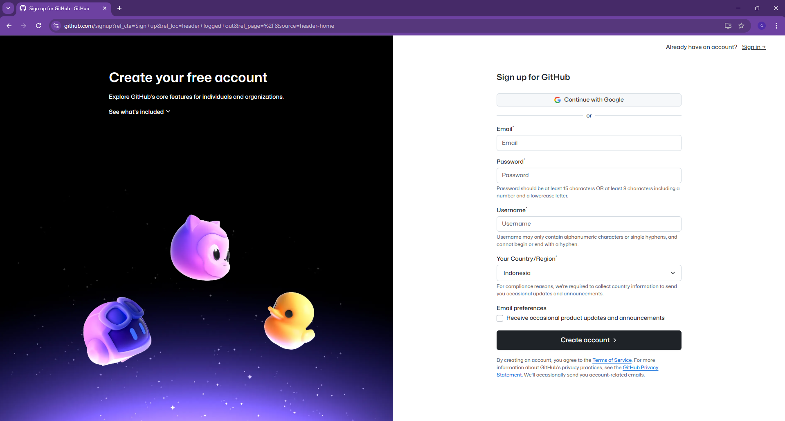
   </p>
3. Choose your **Email Address**
   <p align="left">
     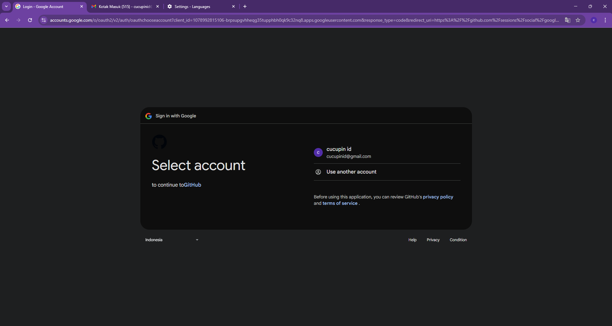
   </p>
4. Clik **Continue** to grant email Access
   <p align="left">
     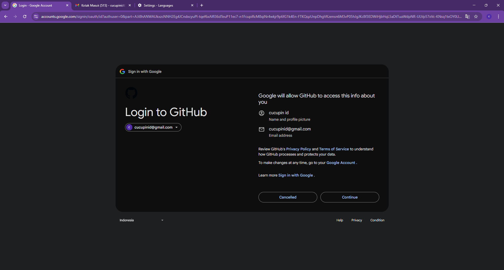
   </p>
5. The form will be auto-filled with your email, username, and country. You can change the username and country, but the email address cannot be changed.
   <p align="left">
     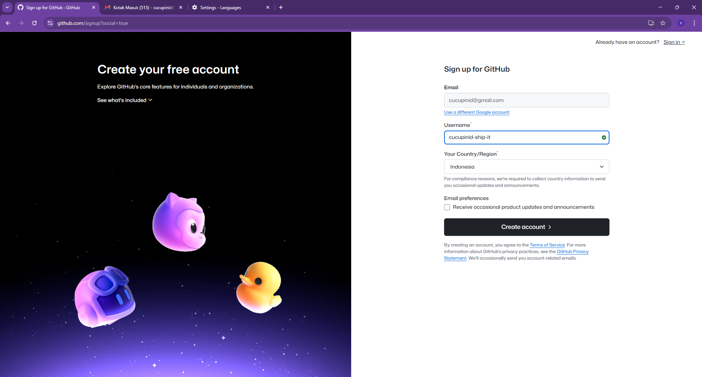
   </p>

6. Click **Create Account** and wait until Verification Complete
7. User will be redirect to HGitHub HomePage
   <p align="left">
     
   </p>

---

<!-- ## 2) Verify Your Email

- Check your email for a message from GitHub and click **Verify email address**.
  _You must verify your email to create repositories and receive notifications._

--- -->

## 2) Download Google Authenticator On Your Phone

### Scan To Get The Code

1. Download **Google Authenticator** on **Playstore**.
   <p align="left">
     
   </p>
2. **Open** Google Authenticator.
   <p align="left">
     
   </p>
3. Click Button **Add a code**
   <p align="left">
     
   </p>
4. Click Button **Scan a QR code**
   <p align="left">
     
   </p>

## 3) Secure Your Account (Recommended)

### Enable Two-Factor Authentication (2FA)

1. In GitHub, click your avatar → **Settings** → **Password and authentication**.
   <p align="left">
     
   </p>

2. Under **Two-factor authentication**, click **Enable two-factor authentication**.
    <p align="left">
     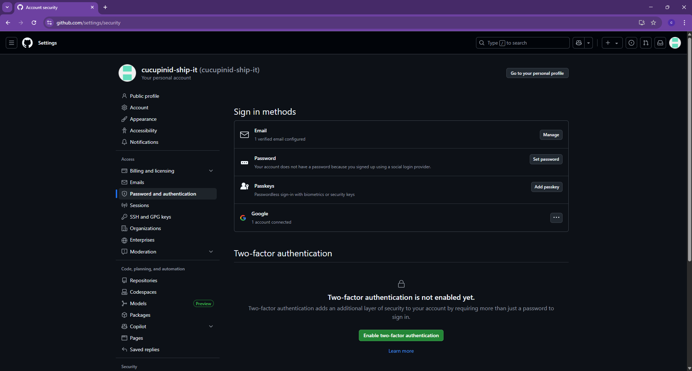
   </p>
3. Open **Authenticator app** than click button **Scan a QR code**
    <p align="left">
     
   </p>
4. Scan QR.
   <p align="left">
     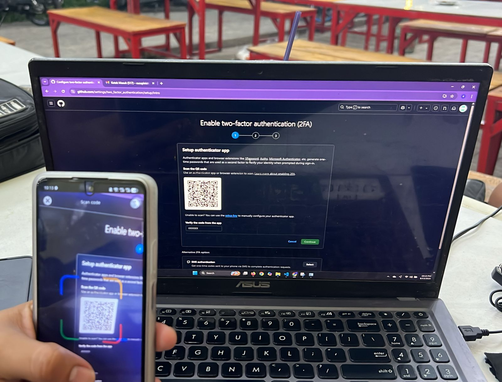
   </p>
5. Get Code and Input at the Form with It.
   <p align="left">
     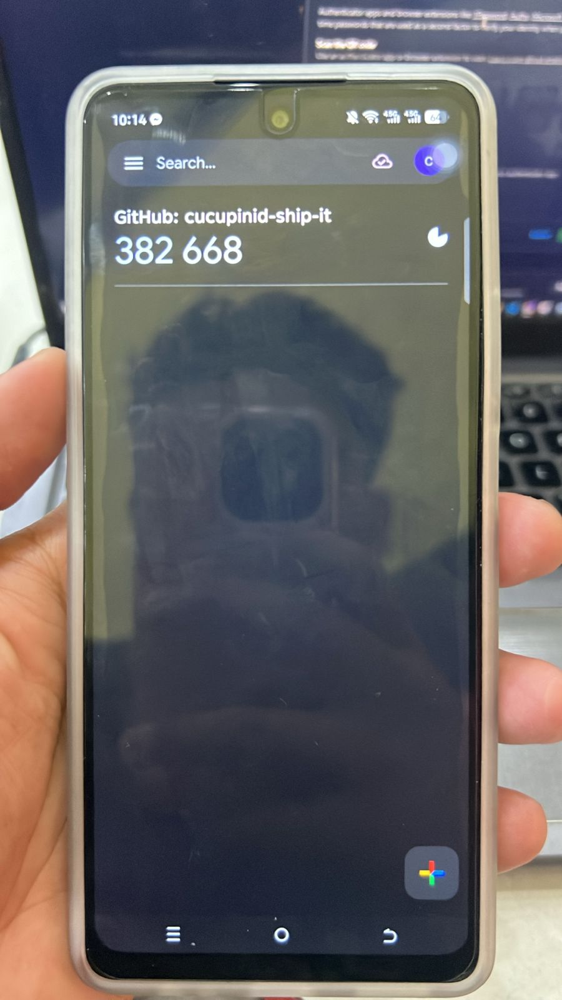
   </p>

6. Input Code and Get Recovery Code
   <p align="left">
     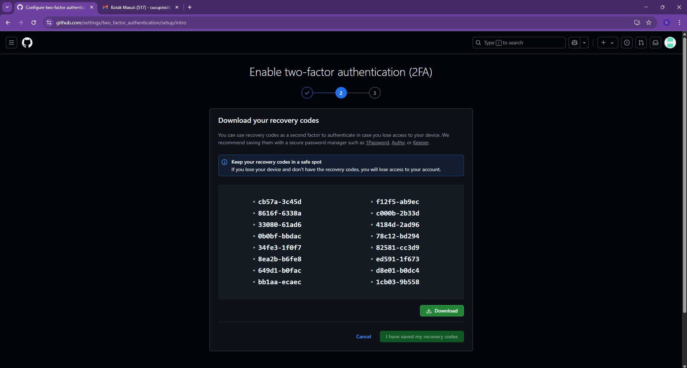
   </p>

7. Click button Download Recovery Code
   <p align="left">
     
   </p>

8. Success Enable Two Factor Authentication
   <p align="left">
     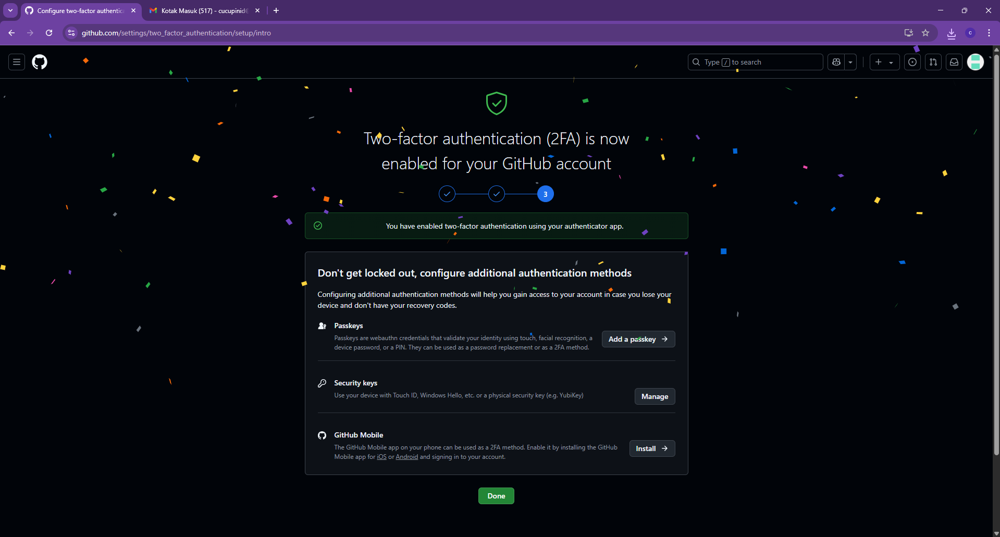
   </p>

---

## 4) Install Git Locally

### Windows

1. Download **Git for Windows** from `https://git-scm.com/download/win`.
   <p align="left">
     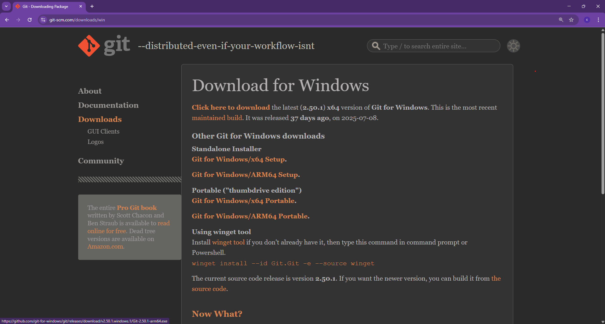
   </p>
2. Install Git, click download result.
   <p align="left">
     
   </p>
3. Click more info for continue run install.
   <p align="left">
     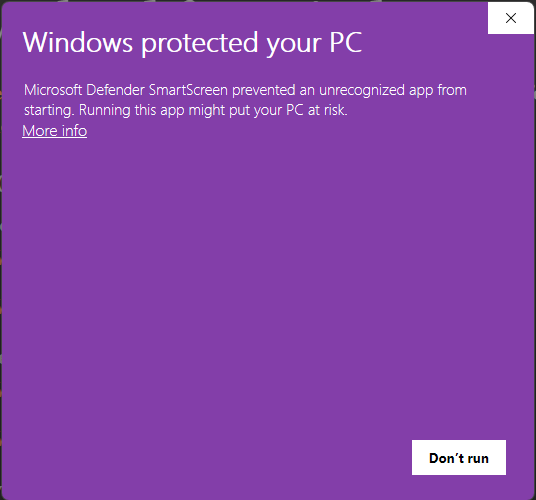
   </p>
4. Click Run Away button for continue install.
   <p align="left">
     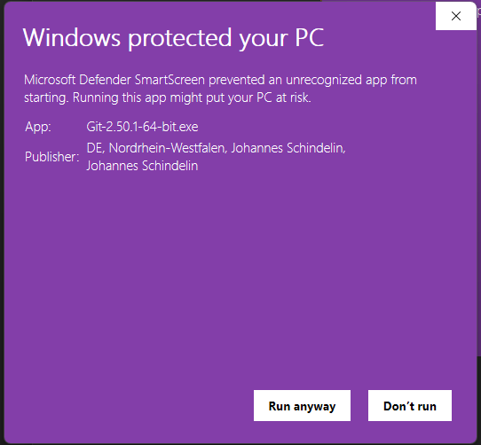
   </p>
5. Click Install button.
   <p align="left">
     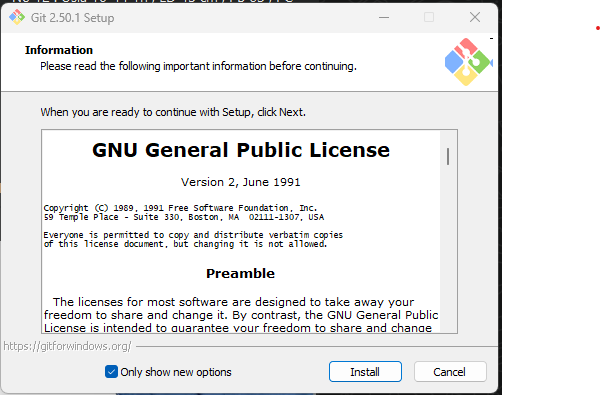
   </p>
6. Click Finish button.
   <p align="left">
     
   </p>
7. Check From Command Prompt with `git`.
   <p align="left">
     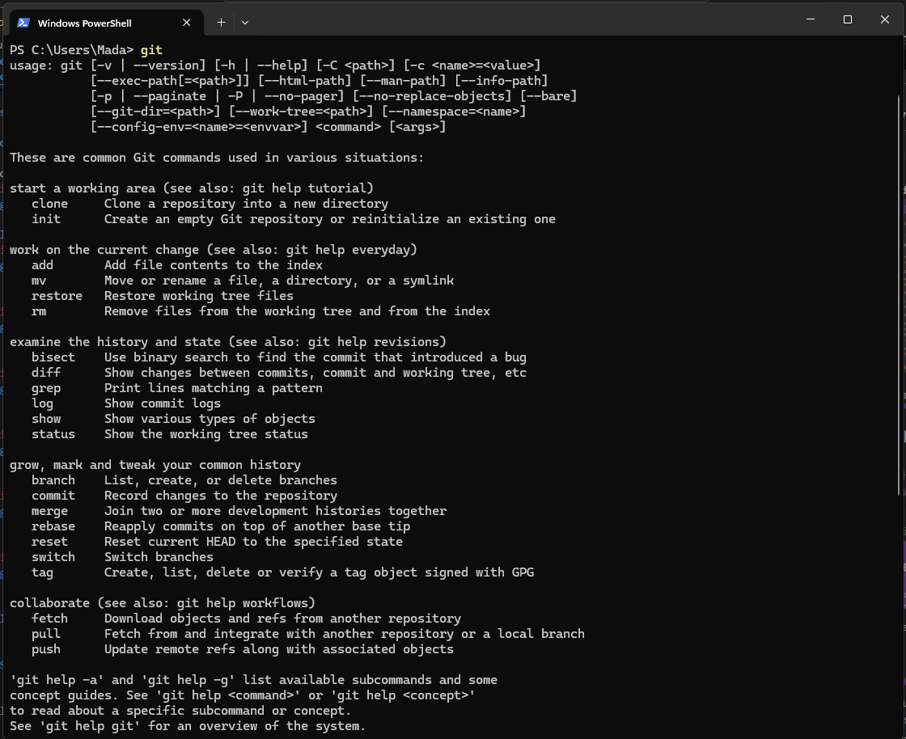
   </p>

### macOS

```bash
xcode-select --install
```

or install via Homebrew:

```bash
brew install git
```

### Linux (Debian/Ubuntu)

```bash
sudo apt update && sudo apt install -y git
```

---

## 5) Configure Git (Identity & Defaults)

```bash
git config --global user.name "Your Name"
git config --global user.email "your_email@example.com"
git config --global init.defaultBranch main
```

> Use the same email you verified on GitHub to associate commits with your account.

---

## 6) Connect to GitHub via SSH (Recommended)

### 6.1 Check Existing Keys

**macOS / Linux (Terminal)**

```bash
ls -al ~/.ssh
```

**Windows (PowerShell)**

```powershell
Get-ChildItem $env:USERPROFILE\.ssh
```

---

### 6.2 Generate a New SSH Key

```bash
ssh-keygen -t ed25519 -C "your_email@example.com"
```

---

### 6.3 Start the SSH Agent & Add Your Key

**macOS / Linux**

```bash
eval "$(ssh-agent -s)"
ssh-add ~/.ssh/id_ed25519
```

**Windows (PowerShell)**

Run as Administrator

```powershell
Start-Service ssh-agent
ssh-add $env:USERPROFILE\.ssh\id_ed25519
```

---

### 6.4 Add the Public Key to GitHub

1. Copy your public key:

   **macOS / Linux**

   ```bash
   cat ~/.ssh/id_ed25519.pub
   ```

   **Windows (PowerShell)**

   ```powershell
   type $env:USERPROFILE\.ssh\id_ed25519.pub
   ```

2. In GitHub: **Settings** → **SSH and GPG keys** → **New SSH key**.
3. Paste the key, name it (e.g., “Laptop-ED25519”), and save.

---

### 6.5 Test the Connection

```bash
ssh -T git@github.com
```

---

## 7) (Alternative) Use HTTPS with a Personal Access Token (PAT)

If you prefer HTTPS:

1. GitHub → **Settings** → **Developer settings** → **Personal access tokens**.
2. Create a **Fine-grained token**, select your repo scope, grant **Contents: Read and write**.
3. Use the token as the **password** when Git prompts during `git push`.

---

## Troubleshooting

- **Permission denied (publickey)** → Ensure SSH key is added to GitHub.
- **Username/Password prompts for HTTPS** → Use a **Personal Access Token**.
- **Email not linked to commits** → Check `git config user.email`.

---

**You are now registered and ready to use GitHub.**
