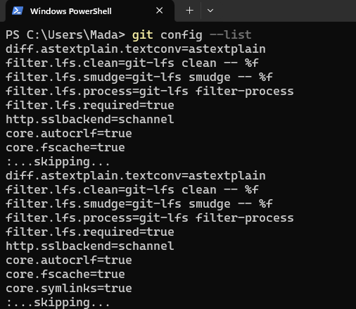

# Visual Studio Code Installation Guide

This guide covers installing Visual Studio Code (VS Code) on **Windows**, **macOS**, and **Ubuntu/Linux**.

---

## 1. Windows

1. Go to the official site:  
   [https://code.visualstudio.com/](https://code.visualstudio.com/)

<p align="left">
        
      </p>

2. Click **Download for Windows**.

<p align="left">
        
      </p>
3. Run the installer and follow prompts:
   - Accept the license agreement.
   - Select installation location.
   - **Optional (recommended):** Check *Add to PATH* and *Register as default editor for supported file types*.
4. Finish installation and launch VS Code.

---

## 2. macOS

1. Download the **macOS** version from:  
   [https://code.visualstudio.com/](https://code.visualstudio.com/)
2. Open the `.zip` file and drag `Visual Studio Code.app` to your `Applications` folder.
3. Launch VS Code from the Applications folder.
4. **Optional:** Enable `code` command in Terminal:
   - Open VS Code.
   - Press `Cmd + Shift + P` → type **Shell Command: Install 'code' command in PATH** → Press Enter.

---

## 3. Ubuntu / Debian Linux

### Using apt

1. Download and install the Microsoft GPG key:
   ```bash
   wget -qO- https://packages.microsoft.com/keys/microsoft.asc | gpg --dearmor > packages.microsoft.gpg
   sudo install -D -o root -g root -m 644 packages.microsoft.gpg /usr/share/keyrings/packages.microsoft.gpg
   rm -f packages.microsoft.gpg
   ```
2. Enable the VS Code repository:
   ```bash
   sudo sh -c 'echo "deb [arch=amd64 signed-by=/usr/share/keyrings/packages.microsoft.gpg] https://packages.microsoft.com/repos/code stable main" > /etc/apt/sources.list.d/vscode.list'
   ```
3. Update package list and install VS Code:
   ```bash
   sudo apt update
   sudo apt install code
   ```
4. Launch VS Code:
   ```bash
   code
   ```

---

## 4. Install Python Extension in VS Code

1. Open VS Code.
2. Go to the **Extensions** view:
   - Click the Extensions icon on the Activity Bar (left side), or
   - Press `Ctrl + Shift + X` (**Cmd + Shift + X** on macOS).
3. In the search box, type:  
   **Python** (by Microsoft).
4. Click **Install**.
5. **Optional but recommended:** Install **Pylance** (Microsoft) for improved IntelliSense and type checking.
6. Restart VS Code to ensure the extension loads properly.

---

**You are now ready to use VS Code for your ML projects!**
