# Git & Branching Strategy for ML Projects

**Purpose:**  
Keep **code**, **data references**, and **models** organized so teams can collaborate effectively, track progress, and reproduce experiments reliably.

---

## 1. Why Git Matters in ML Projects

Machine Learning projects are more complex than standard software projects because they involve:

- **Code** (model training, data processing scripts).
- **Data references** (not storing huge files in Git, but storing pointers/metadata).
- **Models** (binary artifacts that need versioning).
- **Experiments** (different parameter combinations, hyperparameters).

Git allows:

- Collaboration without overwriting each other's work.
- Historical tracking of what was done and when.
- Integration with CI/CD for automation.
- Seamless rollbacks to previous stable states.

---

## 2. Setting Up Git for ML

### Step 1 — Install Git

Follow the [Git Installation Guide](2_Git_Install.md) for Windows, macOS, or Linux.  
Verify installation:

```bash
git --version
```

### Step 2 — Initialize a Repository and Push to GitHub

We'll use a repository name `mlops-workshop-pens` for this workshop.

1. **Create a new folder and initialize Git**

```bash
mkdir mlops-workshop-pens
```

<p align="left">
        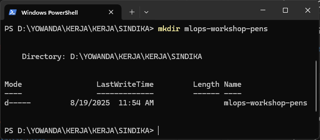
      </p>

```bash
cd mlops-workshop-pens
```

<p align="left">
        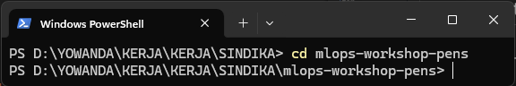
      </p>

```bash
git init
```

<p align="left">
        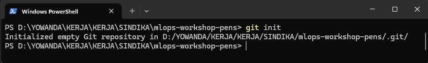
      </p>

2. **Create an initial file using VS Code**

- Open VS Code in the project folder:

  ```bash
  code .
  ```

  _(If `code` command is not recognized, open VS Code manually and choose "File → Open Folder…")_

  - In VS Code:

    1. Click **New File** in the Explorer panel.

       <p align="left">
         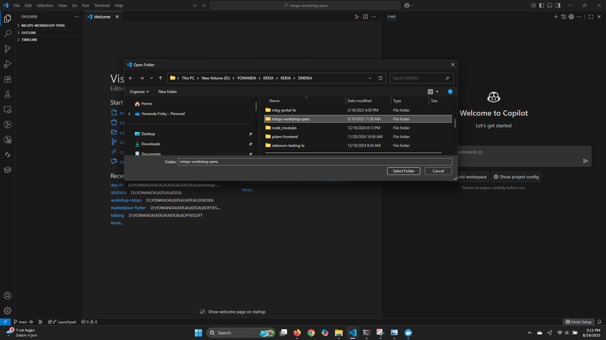
       </p>

    2. Name the file:

       ```
       README.md
       ```

       <p align="left">
         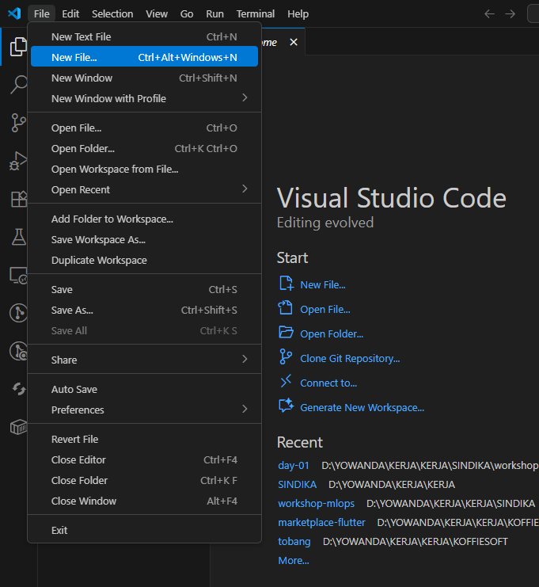
       </p>

       <p align="left">
         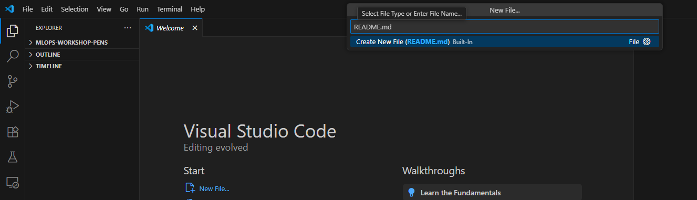
       </p>

    3. Add the following content:
       ```md
       # MLOps Workshop PENS
       ```
    4. Save the file (**Ctrl+S** / **Cmd+S**).

       <p align="left">
         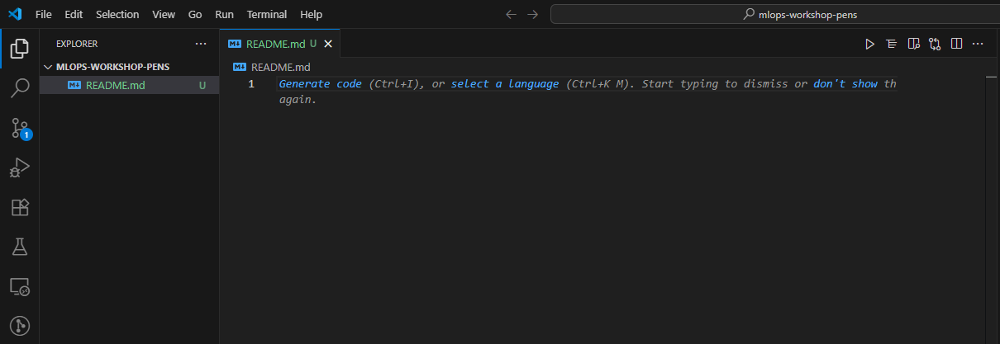
       </p>

3. **Stage and commit the file**

```bash
git add .
git commit -m "Initial commit for MLOps Workshop PENS"
```

<p align="left">
        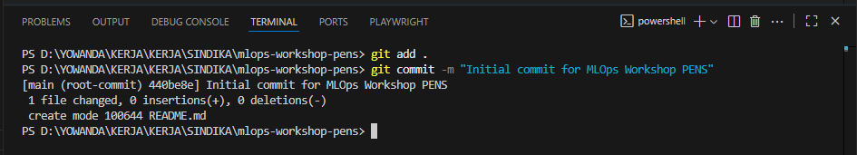
      </p>

4. **Create a new repository on GitHub**

- Go to [https://github.com/new](https://github.com/new)

<p align="left">
        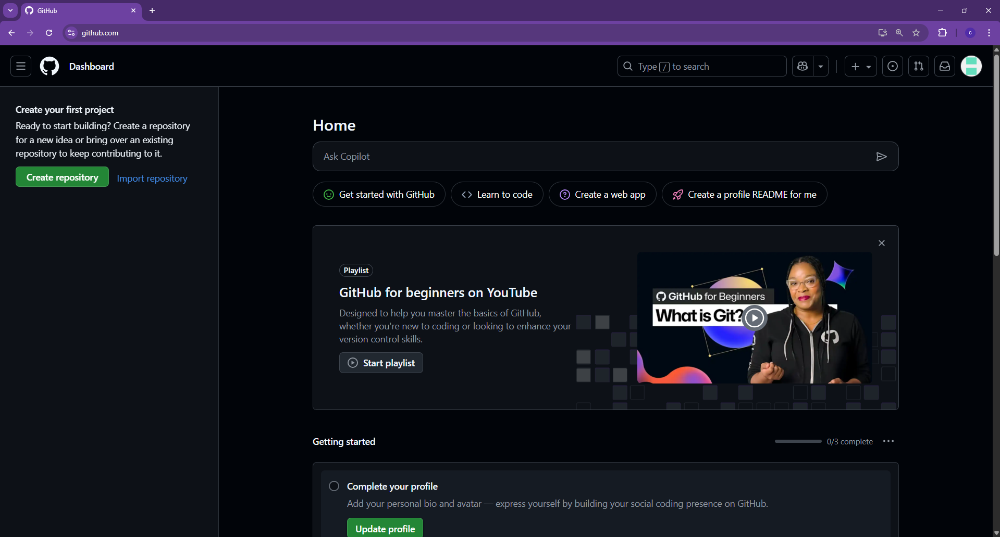
      </p>
      
- Repository name: `mlops-workshop-pens`

- Keep it **empty** (no README, license, or .gitignore — we already created them locally).
- Click **Create repository**.

<p align="left">
        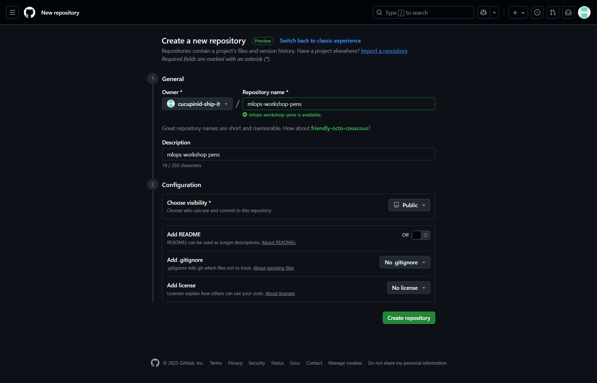
      </p>

5. **Link local repo to GitHub remote**  
   Replace `<your-username>` with your GitHub username:

```bash
git remote add origin https://github.com/cucupinid-ship-it/mlops-workshop-pens.git
```

<p align="left">
        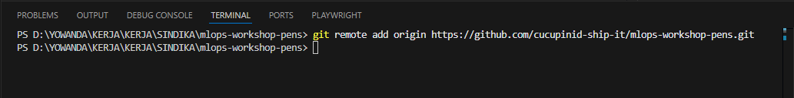
      </p>

6. **Push local repo to GitHub**

```bash
git branch -M main
git push -u origin main
```

<p align="left">
        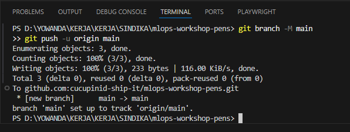
      </p>

### Step 3 — Create a `.gitignore` File

In ML projects, we **must not** commit:

- Large datasets
- Model binary files (track with DVC instead)
- Temporary files, caches, or environment files

#### 1. Create `.gitignore`

Example `.gitignore`:

```gitignore
# Data & model artifacts
data/
models/
*.pt
*.onnx
*.h5

# Virtual environment & cache
.venv/
__pycache__/
*.pyc
.ipynb_checkpoints/

# Secrets
.env

# DVC cache (local only)
.dvc/tmp/
.dvc/cache/
```

<p align="left">
        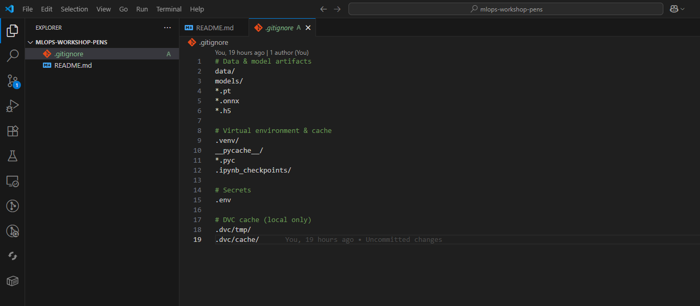
      </p>

#### 2. Stage the file

```bash
git add .gitignore
```

<p align="left">
        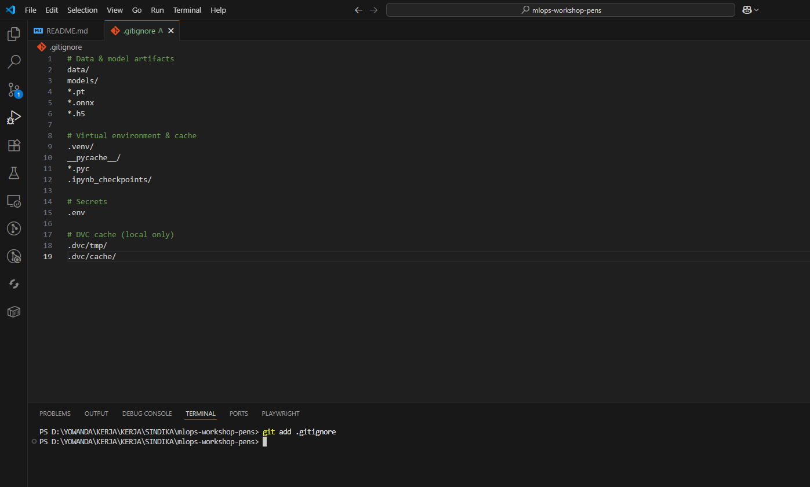
      </p>

---

### 3. Commit changes

```bash
git commit -m "Add .gitignore for ML project"
```

<p align="left">
        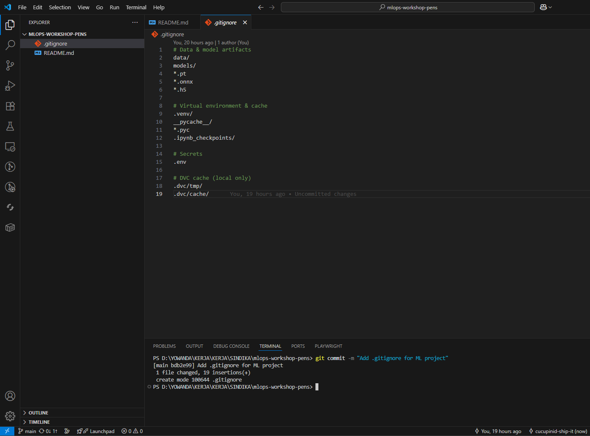
      </p>
---

### 4. Push to GitHub

_(Make sure the remote repository is already set — see Step 2 for `git remote add origin`)_

```bash
git push origin main
```

<p align="left">
        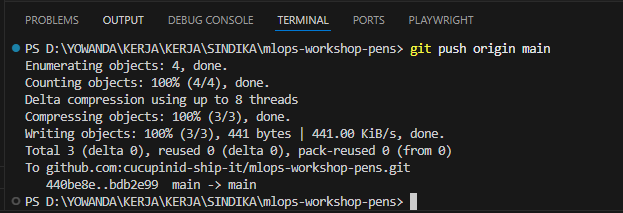
      </p>
---

## 3. Branching Strategy for ML

### Recommended Workflow

- **`main`** → Stable branch, only production-ready code.
- **`develop`** → Integration branch for features ready to test.
- **`feature/<name>`** → Experimental work or new features.

**Flow Example:**

```bash
# Create and switch to main
git checkout -b main
```

<p align="left">
        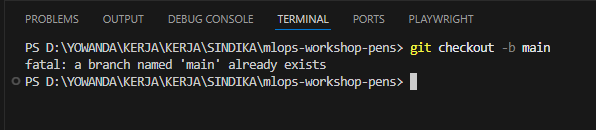
      </p>

```bash
# Create develop branch from main
git checkout -b develop
```

<p align="left">
        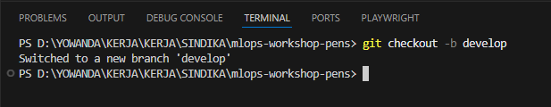
      </p>

```bash
# Create feature branch from develop
git checkout -b feature/data-cleaning
```

<p align="left">
        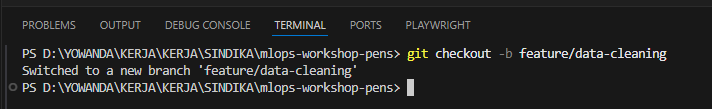
      </p>

### Branching Diagram

```
 main      ----o----------o--------o
               \
 develop         o----o-----o------o
                  \   \
 feature           o   o
```
