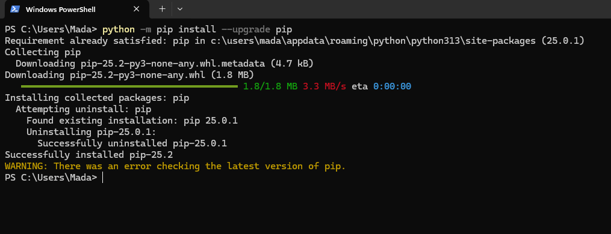

# Python Installation Guide

## 1. Overview

Python is essential for Machine Learning and MLOps development.  
This guide covers installation on **Windows**, **macOS**, and **Ubuntu Linux**.

---

## 2. Install on Windows

### Step 1 — Download Python

1. Visit the official website:  
   [https://www.python.org/downloads/](https://www.python.org/downloads/)

   <p align="left">
        
      </p>

2. Click **Download Python 3.x.x** (choose the latest stable version).

   <p align="left">
        
      </p>

### Step 2 — Run the Installer

1. Double-click the downloaded file.

<p align="left">
        
      </p>

2. **IMPORTANT:** Check the box **"Add Python to PATH"** before clicking
   **Install Now**.

<p align="left">
        
      </p>

3. Wait for the installation to finish.

<p align="left">
        
      </p>

### Step 3 — Verify Installation

Open Command Prompt and run:

```bash
python --version
```

<p align="left">
        
      </p>

or

```bash
python3 --version
```

---

## 3. Install on macOS

### Option 1 — Using Homebrew (Recommended)

1. Install Homebrew if not already installed:
   ```bash
   /bin/bash -c "$(curl -fsSL https://raw.githubusercontent.com/Homebrew/install/HEAD/install.sh)"
   ```
2. Install Python:
   ```bash
   brew install python
   ```
3. Verify:
   ```bash
   python3 --version
   ```

### Option 2 — Direct Download

1. Go to [https://www.python.org/downloads/](https://www.python.org/downloads/).
2. Download the macOS installer.
3. Follow the installation steps.

---

## 4. Install on Ubuntu Linux

### Step 1 — Update Package List

```bash
sudo apt update
```

### Step 2 — Install Python

```bash
sudo apt install -y python3 python3-pip
```

### Step 3 — Verify Installation

```bash
python3 --version
pip3 --version
```

---

## 5. Upgrade pip (All Platforms)

It’s recommended to upgrade `pip` after installation:

```bash
python -m pip install --upgrade pip
```

<p align="left">
        
      </p>

---

✅ **Outcome:**

- Python installed and ready for use.
- `pip` upgraded.
- Verified on your system.
