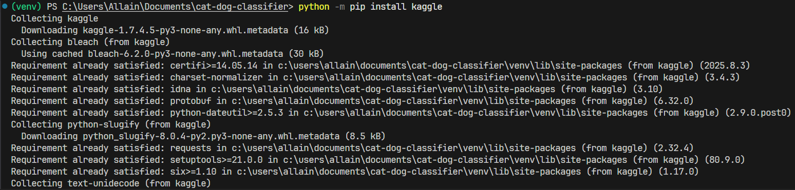
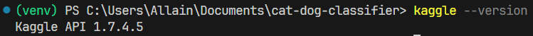
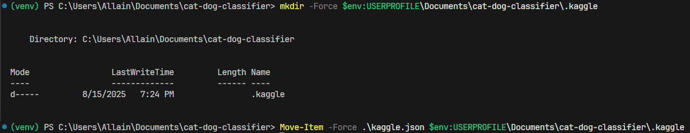
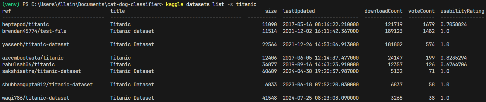
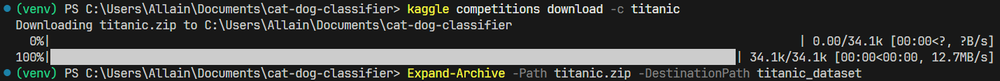
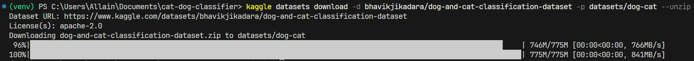
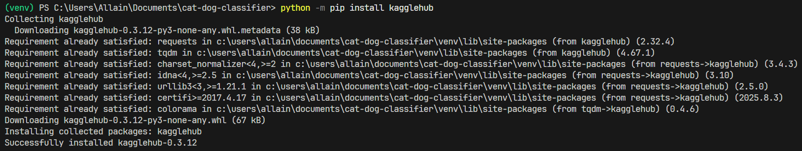
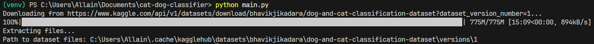

# Kaggle: Registration & API Setup Guide

This guide combines **Kaggle account registration**, **Kaggle API setup**, and **Python `kagglehub` usage** so you can quickly access datasets for your ML projects and workshops.

--- 

## 1. Go to the Kaggle Website
- Open your browser and navigate to:  
  **https://www.kaggle.com**

---

## 2. Click **Sign Up**
- Located in the top-right corner of the page.  
- You have two main options:
  - **Sign up with Google / Microsoft / Apple**  
  - **Sign up with Email**

---

## 3. Fill in the Registration Form (if using Email)
- **Full Name**: Your real name (used for competition leaderboards).  
- **Username**: This will be your public profile name.  
- **Email Address**: Make sure it’s valid — Kaggle will send a confirmation.  
- **Password**: Create a strong password.  

✅ **Tip:** If you’re doing this in a workshop, use the same email you use for GitHub to keep accounts consistent.

---

## 4. Agree to Terms and Privacy Policy
- Read Kaggle’s Terms of Service and Privacy Policy.  
- Check the box to confirm.

---

## 5. Verify Your Email
- Check your inbox for a confirmation email from Kaggle.  
- Click the verification link.

---

## 6. Set Up Your Profile
- Add a profile picture (optional).  
- Fill in your bio and location (optional but recommended).  
- This helps in competitions and when collaborating with others.

---

## 7. Enable Kaggle API (Create Token)
If you want to download datasets programmatically:
1. Click your profile picture → **Setting** → **Account**.  
2. Scroll to **API** section.  
3. Click **Create New API Token**.  
4. This downloads `kaggle.json` — keep it safe and **do not share**.

---

## 8. Install and Configure Kaggle API (CLI)

### 8.1. Prerequisites
- A Kaggle account (steps above completed).  
- **Python** and **pip** installed on your machine.

### 8.2. Install Kaggle CLI
```bash
pip install kaggle
```


Verify installation:
```bash
kaggle --version
```


### 8.3. Place `kaggle.json` in the Correct Location

**Windows (PowerShell):**
```powershell
mkdir -Force $env:USERPROFILE\.kaggle
Move-Item -Force .\kaggle.json $env:USERPROFILE\.kaggle
```


**macOS / Linux (Terminal):**
```bash
mkdir -p ~/.kaggle
mv ./kaggle.json ~/.kaggle/
chmod 600 ~/.kaggle/kaggle.json
```

> The `chmod 600` command restricts file permissions so only your user can read/write the token.

---

## 9. Test the Kaggle CLI

### 9.1. Search for a dataset
```bash
kaggle datasets list -s titanic
```


### 9.2. Download a competition dataset (example: Titanic)
```bash
kaggle competitions download -c titanic
unzip titanic.zip -d titanic_dataset
```


### 9.3. Download a public dataset (example)
```bash
kaggle datasets download -d bhavikjikadara/dog-and-cat-classification-dataset -p datasets/dog-cat --unzip
```


---

## 10. Best Practices
- Keep `kaggle.json` **private** and never commit it to Git.  
- Add the following to your `.gitignore`:
```gitignore
.kaggle/
kaggle.json
```
- For shared workshop machines, delete `kaggle.json` after use.

---

## 11. Download Dataset with `kagglehub` (Python)

> This method is useful if you want to download datasets directly inside a Python script or Jupyter Notebook without using the command line.

### 11.1. Install `kagglehub`
```bash
pip install kagglehub
```


### 11.2. Ensure API Token is Set
- Follow step **7** above to create and download `kaggle.json`.
- Place it in:
  - **Windows**: `%USERPROFILE%\.kaggle\kaggle.json`
  - **macOS/Linux**: `~/.kaggle/kaggle.json`

### 11.3. Example: Download Dataset
```python
import kagglehub

# Download latest version of the dataset
path = kagglehub.dataset_download("bhavikjikadara/dog-and-cat-classification-dataset")

print("Path to dataset files:", path)
```


### 11.4. How It Works
- `kagglehub.dataset_download()` will:
  - Authenticate using your `kaggle.json` API key.
  - Download the dataset to a cache folder (usually `~/.cache/kagglehub`).
  - Return the **local path** so you can use it in your ML pipeline.

---

✅ **Outcome**
You now have:
- A registered Kaggle account.  
- The Kaggle API installed and configured.  
- Ability to download datasets programmatically using **CLI** or **Python `kagglehub`**.
