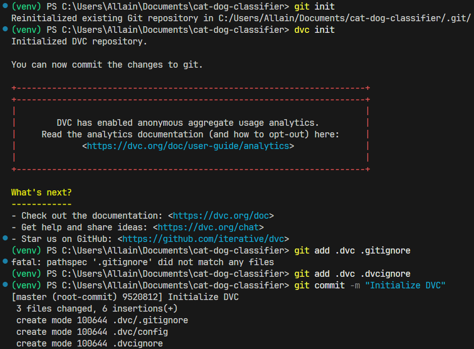
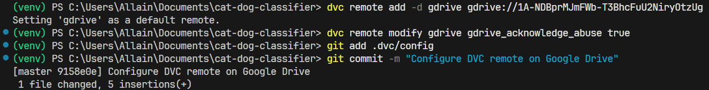

# DVC + Google Drive Integration Guide

This document provides a **complete, production‑ready setup** for using **Data Version Control (DVC)** with **Google Drive** as a remote, including options for individual use, team collaboration, and CI automation via a **Service Account**.

---

## 1) Prerequisites

- **Git** initialized in your project.
- **Python 3.8+** and **pip** (or `conda`).
- A **Google account** with access to a Drive **folder** or **Shared Drive**.
- (Recommended) Use a dedicated **Shared Drive** for teams to avoid ownership issues.

---

## 2) Install DVC with Google Drive Support

### Using `pip` (recommended)
```bash
pip install "dvc[gdrive]"
```


### Using `conda`
```bash
conda install -c conda-forge dvc dvc-gdrive
```

Verify:
```bash
dvc --version
```


> `dvc[gdrive]` installs the Google Drive backend via `pydrive2`.

---

## 3) Initialize DVC in Your Repository

```bash
git init            # if not already a Git repo
dvc init
git add .dvc .dvcignore
git commit -m "Initialize DVC"
```

---

## 4) Create/Locate a Google Drive Folder

- Create a folder in **My Drive** or in a **Shared Drive** (recommended for teams).
- Open the folder in the browser and copy the **Folder ID** from the URL:

```
https://drive.google.com/drive/folders/<FOLDER_ID>
```

> Keep this `<FOLDER_ID>` handy.

---

## 5) Configure the DVC Remote (Interactive OAuth)

The simplest setup uses your Google account with OAuth in an interactive shell. The first `push/pull` will open a browser to authorize, then persist a token in your local config.

```bash
# Add and set as default remote
dvc remote add -d gdrive gdrive://<FOLDER_ID>

# (Optional) for large/binary files Google may show a "can't scan for viruses" interstitial
dvc remote modify gdrive gdrive_acknowledge_abuse true

# Save remote configuration in project (safe fields only)
git add .dvc/config
git commit -m "Configure DVC remote on Google Drive"
```


> The OAuth token is stored under `~/.config/dvc` (Linux/macOS) or `%APPDATA%\dvc` (Windows). **Do not commit tokens.**

---

## 6) Track and Push Data

```bash
# Example: track a dataset directory
dvc add data/

# Stage DVC metadata (not the raw data)
git add data.dvc .gitignore
git commit -m "Track dataset with DVC"

# Upload data to Google Drive
dvc push
```

On another machine (or teammate):
```bash
git clone <repo>
cd <repo>
dvc pull   # will prompt OAuth on first use
```

---

## 7) Team Collaboration Best Practices

- Use a **Shared Drive** so files are not tied to one person’s My Drive ownership.
- Grant teammates **Contributor** or **Content manager** access to the Drive folder.
- Keep **secrets** (tokens, service-account JSON) out of Git. Use `.gitignore`:

```gitignore
# DVC/Drive credentials
*.json
.dvc/tmp/
.dvc/cache/
**/.dvc/cache/
token.json
*.pem
```

- Project config vs local secrets:
  - Commit: `.dvc/config` (remote URL, flags).
  - Local only: `.dvc/config.local` (private credentials if ever needed).

---

## 8) Non‑Interactive/CI Setup (Service Account)

For CI or headless servers, use a **Google Cloud Service Account**.

### 8.1 Create & Enable
1. Go to **Google Cloud Console** → create/select a project.
2. Enable **Google Drive API**.
3. Create a **Service Account** and generate a **JSON key file**.
4. In Google Drive, **share the target folder** (or Shared Drive) with the service account’s email (e.g., `my-ci@project.iam.gserviceaccount.com`) with **Contributor** access.

### 8.2 Configure DVC to Use Service Account
On the CI machine (or locally for testing):

```bash
# Place JSON key securely (outside the repo)
export GDRIVE_SERVICE_ACCOUNT_JSON=/secure/keys/sa-drive.json

# Point DVC remote to service account credentials
dvc remote modify gdrive gdrive_use_service_account true
dvc remote modify gdrive gdrive_service_account_json_file_path "$GDRIVE_SERVICE_ACCOUNT_JSON"
```

Windows (PowerShell):
```powershell
$env:GDRIVE_SERVICE_ACCOUNT_JSON="C:\secure\keys\sa-drive.json"
dvc remote modify gdrive gdrive_use_service_account true
dvc remote modify gdrive gdrive_service_account_json_file_path "$env:GDRIVE_SERVICE_ACCOUNT_JSON"
```

> **Do not** commit the JSON key. In CI, inject it via secret variables and write it at runtime.

---

## 9) Common Commands

```bash
# Check remote(s)
dvc remote list

# See status vs remote
dvc status -r gdrive

# Push/pull data
dvc push
dvc pull

# Clean unused local cache safely
dvc gc -w   # keep used by current workspace
dvc gc -a   # keep used by all Git commits in repo history
```

---

## 10) Troubleshooting

- **OAuth page not opening on headless server**
  - Use Service Account (Section 8) instead of interactive OAuth.
- **403: insufficient permissions / file not found**
  - Ensure your Google account (or service account email) has access to the Drive folder/Shared Drive.
- **Quota / Rate limits**
  - Reduce concurrency: `DVC_NO_ANALYTICS=1 dvc push -j 2` (lower `-j`).
- **“Sorry, cannot scan this file for viruses” prompt**
  - Ensure `gdrive_acknowledge_abuse` is set to `true`.
- **Moved folder / changed owner**
  - If the Folder ID changes, update the remote URL:  
    `dvc remote modify gdrive url gdrive://<NEW_FOLDER_ID>`
- **Windows path issues**
  - Prefer absolute paths for service account JSON and avoid spaces or wrap paths in quotes.

---

## 11) Minimal End‑to‑End Example

```bash
# 1) Setup
pip install "dvc[gdrive]"
git init && dvc init

# 2) Remote
dvc remote add -d gdrive gdrive://<FOLDER_ID>
dvc remote modify gdrive gdrive_acknowledge_abuse true
git add .dvc/config && git commit -m "DVC remote: Google Drive"

# 3) Track data
mkdir -p data && echo "hello" > data/sample.txt
dvc add data/
git add data.dvc .gitignore
git commit -m "Track data with DVC"

# 4) Upload
dvc push
```

On a teammate’s machine:
```bash
git clone <repo>
cd <repo>
pip install "dvc[gdrive]"
dvc pull
```

---

## 12) Security Notes

- Treat service‑account JSON like a password. Store using secret managers (GitHub Actions, GitLab CI, etc.).
- For extra safety, store only the **remote URL** in Git and keep credentials in `.dvc/config.local` or environment variables.
- Review Drive sharing to avoid unintentionally public data.

---

### References
- DVC Docs: Remotes → Google Drive
- Google Cloud Docs: Service Accounts, Drive API