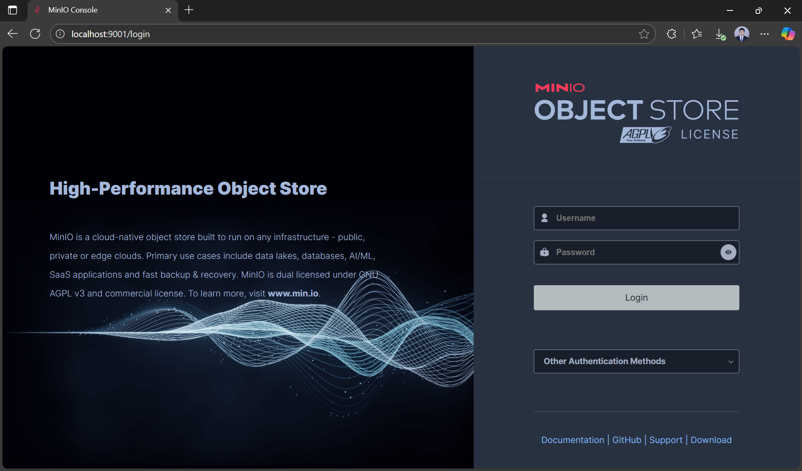
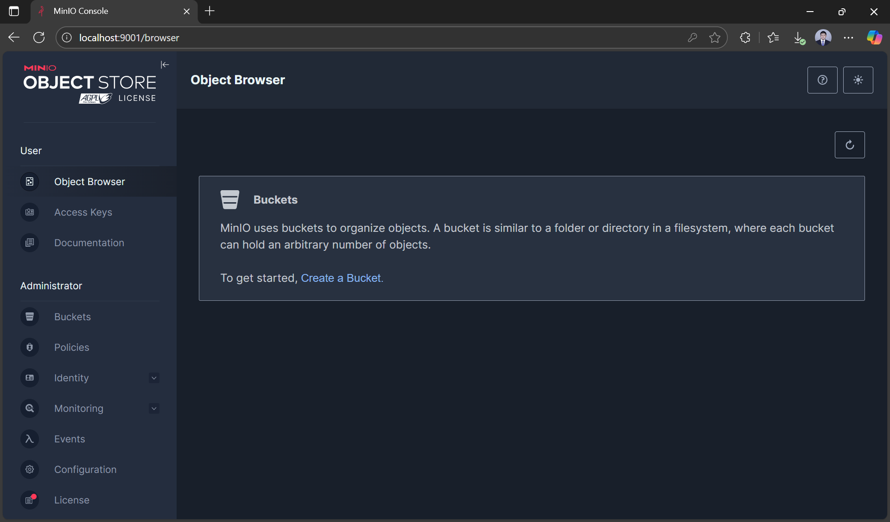
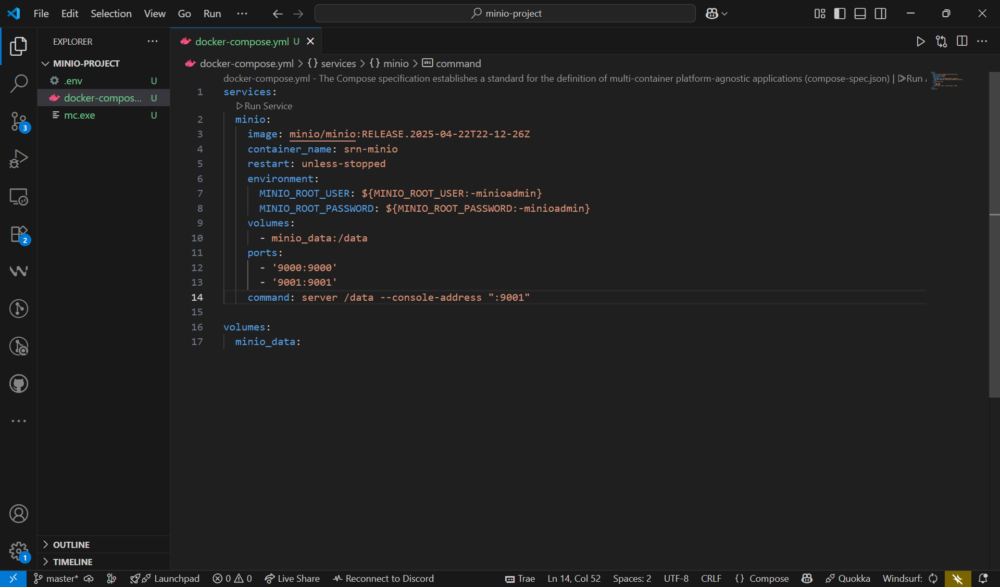
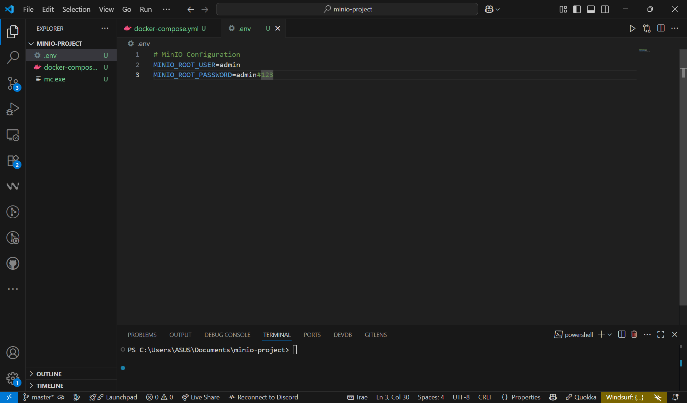
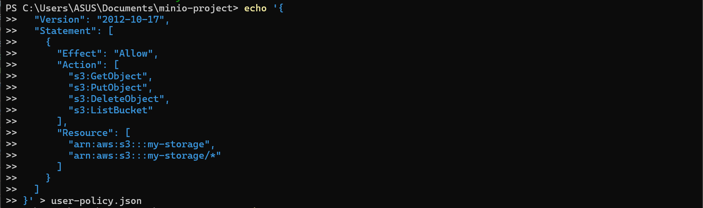
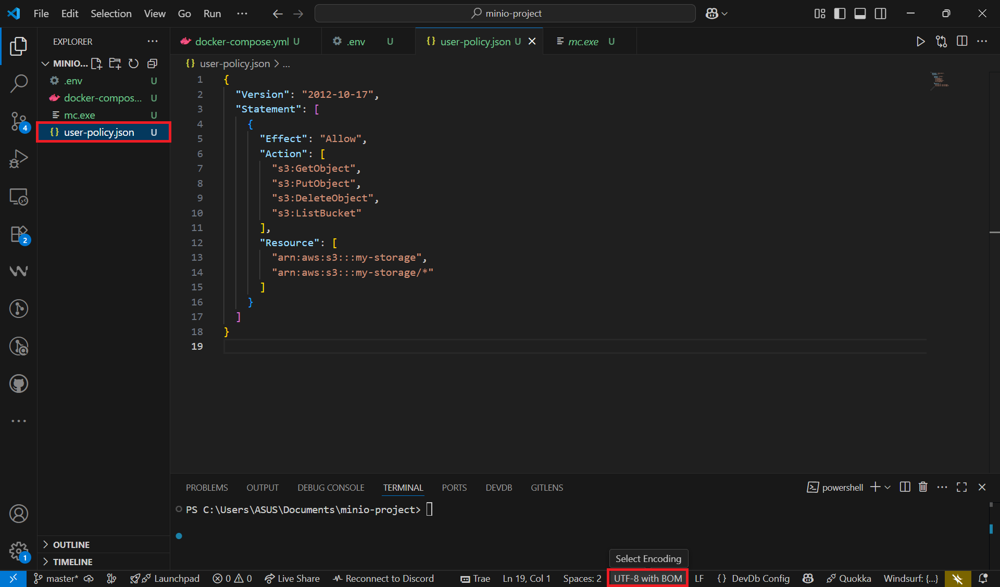
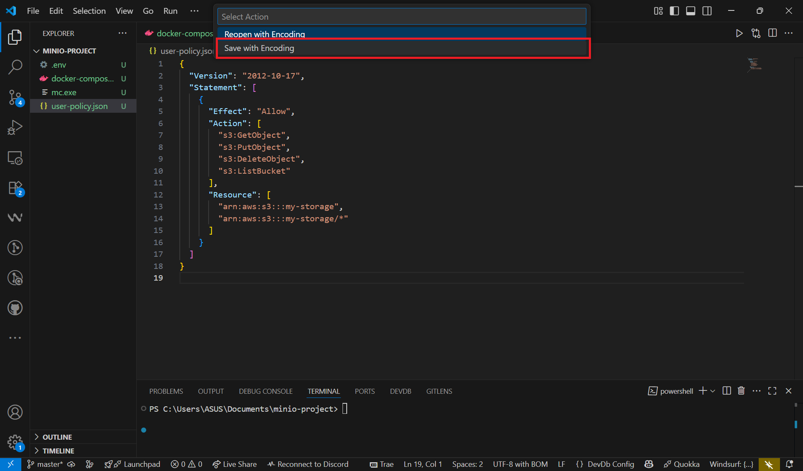

# MinIO Installation and Setup Guide

This document provides a **complete setup guide** for **MinIO** as an S3-compatible object storage solution, covering installation, configuration, and basic usage for local development and team collaboration.

---

## 1) Prerequisites

- **Git** for version control
- **Docker** installed and running
- **Docker Compose** installed (usually included with Docker Desktop)

---

## 2) Install MinIO Server

- Create a `docker-compose.yml` file in your project root:

```yaml
services:
  minio:
    image: minio/minio:RELEASE.2025-04-22T22-12-26Z
    container_name: srn-minio
    restart: unless-stopped
    environment:
      MINIO_ROOT_USER: minioadmin
      MINIO_ROOT_PASSWORD: minioadmin
    volumes:
      - minio_data:/data
    ports:
      - '9000:9000'
      - '9001:9001'
    command: server /data --console-address ":9001"

volumes:
  minio_data:
```


---

## 3) Start MinIO Server

### Using Docker Compose (Recommended)

```bash
# Start MinIO using docker-compose
docker-compose up -d

# Check if container is running
docker-compose ps
```


### Verify MinIO is Running

Check if MinIO is running properly:

```bash
# Check container logs (if using Docker)
docker logs srn-minio

# Check container status
docker ps | grep srn-minio
```


**Access Points:**
- **API Endpoint**: http://localhost:9000
- **Web Console**: http://localhost:9001
- **Default Credentials**: `minioadmin` / `minioadmin`


---

## 4) Configure MinIO Web Console

### 4a) Access Web Console

1. Open your browser and navigate to **http://localhost:9001**


2. Login with your configured credentials:
   - **Username**: `minioadmin`
   - **Password**: `minioadmin`


### 4b) Create Your First Bucket

1. Click **"Buckets"** in the left sidebar


2. Click **"Create Bucket"** button


3. Enter bucket name (e.g., `my-storage`) and click **"Create Bucket"**


4. Your bucket is now created and ready for use


### 4c) Upload Files to Bucket

1. Click on your newly created bucket to open it


2. Click **"Upload"** button to upload files


3. Drag and drop files or click to browse and select files


4. Files are now uploaded and visible in your bucket


---

## 5) Install and Configure MinIO Client (mc)

### 5a) Install MinIO Client

**Using Docker (Recommended):**
```bash
# Create an alias for MinIO client
echo 'alias mc="docker run --rm -it --network host minio/mc"' >> ~/.bashrc
source ~/.bashrc

# Or use it directly
docker run --rm -it --network host minio/mc
```



**Direct Installation:**

**Linux:**
```bash
wget https://dl.min.io/client/mc/release/linux-amd64/mc
chmod +x mc
sudo mv mc /usr/local/bin/
```

**macOS:**
```bash
brew install minio/stable/mc
```

**Windows PowerShell:**
```powershell
Invoke-WebRequest -Uri "https://dl.min.io/client/mc/release/windows-amd64/mc.exe" -OutFile "mc.exe"
```



### 5b) Configure MinIO Client

```bash
# Add your MinIO server configuration (matching your Docker setup)
mc alias set local http://localhost:9000 minioadmin minioadmin

# Test connection
mc admin info local

# List buckets
mc ls local

# Create bucket via CLI
mc mb local/test-bucket
```


---

## 6) Team Collaboration Setup

### 6a) Share Docker Compose Configuration

Create a shared `docker-compose.yml` for your team:

```yaml
services:
  minio:
    image: minio/minio:RELEASE.2025-04-22T22-12-26Z
    container_name: srn-minio
    restart: unless-stopped
    environment:
      MINIO_ROOT_USER: ${MINIO_ROOT_USER:-minioadmin}
      MINIO_ROOT_PASSWORD: ${MINIO_ROOT_PASSWORD:-minioadmin}
    volumes:
      - minio_data:/data
    ports:
      - '9000:9000'
      - '9001:9001'
    command: server /data --console-address ":9001"

volumes:
  minio_data:
```


### 6b) Environment Variables for Team

Create a `.env` file (add to `.gitignore`):

```bash
# MinIO Configuration
MINIO_ROOT_USER=your-team-admin
MINIO_ROOT_PASSWORD=your-secure-password-123
```


### 6c) Team Member Setup

For team members to use the same MinIO instance:

```bash
# Clone the repository
git clone <your-repo>
cd <your-repo>

# Start MinIO using the shared configuration
docker-compose up -d

# Access MinIO console at http://localhost:9001
# Use credentials from .env file or defaults
```


---

## 7) Production Deployment Options

### 7a) Production Docker Compose

For production, enhance your configuration:

```yaml
version: '3.8'

services:
  minio:
    image: minio/minio:RELEASE.2025-04-22T22-12-26Z
    container_name: srn-minio-prod
    restart: unless-stopped
    environment:
      MINIO_ROOT_USER: ${MINIO_ROOT_USER}
      MINIO_ROOT_PASSWORD: ${MINIO_ROOT_PASSWORD}
      MINIO_BROWSER_REDIRECT_URL: https://your-domain.com:9001
    volumes:
      - minio_data:/data
      - ./certs:/root/.minio/certs  # For SSL certificates
    ports:
      - '9000:9000'
      - '9001:9001'
    command: server /data --console-address ":9001"
    healthcheck:
      test: ["CMD", "curl", "-f", "http://localhost:9000/minio/health/live"]
      interval: 30s
      timeout: 20s
      retries: 3
    networks:
      - minio-network

networks:
  minio-network:
    driver: bridge

volumes:
  minio_data:
```



### 7b) Container Management Commands

```bash
# Start the production setup
docker-compose -f docker-compose.prod.yml up -d

# View logs
docker-compose logs -f minio

# Stop services
docker-compose down

# Update MinIO (with data preservation)
docker-compose pull
docker-compose up -d

# Backup data volume
docker run --rm -v minio_data:/data -v $(pwd):/backup alpine tar czf /backup/minio-backup.tar.gz -C /data .
```



---

## 8) User Management

### 8a) Create Additional Users

```bash
# Create a new user via MinIO Client
mc admin user add local newuser newpassword123

# Create a policy for specific permissions
cat > user-policy.json << EOF
{
  "Version": "2012-10-17",
  "Statement": [
    {
      "Effect": "Allow",
      "Action": [
        "s3:GetObject",
        "s3:PutObject",
        "s3:DeleteObject",
        "s3:ListBucket"
      ],
      "Resource": [
        "arn:aws:s3:::my-storage",
        "arn:aws:s3:::my-storage/*"
      ]
    }
  ]
}
EOF

# Add policy and assign to user
mc admin policy add local user-policy user-policy.json
mc admin policy set local user-policy user=newuser
```


### 8b) Manage Users via Web Console

1. In MinIO web console, navigate to **"Identity"** → **"Users"**



2. Click **"Create User"** to add a new user



3. Fill in user details and assign policies



---

## 9) Common Commands

```bash
# Docker Compose operations
docker-compose up -d              # Start MinIO
docker-compose down               # Stop MinIO
docker-compose logs -f minio      # View logs
docker-compose restart minio     # Restart MinIO

# Container operations
docker ps | grep srn-minio        # Check container status
docker logs srn-minio             # View container logs
docker exec -it srn-minio sh      # Access container shell
docker stats srn-minio            # Monitor container resources

# MinIO client operations
mc ls local                       # List all buckets
mc ls local/bucket-name          # List bucket contents
mc cp file.txt local/bucket-name/ # Upload file
mc cp local/bucket-name/file.txt . # Download file
mc rm local/bucket-name/file.txt  # Remove file
mc mirror local-folder/ local/bucket-name/ # Sync folders

# User management
mc admin user list local         # List users
mc admin policy list local       # List policies
mc admin info local              # Server information
```

---

## 10) Troubleshooting

- **Container fails to start**
  - Check if ports 9000/9001 are already in use: `netstat -tlnp | grep :9000`
  - Verify Docker is running: `docker ps`
  - Check container logs: `docker logs srn-minio`
- **Cannot access MinIO console**
  - Verify container is running: `docker ps | grep srn-minio`
  - Check port mapping: ensure ports 9000 and 9001 are mapped correctly
  - Try accessing via container IP: `docker inspect srn-minio | grep IPAddress`
- **Authentication errors**
  - Verify credentials match environment variables
  - Check if custom .env file is loaded properly
  - Reset credentials: stop container, remove volume, restart
- **Data volume issues**
  - Check volume exists: `docker volume ls | grep minio_data`
  - Verify volume permissions: `docker exec srn-minio ls -la /data`
  - Reset volume if corrupted: `docker-compose down -v && docker-compose up -d`
- **Container restart issues**
  - Check restart policy: `docker inspect srn-minio | grep RestartPolicy`
  - View container exit status: `docker ps -a | grep srn-minio`
  - Reset container: `docker-compose down && docker-compose up -d`
- **Network connectivity issues**
  - Check Docker network: `docker network ls`
  - Test container connectivity: `docker exec srn-minio ping host.docker.internal`
  - Verify firewall settings for ports 9000/9001
- **Storage space issues**
  - Check available disk space: `df -h`
  - Monitor MinIO storage usage in web console
  - Clean up old files or expand storage

---

## 11) Performance Optimization

### 11a) Docker Resource Limits

Add resource limits to your `docker-compose.yml`:

```yaml
services:
  minio:
    image: minio/minio:RELEASE.2025-04-22T22-12-26Z
    container_name: srn-minio
    restart: unless-stopped
    deploy:
      resources:
        limits:
          memory: 2G
          cpus: '1.0'
        reservations:
          memory: 512M
          cpus: '0.5'
    # ... rest of configuration
```

### 11b) MinIO Configuration

```bash
# Optimize for performance (add to environment variables)
MINIO_STORAGE_CLASS_STANDARD=EC:2  # Erasure coding
MINIO_BROWSER_REDIRECT_URL=http://localhost:9001
MINIO_SERVER_ACCESS_LOG_ENABLE=false  # Reduce logging overhead
```


---

## 12) Minimal End‑to‑End Example

```bash
# 1) Create docker-compose.yml
cat > docker-compose.yml << EOF
services:
  minio:
    image: minio/minio:RELEASE.2025-04-22T22-12-26Z
    container_name: srn-minio
    restart: unless-stopped
    environment:
      MINIO_ROOT_USER: minioadmin
      MINIO_ROOT_PASSWORD: minioadmin
    volumes:
      - minio_data:/data
    ports:
      - '9000:9000'
      - '9001:9001'
    command: server /data --console-address ":9001"
volumes:
  minio_data:
EOF

# 2) Start MinIO
docker-compose up -d

# 3) Install MinIO client
docker run --rm -it --network host minio/mc alias set local http://localhost:9000 minioadmin minioadmin

# 4) Create bucket and upload file
docker run --rm -it --network host minio/mc mb local/test-bucket
echo "Hello MinIO!" > test.txt
docker run --rm -it -v $(pwd):/data --network host minio/mc cp /data/test.txt local/test-bucket/
```

**Access MinIO Console:**
- Open http://localhost:9001
- Login with `minioadmin` / `minioadmin`
- Navigate to buckets to see your uploaded file

---

## 13) Security Notes

- **Change default credentials** in production (modify `MINIO_ROOT_USER` and `MINIO_ROOT_PASSWORD`)
- **Use environment variables** for sensitive data (create `.env` file)
- **Enable HTTPS/TLS** for production deployments
- **Implement proper IAM policies** and user access controls
- **Regular backup** of MinIO data volume
- **Monitor access logs** and audit trails
- **Keep Docker images updated** regularly
- **Use strong passwords** for all user accounts
- **Restrict network access** in production environments


---

## 14) Data Backup and Recovery

### 14a) Backup Data Volume

```bash
# Create backup of MinIO data
docker run --rm -v minio_data:/data -v $(pwd):/backup \
  alpine tar czf /backup/minio-backup-$(date +%Y%m%d).tar.gz -C /data .

# List backups
ls -la minio-backup-*.tar.gz
```

### 14b) Restore Data Volume

```bash
# Stop MinIO
docker-compose down

# Restore data from backup
docker run --rm -v minio_data:/data -v $(pwd):/backup \
  alpine tar xzf /backup/minio-backup-YYYYMMDD.tar.gz -C /data

# Start MinIO
docker-compose up -d
```


---

### References
- MinIO Documentation: https://docs.min.io/
- MinIO Object Storage Documentation: https://docs.min.io/community/minio-object-store/
- Docker MinIO: https://hub.docker.com/r/minio/minio
- Docker Compose Documentation: https://docs.docker.com/compose/