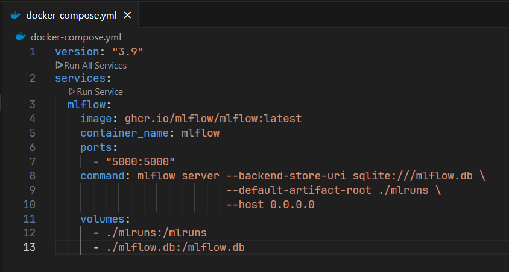
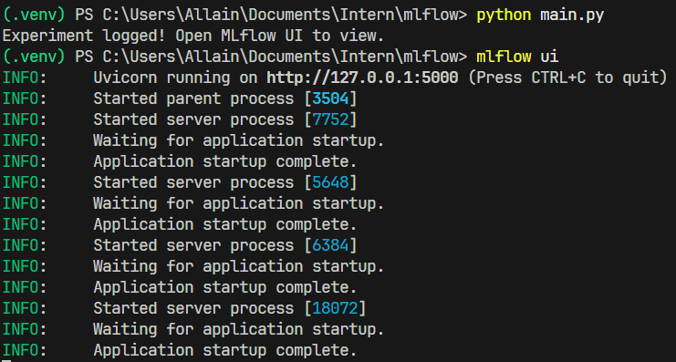

# 1. Installing MLflow

## 🎯 Learning Objectives
- Understand what MLflow is and why it’s used in MLOps.
- Install MLflow on your local machine.
- Run MLflow Tracking Server and access the UI.
- Verify installation with a simple experiment.

---

## 📘 What is MLflow?
MLflow is an **open-source platform** for managing the **end-to-end machine learning lifecycle**:
- **Tracking**: log parameters, metrics, and artifacts from experiments.  
- **Projects**: package ML code for reproducibility.  
- **Models**: manage and deploy trained models.  
- **Registry**: organize and version models.  

We will primarily focus on **MLflow Tracking & Registry** in this workshop.

---

## ⚙️ Installation Methods

### **Option 1: Install via pip (Local Environment)**
```bash
# Create a new virtual environment (recommended)
python -m venv .venv
.venv\Scripts\activate      # On Windows

# Install MLflow
pip install mlflow
```


Verify installation:
```bash
mlflow --version
```


---

### **Option 2: Install via Docker**
If you prefer isolation:
```bash
docker run -it -p 5000:5000 --rm --name mlflow ghcr.io/mlflow/mlflow:latest mlflow ui --host 0.0.0.0
```


Now MLflow UI is available at:  
👉 [http://localhost:5000](http://localhost:5000)


---

### **Option 3: Install with Docker Compose**  
*(recommended for later integration with Day-03 and Day-04)*  

`docker-compose.yml` snippet:
```yaml
version: "3.9"
services:
  mlflow:
    image: ghcr.io/mlflow/mlflow:latest
    container_name: mlflow
    ports:
      - "5000:5000"
    command: mlflow server --backend-store-uri sqlite:///mlflow.db \
                           --default-artifact-root ./mlruns \
                           --host 0.0.0.0
    volumes:
      - ./mlruns:/mlruns
      - ./mlflow.db:/mlflow.db
```



Run:
```bash
docker compose up -d
```


---

## 🧪 Quick Test
Run a simple experiment to confirm logging works:

```python
import mlflow

with mlflow.start_run():
    mlflow.log_param("learning_rate", 0.01)
    mlflow.log_metric("accuracy", 0.95)

print("Experiment logged! Open MLflow UI to view.")
```


Run:
```bash
python main.py
mlflow ui
```



Then go to the **MLflow UI** → **Experiments** tab → you should see the run.


---

## ✅ Summary
- MLflow can be installed with **pip**, **Docker**, or **Docker Compose**.  
- The UI runs on **localhost:5000** by default.  
- You verified installation by logging a test run.  
