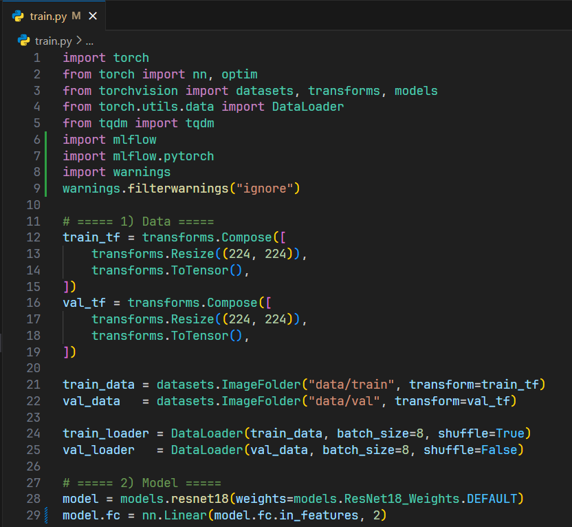

# 2. Tracking Experiments with MLflow

## 🎯 Learning Objectives
- Understand how to integrate MLflow into PyTorch workflows.
- Track parameters, metrics, and artifacts.
- Compare multiple runs in the MLflow UI.

---

## 🛠 Step 1: Setup MLflow
Ensure MLflow is installed and running (see [1_Installing_MLFlow.md](./1_Installing_MLFlow.md)).

Start the UI server:
```bash
mlflow ui
```


Open: **http://localhost:5000**


---

## 🛠 Step 2: Import MLflow
Update the training script by adding MLflow tracking.

```python
import mlflow
import mlflow.pytorch
```

---

## 🛠 Step 3: Wrap Training with MLflow Run
Example code (based on your `cat vs dog` ResNet script):

```python
import torch
from torch import nn, optim
from torchvision import datasets, transforms, models
from torch.utils.data import DataLoader
from tqdm import tqdm
import mlflow
import mlflow.pytorch

# ===== 1) Data =====
train_tf = transforms.Compose([
    transforms.Resize((224, 224)),
    transforms.ToTensor(),
])
val_tf = transforms.Compose([
    transforms.Resize((224, 224)),
    transforms.ToTensor(),
])

train_data = datasets.ImageFolder("data/train", transform=train_tf)
val_data   = datasets.ImageFolder("data/val", transform=val_tf)

train_loader = DataLoader(train_data, batch_size=8, shuffle=True)
val_loader   = DataLoader(val_data, batch_size=8, shuffle=False)

# ===== 2) Model =====
model = models.resnet18(weights=models.ResNet18_Weights.DEFAULT)
model.fc = nn.Linear(model.fc.in_features, 2)

device = torch.device("cuda" if torch.cuda.is_available() else "cpu")
model.to(device)

# ===== 3) Loss & Optimizer =====
criterion = nn.CrossEntropyLoss()
optimizer = optim.Adam(model.parameters(), lr=1e-3)

# ===== 4) Training with MLflow =====
with mlflow.start_run(run_name="resnet18-catdog"):
    mlflow.log_param("model", "resnet18")
    mlflow.log_param("optimizer", "adam")
    mlflow.log_param("learning_rate", 1e-3)
    mlflow.log_param("batch_size", 8)
    mlflow.log_param("epochs", 3)

    for epoch in range(3):
        model.train()
        total_loss = 0.0
        for imgs, labels in tqdm(train_loader, desc=f"Epoch {epoch+1}"):
            imgs, labels = imgs.to(device), labels.to(device)
            optimizer.zero_grad()
            outputs = model(imgs)
            loss = criterion(outputs, labels)
            loss.backward()
            optimizer.step()
            total_loss += loss.item()

        avg_loss = total_loss / len(train_loader)
        mlflow.log_metric("train_loss", avg_loss, step=epoch)
        print(f"Train loss: {avg_loss:.4f}")

        # Validation
        model.eval()
        correct, total = 0, 0
        with torch.no_grad():
            for imgs, labels in val_loader:
                imgs, labels = imgs.to(device), labels.to(device)
                outputs = model(imgs)
                preds = outputs.argmax(1)
                correct += (preds == labels).sum().item()
                total += labels.size(0)

        val_acc = correct / total
        mlflow.log_metric("val_accuracy", val_acc, step=epoch)
        print(f"Validation accuracy: {val_acc:.2%}")

    # Save model as artifact
    torch.save(model.state_dict(), "catdog_model.pth")
    mlflow.pytorch.log_model(model, "model")
    mlflow.log_artifact("catdog_model.pth")
    print("Model logged to MLflow")
```




---

## 🖥 Step 4: View Experiments
- Navigate to **http://localhost:5000**.
- You will see:
  - **Parameters**: learning rate, batch size, epochs.

  

  - **Metrics**: train loss per epoch, validation accuracy.

  

  - **Artifacts**: saved model file and logged MLflow model.
  
  

---

## ✅ Summary
- MLflow simplifies experiment tracking for PyTorch.
- You logged parameters, metrics, and model weights.
- Runs can be compared and visualized in the MLflow UI.
