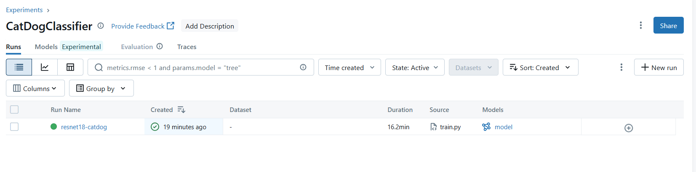

# 3. MLflow UI and Model Registry

## 🎯 Learning Objectives
- Navigate the MLflow Tracking UI effectively.
- Understand the purpose of the MLflow Model Registry.
- Register and manage multiple model versions for deployment.

---

## 🖥 Step 1: Exploring the MLflow UI

Once you start MLflow (`mlflow ui` or via Docker/Docker Compose), open:

👉 **http://localhost:5000**

The UI provides:

- **Experiments**: A collection of runs (each run represents a training execution).


- **Runs**: Detailed metrics, parameters, and artifacts for each training session.



- **Comparison**: Select multiple runs to compare metrics visually.


- **Artifacts**: Files produced by your runs (e.g., models, plots, logs). 


📌 Example: You can compare two runs with different learning rates and visualize how accuracy changes.

---

## 🛠 Step 2: Registering Models in MLflow

MLflow provides a **Model Registry** to manage multiple versions of trained models.

### Register a model (from Python)

```python
import mlflow

# Assume you already logged a model in previous steps
result = mlflow.register_model(
    "runs:/<RUN_ID>/model",  # path from a completed run
    "CatDogClassifier"       # name of the model in the registry
)
print("Registered model:", result.name, "version:", result.version)
```

Replace `<RUN_ID>` with the run ID from your MLflow experiment.


---

### Promote a model version

Models can move across **stages**:
- **None**: Default stage after registration.  
- **Staging**: For testing before production.  
- **Production**: Approved model used in production.  
- **Archived**: Old models no longer in use.  

```python
from mlflow.tracking import MlflowClient

client = MlflowClient()
client.set_registered_model_alias(
    name="CatDogClassifier",
    alias="production",
    version=1
)
```


---

## 🖥 Step 3: Managing Models in the UI

In the MLflow UI, go to the **Models** tab:

- Browse registered models.  
- View all versions of a given model.  
- Assign stages (Staging, Production, Archived).  
- Track metadata (author, date, performance metrics).  

This provides **centralized governance** for ML models.

---

## 🧩 Step 4: Using a Registered Model

Load the latest **production** model in Python:

```python
from torchvision import transforms
from PIL import Image
import torch
import mlflow.pytorch

model = mlflow.pytorch.load_model("models:/CatDogClassifier@production")
device = torch.device("cuda" if torch.cuda.is_available() else "cpu")
model.to(device)

def predict(image_path):
    image = Image.open(image_path).convert("RGB")

    transform = transforms.Compose([
        transforms.Resize((224, 224)),
        transforms.ToTensor(),
        transforms.Normalize(mean=[0.485, 0.456, 0.406], std=[0.229, 0.224, 0.225])
    ])

    image_tensor = transform(image).unsqueeze(0).to(device)

    model.eval()

    with torch.no_grad():
        output = model(image_tensor)

    probabilities = torch.nn.functional.softmax(output[0], dim=0)

    class_names = ["cat", "dog"]
    predicted_class = probabilities.argmax().item()
    confidence = probabilities[predicted_class].item()

    print(f"Predicted class: {class_names[predicted_class]}, Confidence: {confidence:.4f}")
```


---

## ✅ Summary
- The MLflow UI helps visualize and compare experiments.  
- The Model Registry provides version control for models.  
- You can promote models through stages (Staging → Production).  
- Registered models can be loaded programmatically for deployment.  