# 5. Integrating DVC with MLflow

## 🎯 Learning Objectives
- Understand how Data Version Control (DVC) and MLflow complement each other.
- Track dataset versions with DVC and associate them with MLflow runs.
- Build reproducible pipelines combining data + code + model.

---

## 📘 Why Integrate DVC and MLflow?
- **DVC** handles **datasets and preprocessing pipelines**.  
- **MLflow** tracks **experiments, metrics, and models**.  
- Together they ensure **end-to-end reproducibility**:  
  - Dataset version (DVC)  
  - Training code version (Git)  
  - Metrics, hyperparameters, model artifact (MLflow)  

---

## 🛠 Step 1: Version Your Dataset with DVC

Initialize DVC (if not already):
```bash
dvc init
```
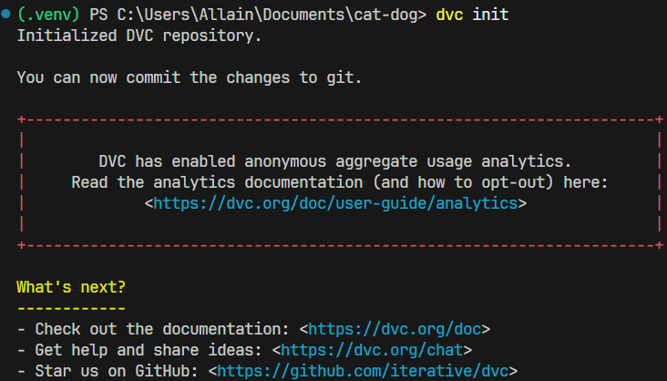

Add a dataset under version control:
```bash
dvc add data/train
dvc add data/val
git add data/*.dvc .gitignore
git commit -m "Track dataset with DVC"
```
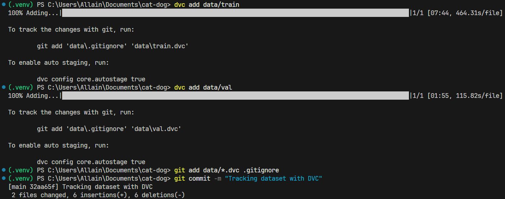

Push data to remote storage:
```bash
dvc remote add -d myremote s3://dvcstore
dvc push
```
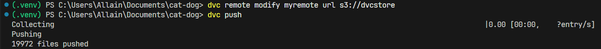

---

## 🛠 Step 2: Link Dataset Version to MLflow Run

In your training script, log the **DVC data version** (Git commit hash of `.dvc` files).

```python
import subprocess
import mlflow

# Get current git commit hash for reproducibility
def get_git_revision_hash():
    return subprocess.check_output(['git', 'rev-parse', 'HEAD']).decode('ascii').strip()

with mlflow.start_run():
    dvc_version = get_git_revision_hash()
    mlflow.log_param("dvc_dataset_version", dvc_version)
```
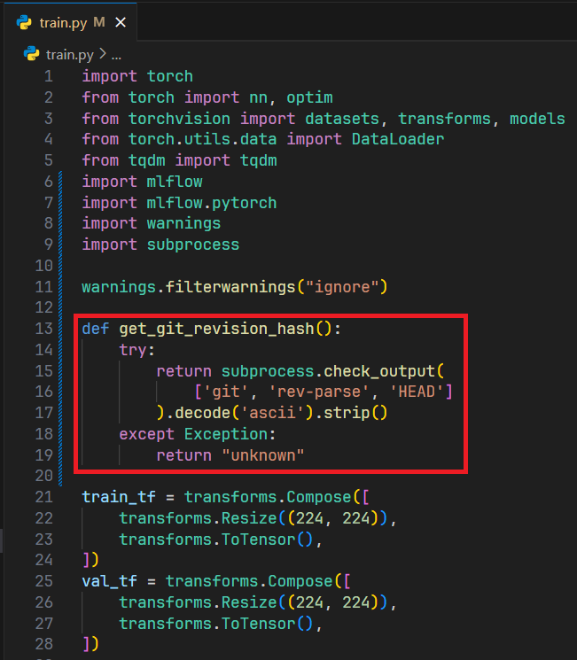

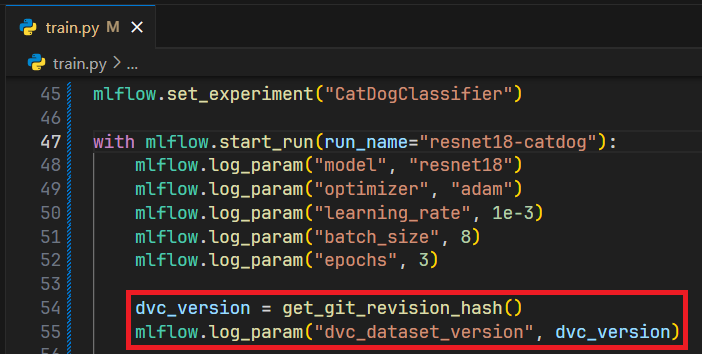

This way, every MLflow run is tied to the **exact dataset version** tracked by DVC.

---

## 🛠 Step 3: Full Workflow Example

```bash
# 1. Update dataset
dvc pull

# 2. Train model (logs run to MLflow with dataset commit hash)
python train.py

# 3. Push new dataset if changed
dvc push

# 4. Commit updates to Git
git add *.dvc train.py
git commit -m "Train with new dataset version"
git push

# 5. Launch MLflow UI to view runs
mlflow ui
```

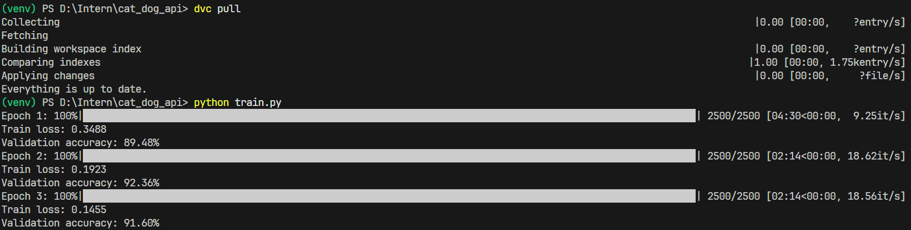
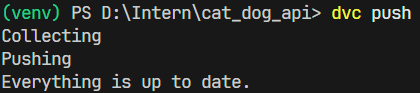
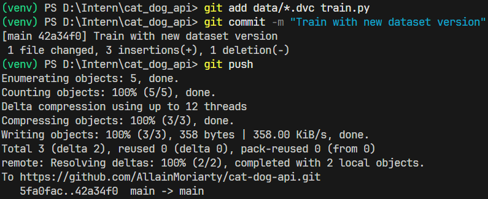
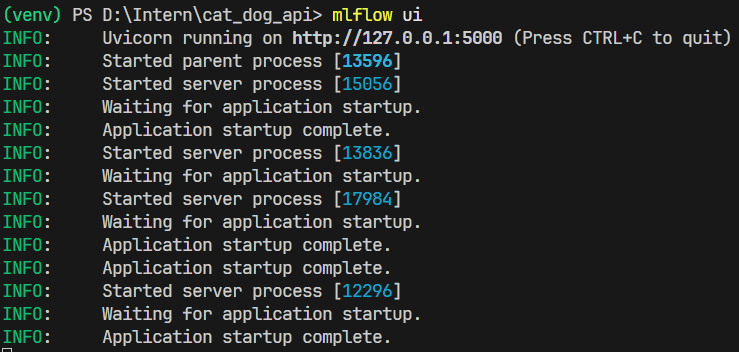

In MLflow UI (default: http://127.0.0.1:5000
), you’ll see:

- Experiment metrics and artifacts.

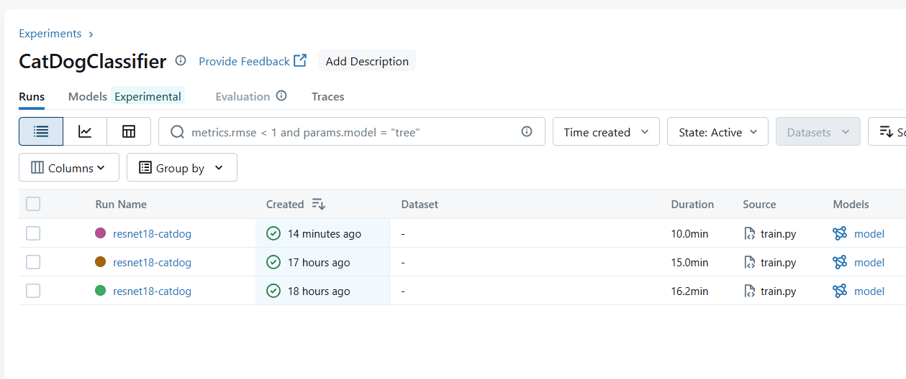
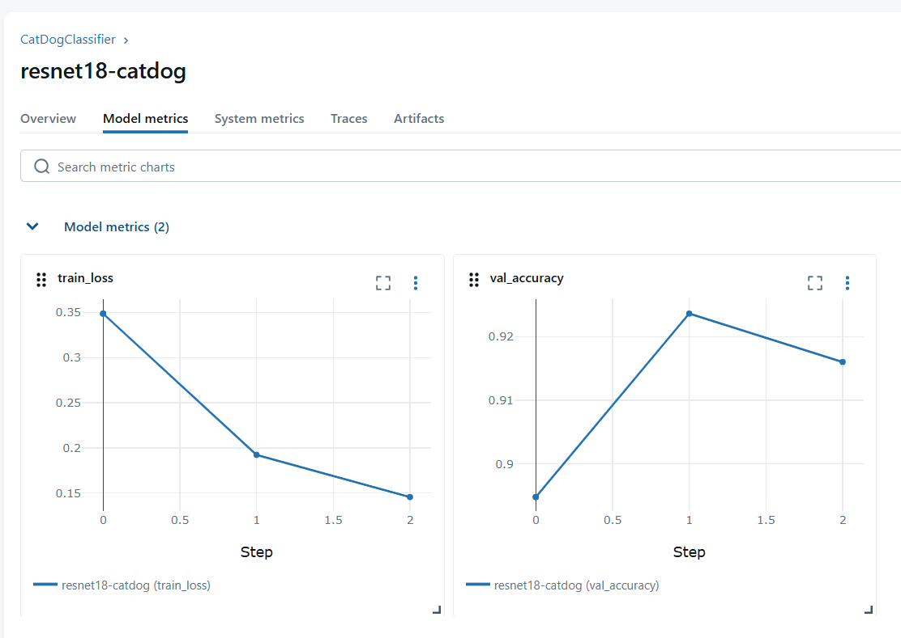
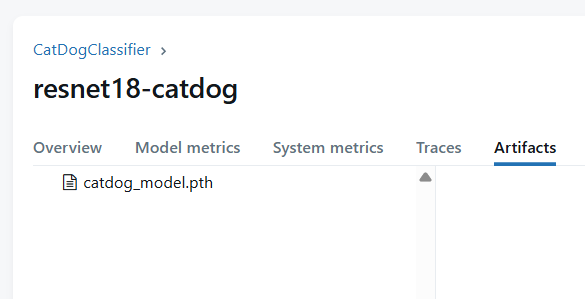

- Logged parameter dvc_dataset_version (the Git commit hash of .dvc file).

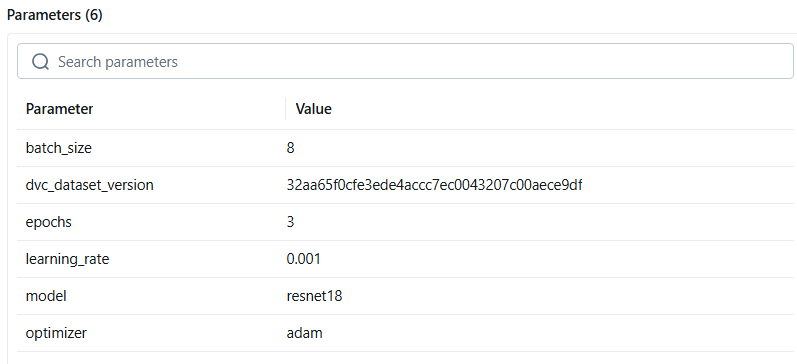

This ensures each run is tied to the exact dataset version.

## 🔁 Reproducing an Experiment
To reproduce any run:
1. Checkout the Git commit corresponding to that MLflow run.
2. Run `dvc pull` → fetch the exact dataset snapshot.
3. Re-run training → you’ll get the same metrics and artifacts.

✅ This guarantees full reproducibility across data + code + results.

---

## ✅ Summary
- DVC versions datasets; MLflow tracks experiments and models.  
- Together they link **data + code + results** in one pipeline.  
- Each MLflow run should log the dataset commit version for reproducibility.  
