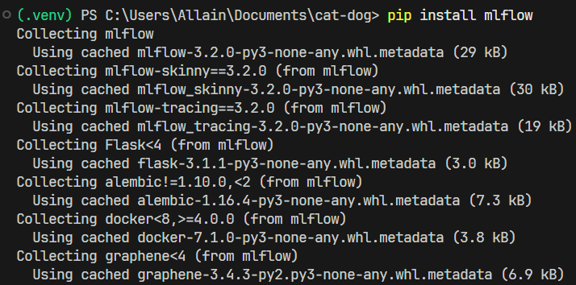
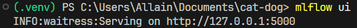
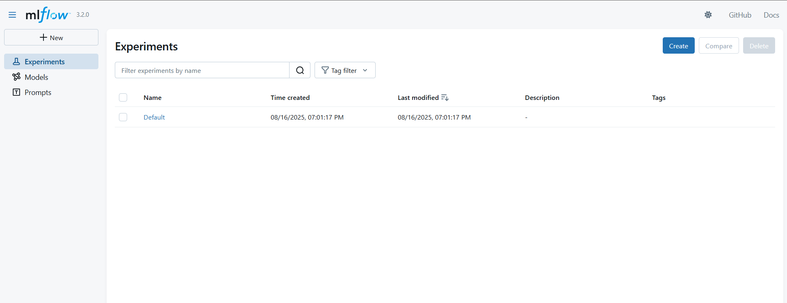
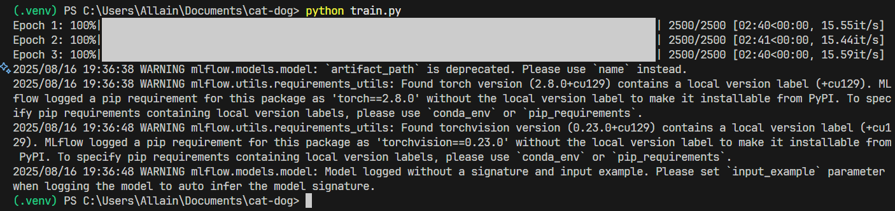
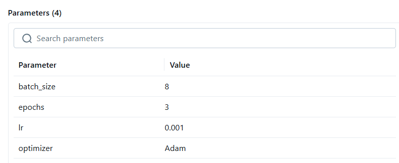
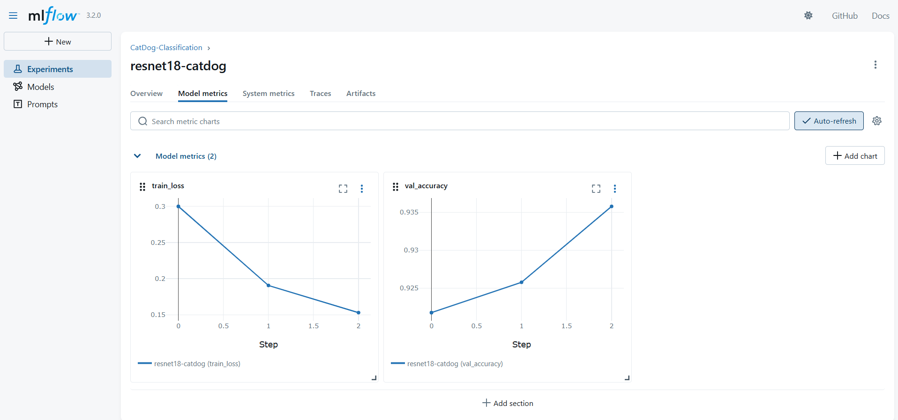
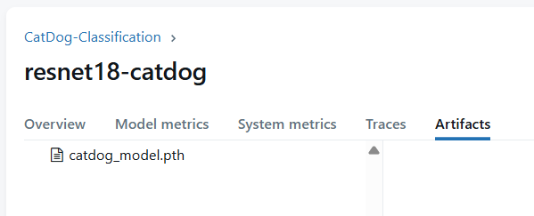

# Tracking Model Training with MLflow

MLflow is an open-source platform that helps manage the machine learning lifecycle.
In this workshop, we’ll focus on MLflow Tracking, which allows us to:

- 🔎 Log parameters (e.g., learning rate, batch size)
- 📊 Track metrics (e.g., loss, accuracy)
- 📦 Store artifacts (e.g., trained models, logs)
- 🔄 Compare multiple experiments easily

Instead of manually writing down results in spreadsheets or notes, MLflow automatically organizes and visualizes everything.

---

## 1) Install Mlflow
```bash
pip install mlflow
```



Run MLflow UI:
```bash
mlflow ui
```



Open http://localhost:5000 → here you’ll see your experiment logs.



---

## 2) Project Structure

Dataset layout:
```bash
cat-dog/
  data/
    train/
      cat/
      dog/
    val/
      cat/
      dog/
  train.py   ← our training script
```

---

## 3) How to Integrate MLflow
There are 3 main steps to enable MLflow in your training script:

Import MLflow
```python
import mlflow
import mlflow.pytorch
```
Wrap training inside mlflow.start_run()
```python
mlflow.set_experiment("CatDog-Classification")
with mlflow.start_run(run_name="resnet18-catdog"):
    ...
```
Log parameters, metrics, and model inside that block.

---

## 5) Full Training Script (train.py)
```python
import torch
from torch import nn, optim
from torchvision import datasets, transforms, models
from torch.utils.data import DataLoader
from tqdm import tqdm
import mlflow
import mlflow.pytorch

# ===== Data =====
train_tf = transforms.Compose([
    transforms.Resize((224, 224)),
    transforms.ToTensor(),
])
val_tf = transforms.Compose([
    transforms.Resize((224, 224)),
    transforms.ToTensor(),
])

train_data = datasets.ImageFolder("data/train", transform=train_tf)
val_data   = datasets.ImageFolder("data/val", transform=val_tf)

train_loader = DataLoader(train_data, batch_size=8, shuffle=True)
val_loader   = DataLoader(val_data, batch_size=8, shuffle=False)

# ===== Model =====
model = models.resnet18(weights=models.ResNet18_Weights.DEFAULT)
model.fc = nn.Linear(model.fc.in_features, 2)  # 2 classes: cat & dog

device = torch.device("cuda" if torch.cuda.is_available() else "cpu")
model.to(device)

criterion = nn.CrossEntropyLoss()
optimizer = optim.Adam(model.parameters(), lr=1e-3)

# ===== MLflow Tracking =====
mlflow.set_experiment("CatDog-Classification")

with mlflow.start_run(run_name="resnet18-catdog"):
    # Log hyperparameters
    mlflow.log_param("lr", 1e-3)
    mlflow.log_param("batch_size", 8)
    mlflow.log_param("optimizer", "Adam")
    mlflow.log_param("epochs", 3)

    for epoch in range(3):  # keep small for demo
        model.train()
        total_loss = 0.0
        for imgs, labels in tqdm(train_loader, desc=f"Epoch {epoch+1}"):
            imgs, labels = imgs.to(device), labels.to(device)
            optimizer.zero_grad()
            outputs = model(imgs)
            loss = criterion(outputs, labels)
            loss.backward()
            optimizer.step()
            total_loss += loss.item()

        avg_loss = total_loss / len(train_loader)
        mlflow.log_metric("train_loss", avg_loss, step=epoch)
        print(f"Train loss: {avg_loss:.4f}")

        # Validation
        model.eval()
        correct, total = 0, 0
        with torch.no_grad():
            for imgs, labels in val_loader:
                imgs, labels = imgs.to(device), labels.to(device)
                outputs = model(imgs)
                preds = outputs.argmax(1)
                correct += (preds == labels).sum().item()
                total += labels.size(0)
        val_acc = correct / total
        mlflow.log_metric("val_accuracy", val_acc, step=epoch)
        print(f"Validation accuracy: {val_acc:.2%}")

    # Save & log model
    torch.save(model.state_dict(), "catdog_model.pth")
    mlflow.log_artifact("catdog_model.pth")     # save .pth file
    mlflow.pytorch.log_model(model, "model")    # MLflow model format
```
---

## 6) Run Training
```bash
python train.py
```



After training, open the MLflow UI (http://localhost:5000) and explore:

- Parameters → lr, batch size, optimizer, epochs

- Metrics → train loss and validation accuracy curves

- Artifacts → catdog_model.pth and MLflow model folder


---

✨ Done! You’ve successfully integrated MLflow into PyTorch training.
Now every experiment is logged, reproducible, and ready for deployment.