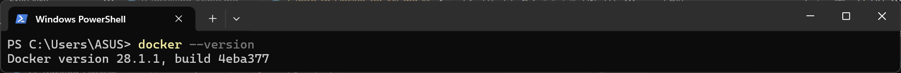

# 1. Intro to Docker for ML

## 🎯 Learning Objectives
- Understand why Docker is useful in machine learning workflows.
- Learn the basics of images, containers, and volumes.
- Build a simple Docker container for ML experiments.

---

## 📘 Why Docker for ML?

Machine Learning projects often face challenges like:
- **Environment Drift**: “It worked on my machine, but not on the server.” 
- **Dependencies Hell**: Different Python/OS/library versions.  
- **Reproducibility Issues**: Training cannot be repeated with exact results.  

✅ Docker solves these by:
- Packaging **code + dependencies + environment** into one container.  
- Ensuring consistent execution across **local, server, or cloud**.  
- Allowing easy deployment of ML models as microservices.  

---

## 🛠 Step 1: Key Concepts

- **Image** → Blueprint for containers (like a class in OOP).  
- **Container** → Running instance of an image (like an object).  
- **Volume** → Persistent storage outside the container.  
- **Dockerfile** → Instructions to build an image.  

---

## 🛠 Step 2: Install Docker

- [Download Docker Desktop](https://www.docker.com/products/docker-desktop/) (Windows/Mac).  
- For Linux:  
```bash
sudo apt update
sudo apt install docker.io -y
sudo systemctl start docker
sudo systemctl enable docker
```

Verify installation:
```bash
docker --version
```



---

## 🛠 Step 3: First Docker Container

Run a hello-world container:
```bash
docker run hello-world
```


Run a Python container:
```bash
docker run -it --rm python:3.10 bash
```


Inside the container:
```bash
python --version
exit
```


---

## 🛠 Step 4: Dockerfile for ML

Example `Dockerfile`:

```dockerfile
FROM python:3.10-slim

# Set working directory
WORKDIR /app

# Install dependencies
COPY requirements.txt .
RUN pip install --no-cache-dir -r requirements.txt

# Copy code
COPY . .

# Default command
CMD ["python", "train.py"]
```


Build the image:
```bash
docker build -t ml-workshop:latest .
```


Run the container:
```bash
docker run --rm -it ml-workshop:latest
```


---

## 🧩 Step 5: Mounting Volumes

To persist data outside containers:
**Bash (Linux/macOS):**
```bash
docker run --rm -it -v $(pwd):/app ml-workshop:latest
```

**PowerShell (Windows):**
```powershell
docker run --rm -it -v "${PWD}:/app" ml-workshop:latest
```


Now, datasets and trained models are saved on your host machine.  


---

## ✅ Summary
- Docker provides **reproducibility** and **portability** for ML projects.  
- You learned about images, containers, volumes, and Dockerfiles.  
- Next, you will create Dockerfiles tailored for ML **training and serving**.


