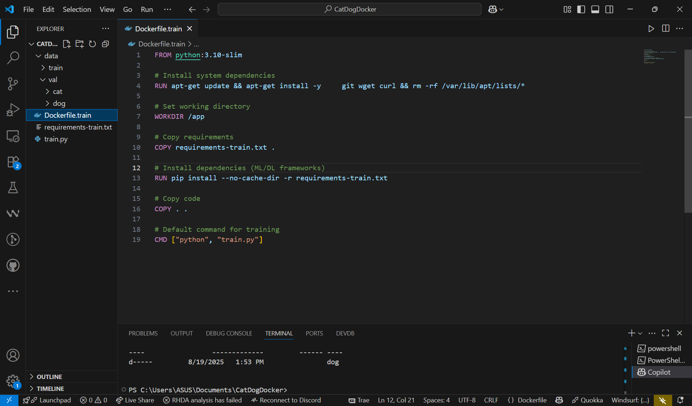
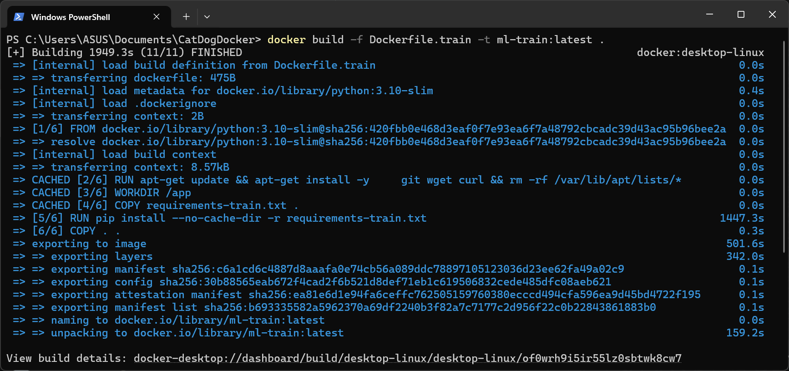
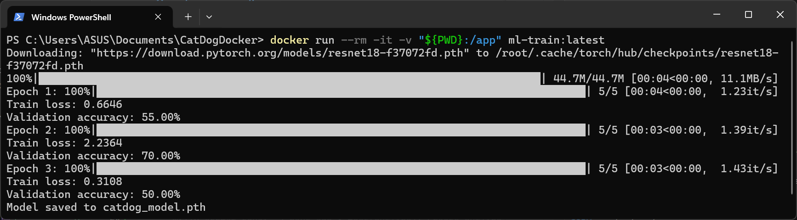
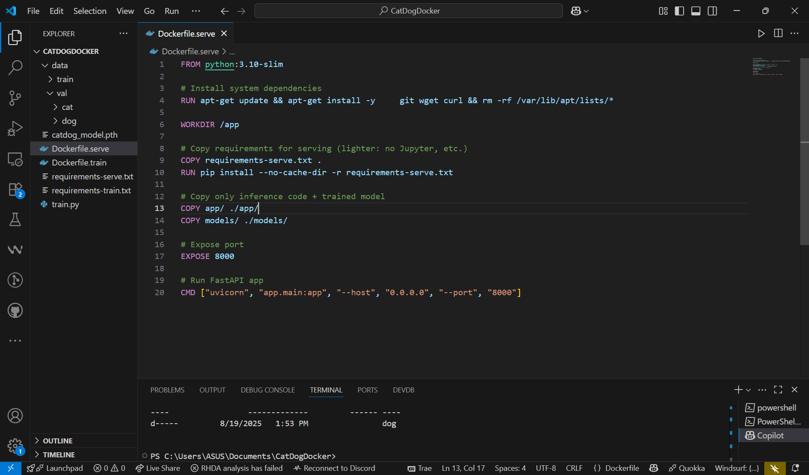
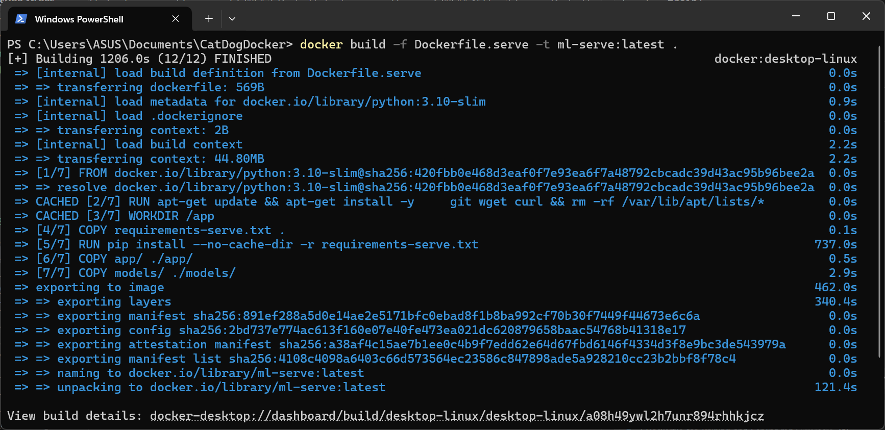
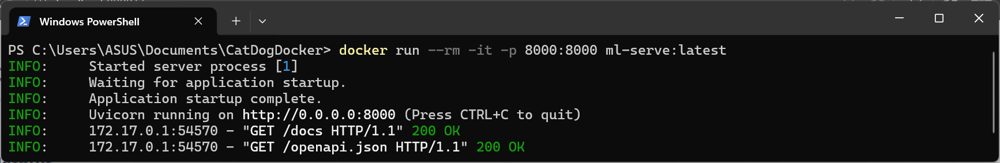
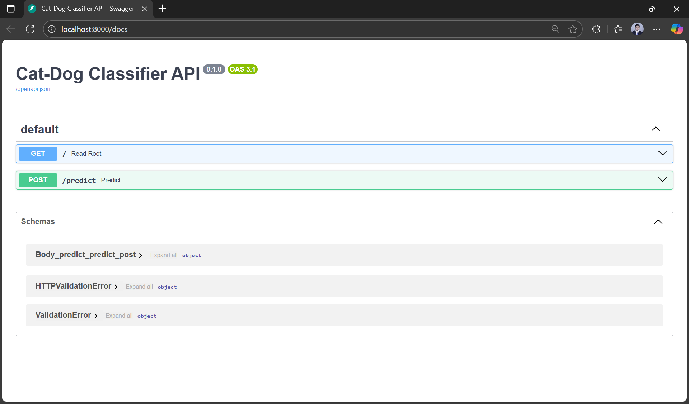
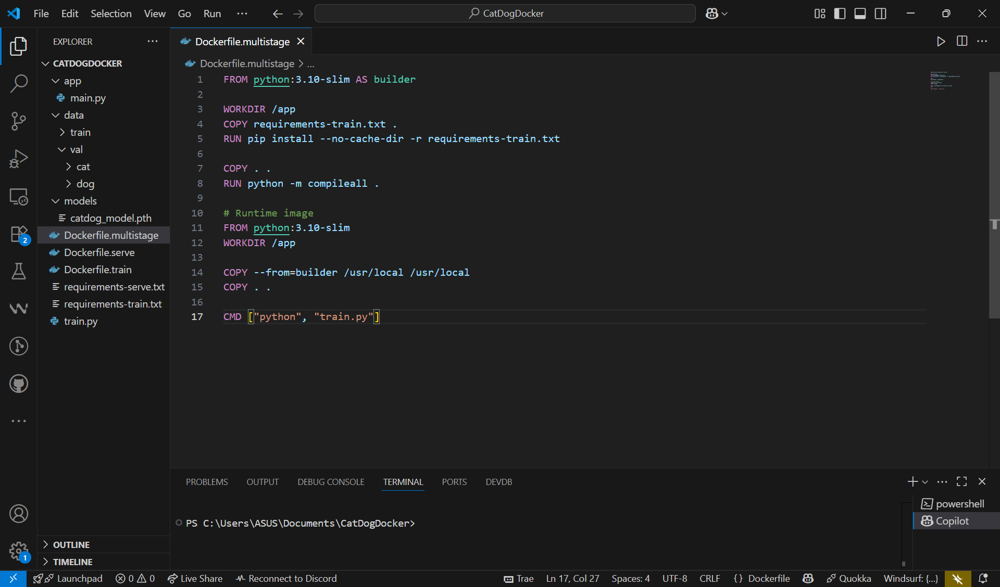
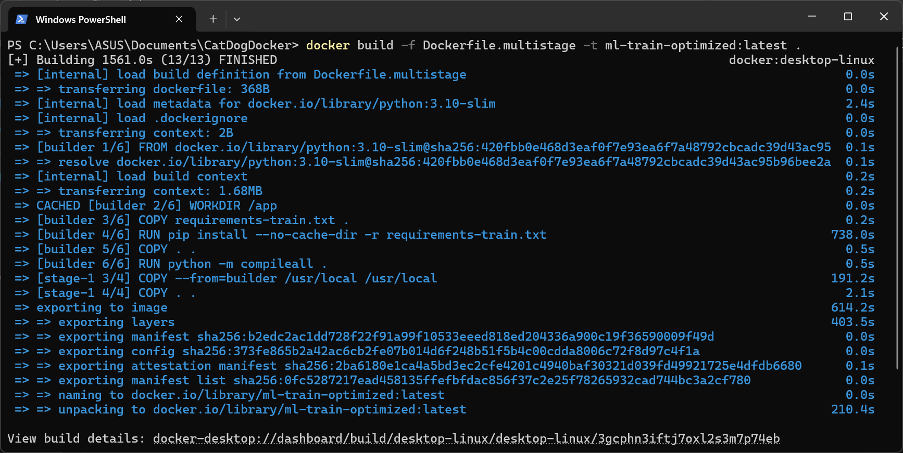
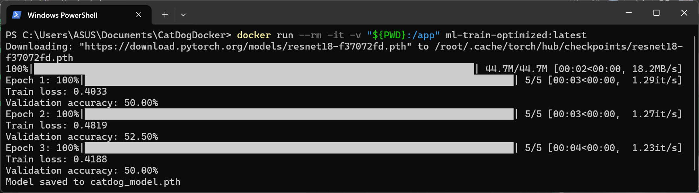

# 2. Dockerfile for Training and Serving

## 🎯 Learning Objectives
- Learn how to write Dockerfiles for ML training and serving.  
- Understand the difference between training and inference containers.  
- Build lightweight, reproducible images for deployment.  

---

## 📘 Why Separate Training and Serving?

- **Training containers**: heavy, contain PyTorch/TensorFlow, data science libraries, used offline for experiments.  
- **Serving containers**: lightweight, optimized for inference (FastAPI, Flask, TorchServe).  

This separation makes pipelines more efficient and production-ready.  

---

## 🛠 Step 1: Training Dockerfile

Example `Dockerfile.train`:

```dockerfile
FROM python:3.10-slim

# Install system dependencies
RUN apt-get update && apt-get install -y     git wget curl && rm -rf /var/lib/apt/lists/*

# Set working directory
WORKDIR /app

# Copy requirements
COPY requirements-train.txt .

# Install dependencies (ML/DL frameworks)
RUN pip install --no-cache-dir -r requirements-train.txt

# Copy code
COPY . .

# Default command for training
CMD ["python", "train.py"]
```



Build the image:
```bash
docker build -f Dockerfile.train -t ml-train:latest .
```



Run training:
**Bash (Linux/macOS):**
```bash
docker run --rm -it -v $(pwd):/app ml-train:latest
```

**PowerShell (Windows):**
```powershell
docker run --rm -it -v "${PWD}:/app" ml-train:latest
```



---

## 🛠 Step 2: Serving Dockerfile

Example `Dockerfile.serve`:

```dockerfile
FROM python:3.10-slim

# Install system dependencies
RUN apt-get update && apt-get install -y     git wget curl && rm -rf /var/lib/apt/lists/*

WORKDIR /app

# Copy requirements for serving (lighter: no Jupyter, etc.)
COPY requirements-serve.txt .
RUN pip install --no-cache-dir -r requirements-serve.txt

# Copy only inference code + trained model
COPY app/ ./app/
COPY models/ ./models/

# Expose port
EXPOSE 8000

# Run FastAPI app
CMD ["uvicorn", "app.main:app", "--host", "0.0.0.0", "--port", "8000"]
```



Build the image:
```bash
docker build -f Dockerfile.serve -t ml-serve:latest .
```



Run serving:
```bash
docker run --rm -it -p 8000:8000 ml-serve:latest
```



Access the API at 👉 http://localhost:8000/docs  



---

## 🛠 Step 3: Multi-stage Build (Optional)

Reduce image size by separating build & runtime layers:

Example `Dockerfile.multistage`:
```dockerfile
FROM python:3.10-slim AS builder

WORKDIR /app
COPY requirements-train.txt .
RUN pip install --no-cache-dir -r requirements-train.txt

COPY . .
RUN python -m compileall .

# Runtime image
FROM python:3.10-slim
WORKDIR /app

COPY --from=builder /usr/local /usr/local
COPY . .

CMD ["python", "train.py"]
```



Build the image:
```bash
docker build -f Dockerfile.multistage -t ml-train-optimized:latest .
```



Run the optimized training:
**Bash (Linux/macOS):**
```bash
docker run --rm -it -v $(pwd):/app ml-train-optimized:latest
```

**PowerShell (Windows):**
```powershell
docker run --rm -it -v "${PWD}:/app" ml-train-optimized:latest
```



---

## ✅ Summary
- Training and serving should use **different Dockerfiles**.  
- Training: heavy, includes ML frameworks.  
- Serving: lightweight, focused on inference.  
- Multi-stage builds reduce size and improve portability.
