# 3. Building and Tagging Images

## 🎯 Learning Objectives
- Learn how to build Docker images for ML workflows.  
- Understand best practices for tagging images.  
- Push images to a registry for sharing and deployment.  

---

## 🛠 Step 1: Building Docker Images

From the project root (with a Dockerfile present):

```bash
docker build -f <Dockerfile Name> -t ml-app:latest .
```

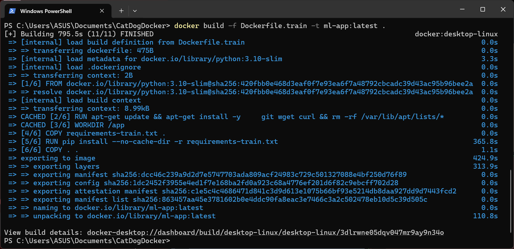

- `-t` → assigns a name (tag) to the image.  
- `ml-app` → repository name (local image name).  
- `latest` → tag (version label).  

Check images:
```bash
docker images
```

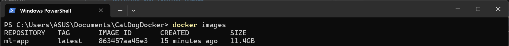

---

## 🛠 Step 2: Tagging Best Practices

Instead of using only `latest`, tag with **semantic versions or Git commits**.

Examples:
```bash
docker build -f <Dockerfile Name> -t ml-app:1.0.0 .
docker build -f <Dockerfile Name> -t ml-app:1.0.1 .
docker build -f <Dockerfile Name> -t ml-app:$(git rev-parse --short HEAD) .
```

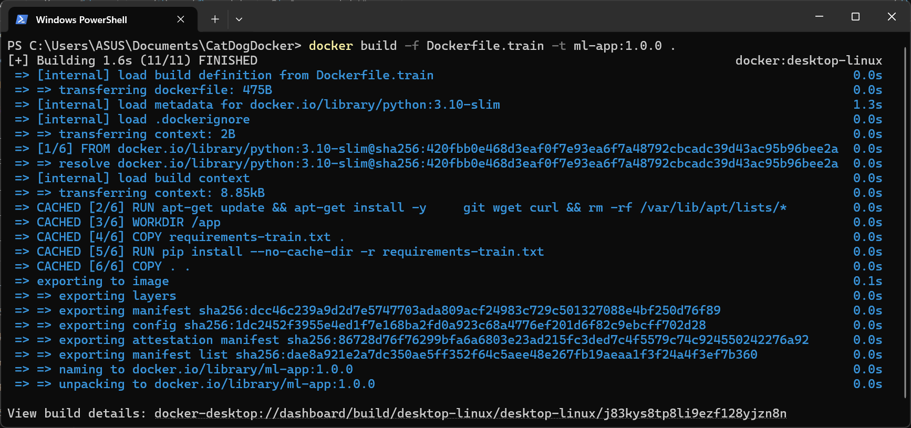

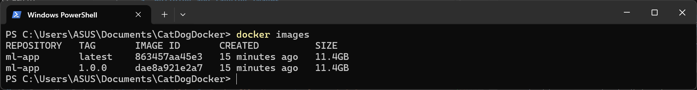

📌 Recommendation:  
- Use **semantic versioning** (1.0.0, 1.1.0, etc.) for releases.  
- Use **Git commit hash** for reproducibility.  
- Keep `latest` as the most recent build.  

---

## 🛠 Step 3: Running Images

Run the image locally:
```bash
docker run --rm -it ml-app:1.0.0
```

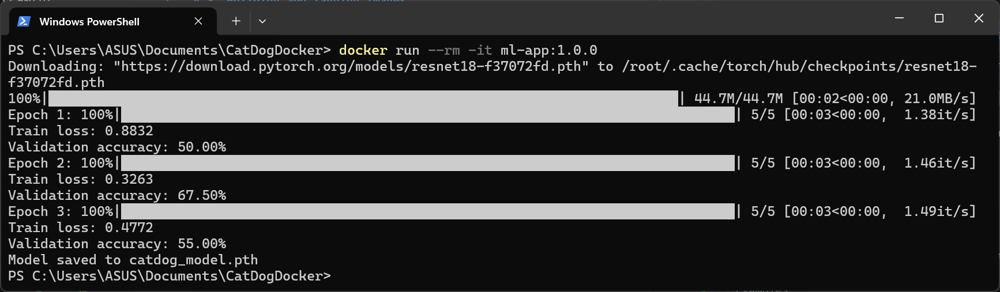

Map ports for APIs:
```bash
docker run --rm -it -p 8000:8000 ml-serve:1.0.0
```

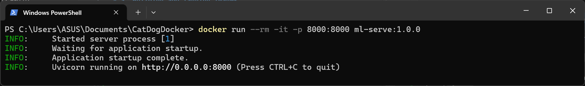

Mount volumes for data/models:
**Bash (Linux/macOS):**
```bash
docker run --rm -it -v $(pwd):/app ml-train:1.0.0
```

**PowerShell (Windows):**
```powershell
docker run --rm -it -v "${PWD}:/app" ml-train:1.0.0
```

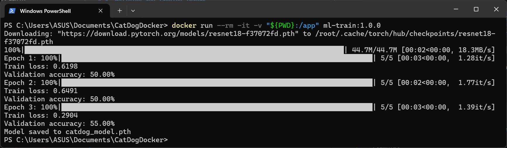

---

## 🛠 Step 4: Pushing to a Registry

### Docker Hub
1. Login:
```bash
docker login
```

>If there are "net/http: TLS handshake timeout" errors, try:

>```bash
>wsl --shutdown
>```
>Then restart Docker Desktop.
>After restarting, try logging in again.

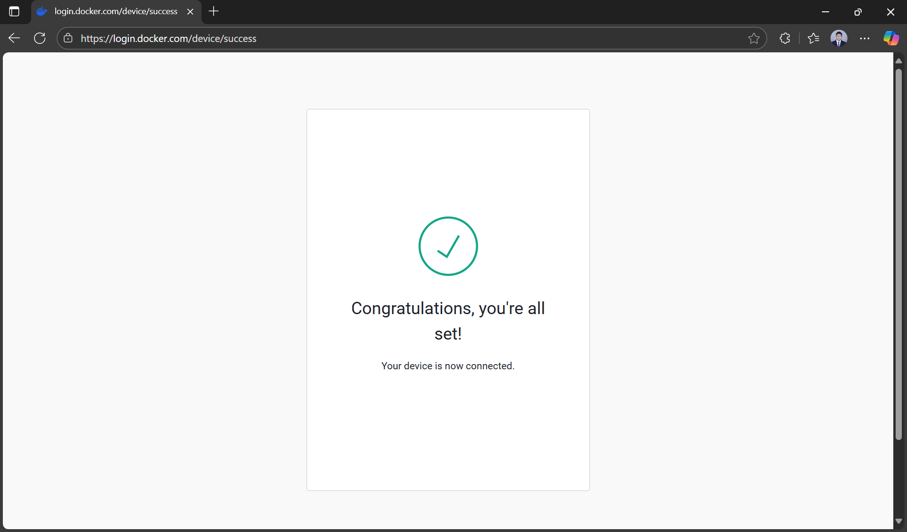

2. Tag the image:
```bash
docker tag ml-app:1.0.0 your-dockerhub-username/ml-app:1.0.0
```

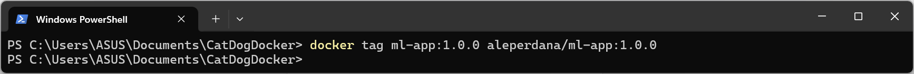

3. Push:
```bash
docker push your-dockerhub-username/ml-app:1.0.0
```

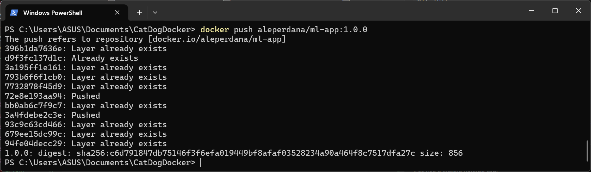

### GitHub Container Registry (GHCR)
```bash
docker tag ml-app:1.0.0 ghcr.io/<username>/ml-app:1.0.0
docker push ghcr.io/<username>/ml-app:1.0.0
```

> If you get "denied" errors from ghcr.io:
> 
> 1. **Login with username:**
>    ```bash
>    docker login ghcr.io -u <username>
>    ```
> 
> 2. **Use Personal Access Token as password:**
>    - Go to [GitHub Settings](https://github.com/settings/tokens)
>    - Select "Personal Access Tokens" > "Generate New Token (classic)"
>    - Enable permissions: `read:packages`, `write:packages`, `delete:packages`
>    - Enter the generated token as password when prompted


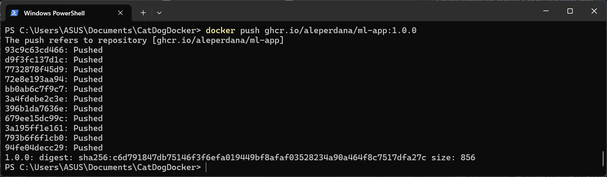

---

## 🧩 Step 5: Automating with CI/CD

In your CI/CD pipeline (e.g., GitHub Actions, GitLab CI):
- Build Docker images automatically on push.  
- Tag with both `latest` and commit hash.  
- Push to Docker Hub or GHCR.  

Example GitHub Actions step:
```yaml
- name: Build and push Docker image
  uses: docker/build-push-action@v5
  with:
    push: true
    tags: |
      ghcr.io/${{ github.repository }}/ml-app:latest
      ghcr.io/${{ github.repository }}/ml-app:${{ github.sha }}
```

---

## ✅ Summary
- Use `docker build` to create images.  
- Always tag images with **version numbers** or **commit hashes**.  
- Push images to a registry for sharing and deployment.  
- Automate builds in CI/CD for consistency.


