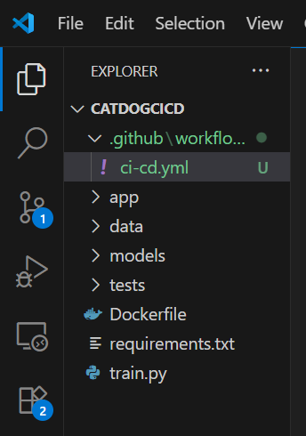
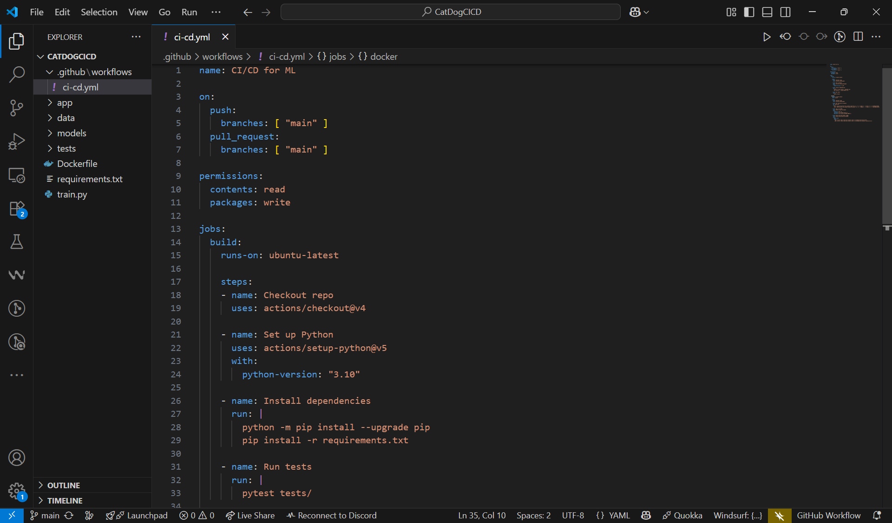
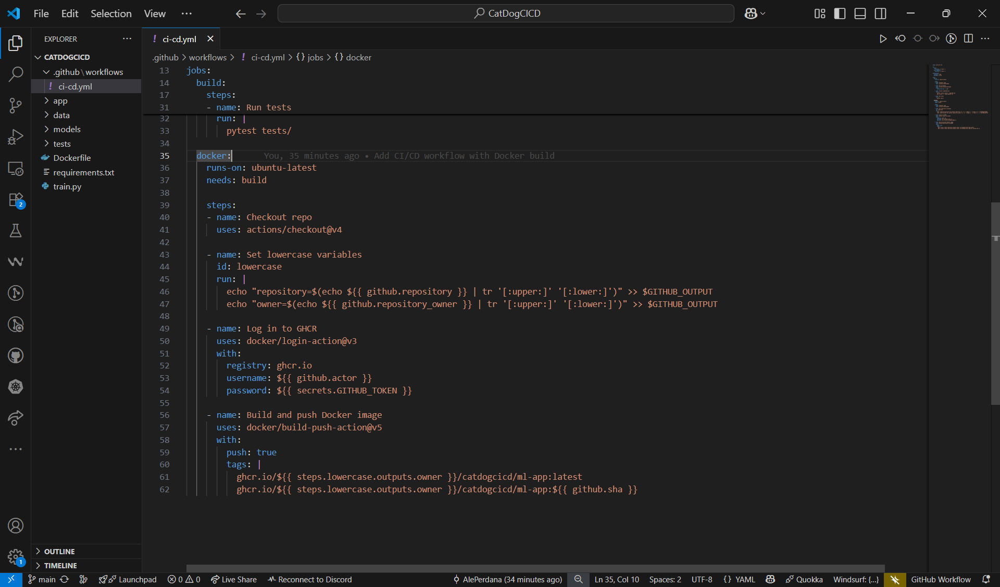
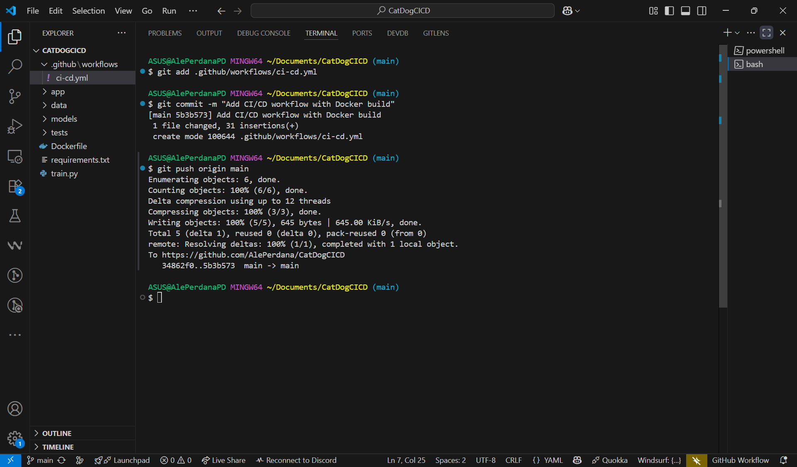
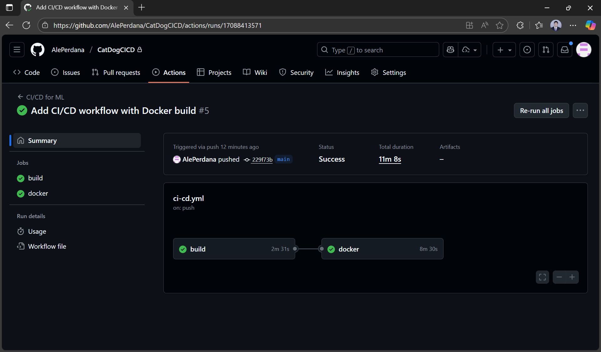
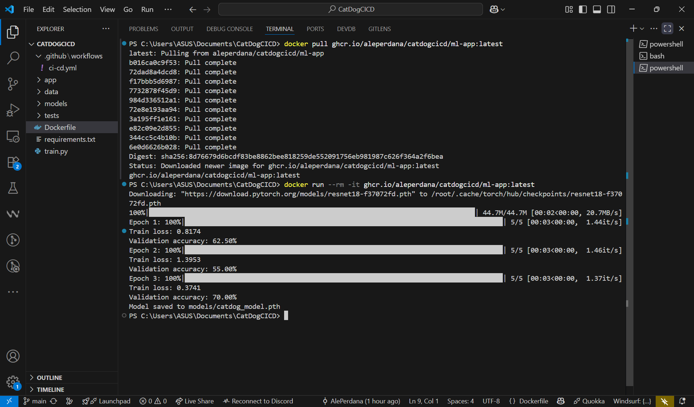

# 4. CI/CD with GitHub Actions

## 🎯 Learning Objectives
- Understand how Continuous Integration (CI) and Continuous Deployment (CD) apply to ML projects.  
- Learn to set up GitHub Actions for automated testing, building, and deployment.  
- Automate Docker builds and push images to a registry.  

---

## 📋 Prerequisites

Before starting this tutorial, ensure you have:
- ✅ A **GitHub repository** for your ML project
- ✅ Local project connected to GitHub with `git remote`
- ✅ Project structure with `requirements.txt`, training scripts, and Dockerfiles
- ✅ Basic `tests/` folder with at least one test file

**Quick setup:**
```bash
git init
git add .
git commit -m "Initial commit"
git remote add origin https://github.com/your-username/your-repo.git
git push -u origin main
```

---

## 📘 Why CI/CD for ML?

Machine Learning projects need CI/CD to:  
- Run **tests** automatically (data checks, unit tests, training sanity checks).  
- Ensure **reproducibility** (build Docker images the same way each time).  
- Automate **deployment** of models and APIs.  

---

## 🛠 Step 1: GitHub Actions Basics

Workflows are defined in `.github/workflows/` as YAML files.  

Example folder structure:
```
.github/
└── workflows/
    └── ci-cd.yml
```



---

## 🛠 Step 2: Simple Workflow for ML

```yaml
name: CI/CD for ML

on:
  push:
    branches: [ "main" ]
  pull_request:
    branches: [ "main" ]

permissions:
  contents: read
  packages: write

jobs:
  build:
    runs-on: ubuntu-latest

    steps:
    - name: Checkout repo
      uses: actions/checkout@v4

    - name: Set up Python
      uses: actions/setup-python@v5
      with:
        python-version: "3.10"

    - name: Install dependencies
      run: |
        python -m pip install --upgrade pip
        pip install -r requirements.txt

    - name: Run tests
      run: |
        pytest tests/
```



>This workflow installs dependencies and runs unit tests on every push/PR.  

---

## 🛠 Step 3: Build & Push Docker Image

Add a job to build Docker images and push to GitHub Container Registry (GHCR):

```yaml
  docker:
    runs-on: ubuntu-latest
    needs: build

    steps:
    - name: Checkout repo
      uses: actions/checkout@v4

    - name: Set lowercase variables
      id: lowercase
      run: |
        echo "repository=$(echo ${{ github.repository }} | tr '[:upper:]' '[:lower:]')" >> $GITHUB_OUTPUT
        echo "owner=$(echo ${{ github.repository_owner }} | tr '[:upper:]' '[:lower:]')" >> $GITHUB_OUTPUT

    - name: Log in to GHCR
      uses: docker/login-action@v3
      with:
        registry: ghcr.io
        username: ${{ github.actor }}
        password: ${{ secrets.GITHUB_TOKEN }}

    - name: Build and push Docker image
      uses: docker/build-push-action@v5
      with:
        push: true
        tags: |
          ghcr.io/${{ steps.lowercase.outputs.owner }}/catdogcicd/ml-app:latest
          ghcr.io/${{ steps.lowercase.outputs.owner }}/catdogcicd/ml-app:${{ github.sha }}
```



**Save and commit the workflow:**
```bash
# Add the workflow file
git add .github/workflows/ci-cd.yml

# Commit changes
git commit -m "Add CI/CD workflow with Docker build"

# Push to GitHub (this triggers the workflow)
git push origin main
```



**View workflow execution:**
1. Go to your GitHub repository
2. Click the **"Actions"** tab
3. Click on the latest workflow run
4. Watch the build and docker jobs execute



**Check the built image:**
After successful execution, your image will be available at:
```
ghcr.io/your-username/your-repo-name/ml-app:latest
```

**Test the workflow locally (optional):**
```bash
# Pull the built image
docker pull ghcr.io/your-username/your-repo-name/ml-app:latest

# Run the image
docker run --rm -it ghcr.io/your-username/your-repo-name/ml-app:latest
```



---

## 🧩 Step 4: Extending the Workflow

- Add **data validation** (Great Expectations).  
- Run **linting** (flake8, black).  
- Deploy model API automatically with **Docker Compose** on a server.  
- Set up **monitoring** and **alerting** for model performance.
- Implement **A/B testing** for model versions.
- Add **security scanning** for containers and dependencies. 

---

## ✅ Summary
- GitHub Actions enables automated testing, building, and deployment.  
- You can build & tag Docker images on every push.  
- Upload trained models as artifacts or deploy them automatically.