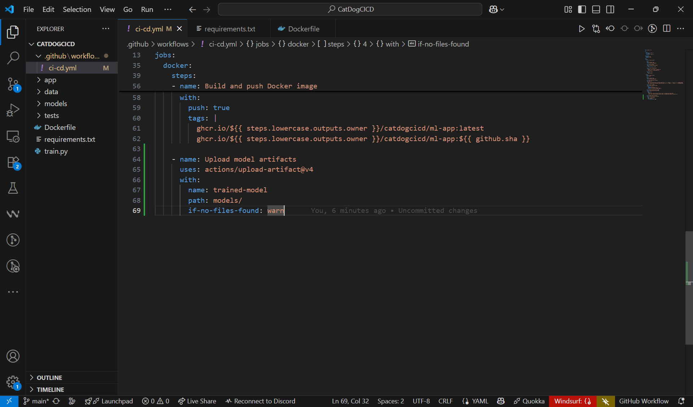
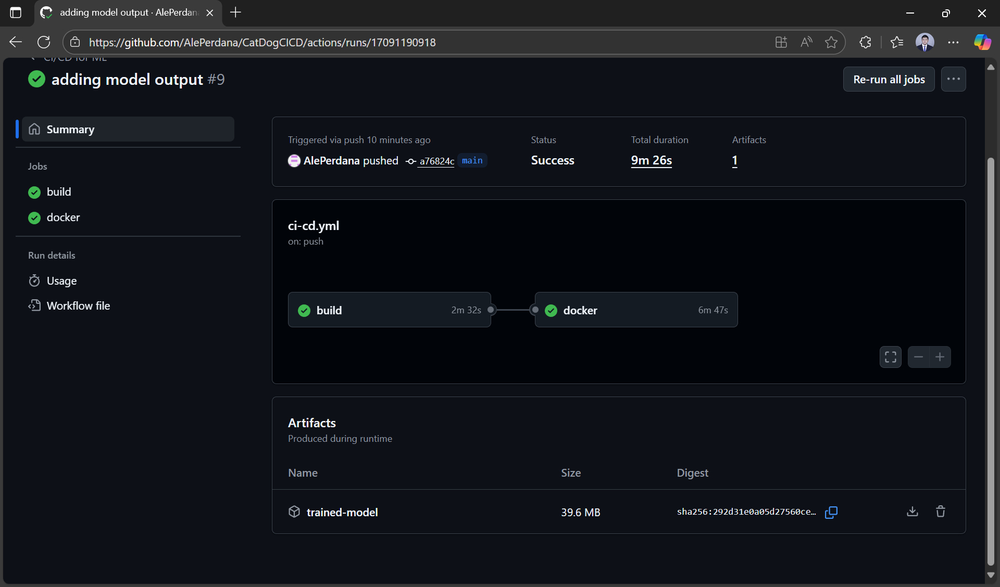
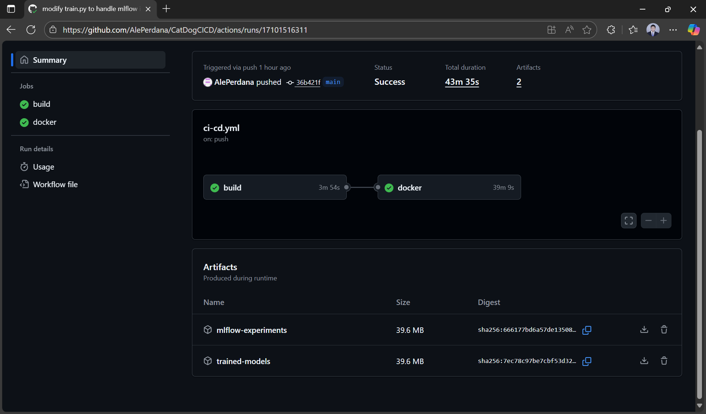
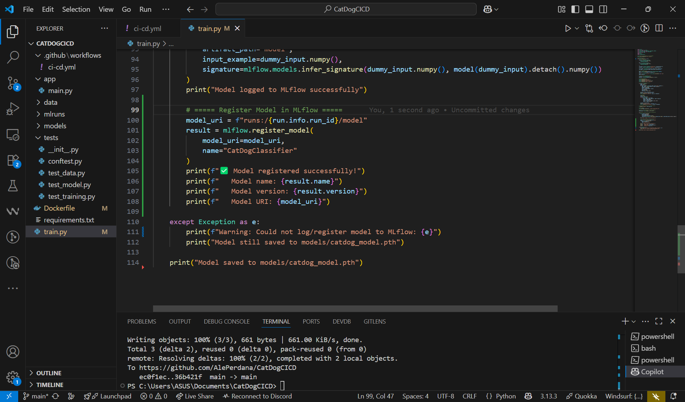

# 5. Publishing Artifacts and MLflow in CI

## 🎯 Learning Objectives
- Learn how to save and publish trained models and logs as CI artifacts.  
- Understand how to integrate MLflow with CI/CD workflows.  
- Automate model registration and experiment tracking.  

---

## 📘 Why Publish Artifacts?

In CI/CD workflows, artifacts allow you to:
- Store trained models (`.pth`, `.pkl`, `.onnx`) for later use.  
- Save experiment logs, plots, and metrics.  
- Share results with your team directly from the CI system.  

Combined with MLflow, artifacts create a complete **model lineage**:  
data → code → experiment → model → deployment.  

---

## 🛠 Step 1: Uploading Artifacts in GitHub Actions

Example workflow step to upload trained model:

```yaml
- name: Upload trained model
  uses: actions/upload-artifact@v4
  with:
    name: trained-model
    path: models/
```



Artifacts will be available for download in the GitHub Actions UI.



---

## 🛠 Step 2: MLflow in CI/CD

### Option 1: Using MLflow Server

For teams with a dedicated MLflow server running:

```yaml
- name: Train model with MLflow server
  env:
    MLFLOW_TRACKING_URI: http://mlflow-server:5000
  run: |
    pip install mlflow
    python train.py
```

### Option 2: Local Training + CI/CD Artifacts

For local training with CI/CD artifact publishing:

**2. CI/CD processes the results:**
```yaml
- name: Setup MLflow environment
  run: |
    pip install mlflow
    mkdir -p mlruns

- name: Process MLflow results
  env:
    MLFLOW_TRACKING_URI: file:./mlruns
  run: |
    python train.py

- name: Upload MLflow experiments
  uses: actions/upload-artifact@v4
  with:
    name: mlflow-experiments
    path: mlruns/
```



> **💡 Choose your approach:** Use Option A for centralized team workflows with MLflow infrastructure, or Option B for individual development with CI/CD artifact sharing.

---

## 🛠 Step 3: Registering Model in MLflow from CI

After training, register the model automatically:

```python
import mlflow

result = mlflow.register_model(
    "runs:/<RUN_ID>/model",
    "CatDogClassifier"
)
print("Registered model:", result.name, "version:", result.version)
```



This ensures new models are tracked and versioned automatically.


---

## 🛠 Step 4: Example Workflow

Here's an example of completed workflow that combines testing, MLflow tracking, artifact publishing, and Docker deployment:

```yaml
name: CI/CD for ML

on:
  push:
    branches: [ "main" ]
  pull_request:
    branches: [ "main" ]

permissions:
  contents: read
  packages: write

jobs:
  build:
    runs-on: ubuntu-latest

    steps:
    - name: Checkout repo
      uses: actions/checkout@v4

    - name: Set up Python
      uses: actions/setup-python@v5
      with:
        python-version: "3.10"

    - name: Install dependencies
      run: |
        python -m pip install --upgrade pip
        pip install -r requirements.txt

    - name: Run tests
      run: |
        pytest tests/

    - name: Setup MLflow environment
      run: |
        pip install mlflow
        mkdir -p mlruns

    - name: Process MLflow results
      env:
        MLFLOW_TRACKING_URI: file:./mlruns
      run: |
        python train.py

    - name: Upload MLflow experiments
      uses: actions/upload-artifact@v4
      with:
        name: mlflow-experiments
        path: mlruns/

    - name: Upload trained models
      uses: actions/upload-artifact@v4
      with:
        name: trained-models
        path: models/

  docker:
    runs-on: ubuntu-latest
    needs: build
    
    if: github.event_name == 'push' && github.ref == 'refs/heads/main'

    steps:
    - name: Checkout repo
      uses: actions/checkout@v4

    - name: Download trained models
      uses: actions/download-artifact@v4
      with:
        name: trained-models
        path: models/

    - name: Set lowercase variables
      id: lowercase
      run: |
        echo "repository=$(echo ${{ github.repository }} | tr '[:upper:]' '[:lower:]')" >> $GITHUB_OUTPUT
        echo "owner=$(echo ${{ github.repository_owner }} | tr '[:upper:]' '[:lower:]')" >> $GITHUB_OUTPUT

    - name: Log in to GHCR
      uses: docker/login-action@v3
      with:
        registry: ghcr.io
        username: ${{ github.actor }}
        password: ${{ secrets.GITHUB_TOKEN }}

    - name: Build and push Docker image
      uses: docker/build-push-action@v5
      with:
        push: true
        tags: |
          ghcr.io/${{ steps.lowercase.outputs.owner }}/catdogcicd/ml-app:latest
          ghcr.io/${{ steps.lowercase.outputs.owner }}/catdogcicd/ml-app:${{ github.sha }}
        
        cache-from: type=gha
        cache-to:
```

## 🔄 How This Workflow Works

### Stage 1: Build & Test (`build` job)
1. **Code Quality**: Runs tests to ensure code reliability
2. **ML Training**: Executes `train.py` with MLflow experiment tracking
3. **Artifact Collection**: Saves both MLflow experiments and trained models
4. **Universal Execution**: Runs on every push and pull request

### Stage 2: Docker Deployment (`docker` job)
1. **Conditional Trigger**: Only runs on main branch pushes
2. **Model Retrieval**: Downloads trained models from the previous job
3. **Container Building**: Creates Docker image with the trained model
4. **Registry Publishing**: Pushes to GitHub Container Registry with version tags

---

## ✅ Summary
- CI pipelines can **publish trained models as artifacts** for download.  
- MLflow logs all metrics, parameters, and artifacts automatically.  
- You can register models in MLflow directly from CI/CD.  
- This creates a reliable, automated **MLOps workflow**.