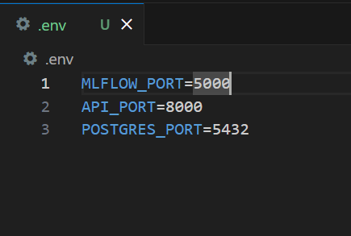
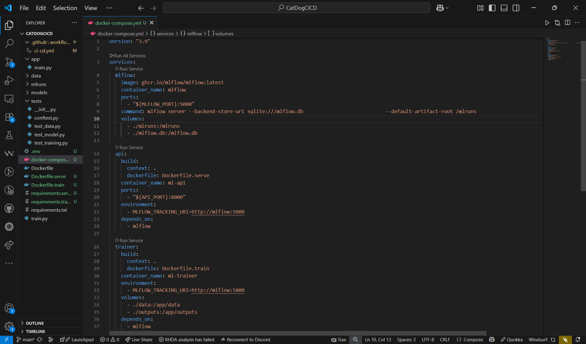
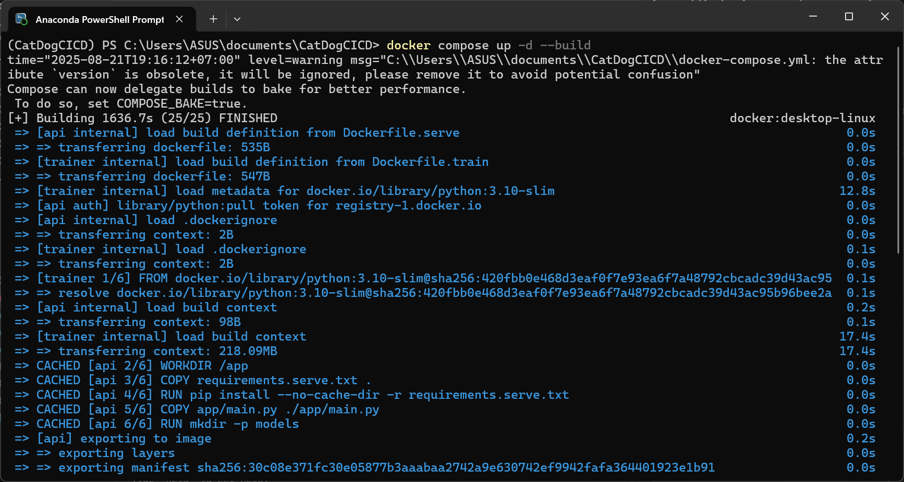
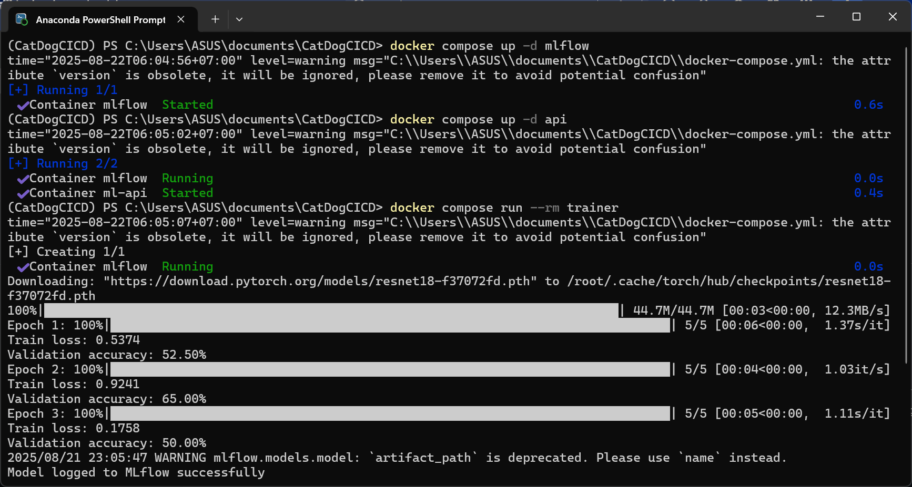
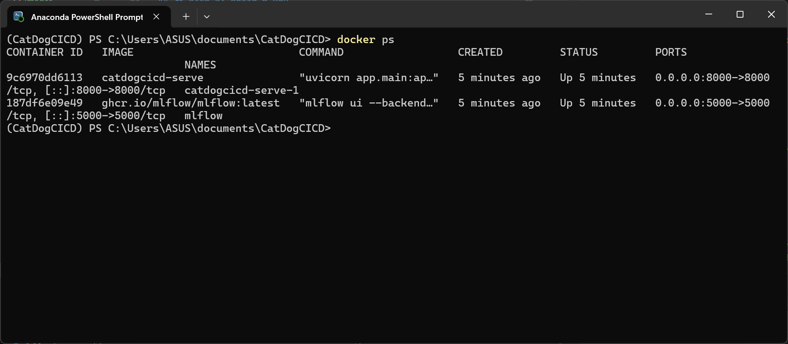
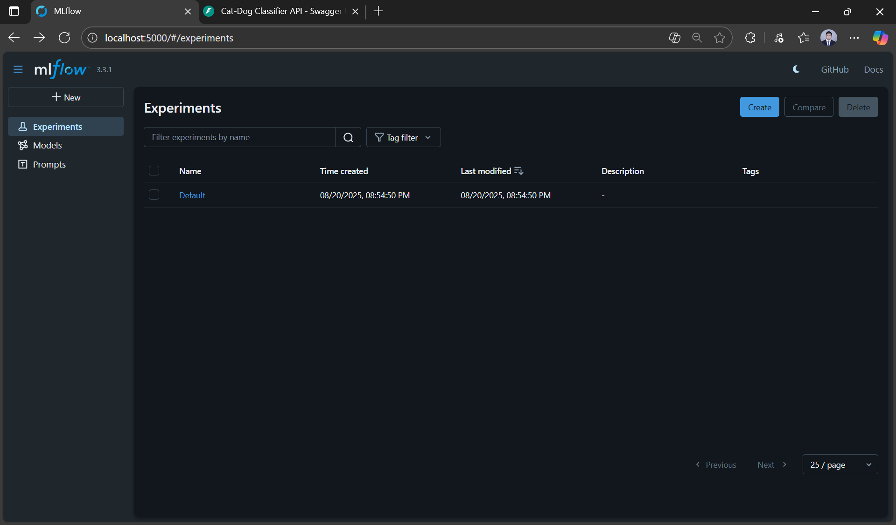
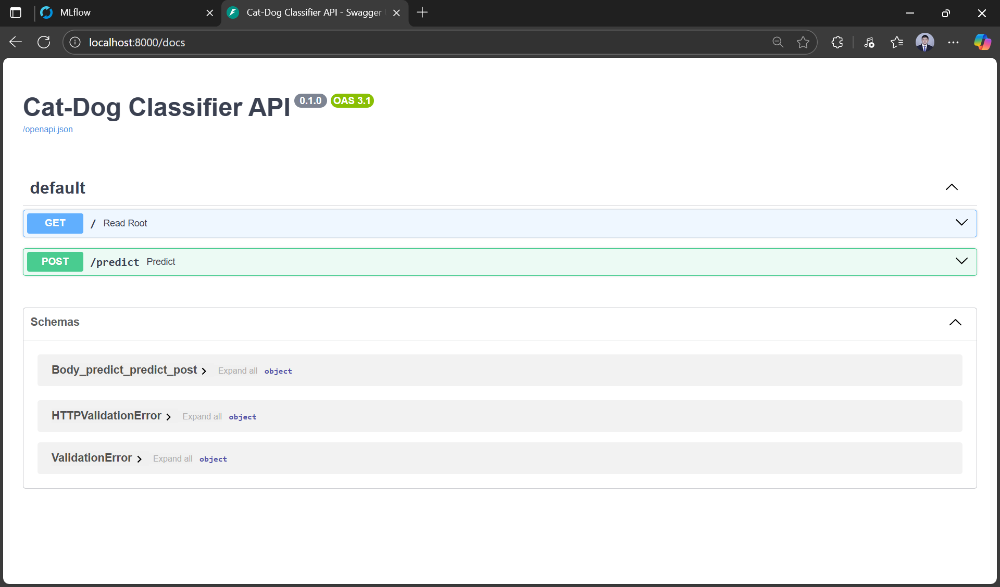
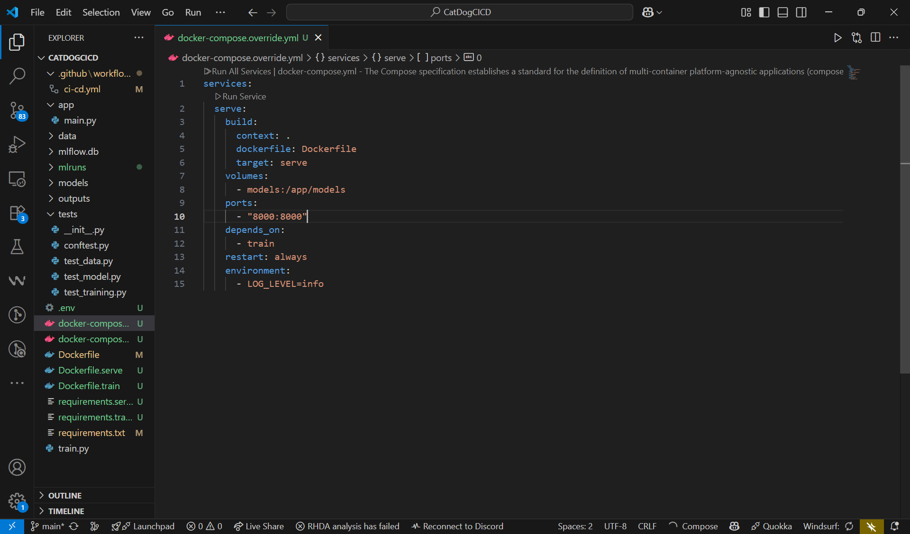
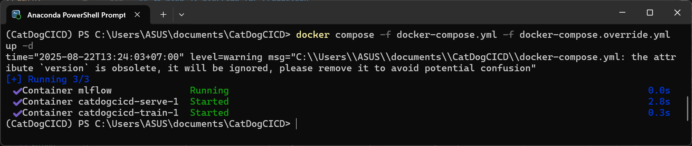
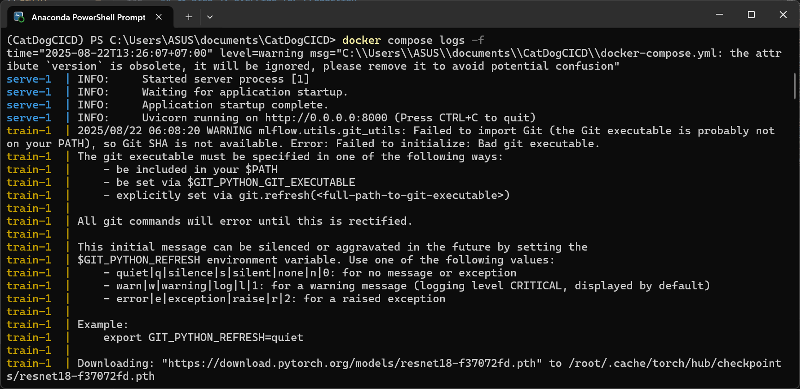

# 6. Preparing for Docker Compose Release

## 🎯 Learning Objectives
- Learn how to orchestrate ML services using Docker Compose.  
- Prepare training, serving, and MLflow services for integration.  
- Define environment variables, volumes, and networks for reproducibility.  

---

## 📘 Why Docker Compose for ML?

- Run **multiple services** (MLflow, training container, serving API, database) together.  
- Simplifies local testing of production-like environments.  
- Provides **reproducible deployments** across teams.  

---

## 🛠 Step 1: Define `.env` File

Centralize configuration in `.env`:

```env
MLFLOW_PORT=5000
API_PORT=8000
POSTGRES_PORT=5432
```



>This allows different configurations for development and production environments.

---

## 🛠 Step 2: Example `docker-compose.yml`

This docker compose uses multi-stage build to separate training and serving:

```yaml
version: "3.9"

services:
  train:
    build:
      context: .
      dockerfile: Dockerfile
      target: train
    volumes:
      - models:/app/models
      - ./mlruns:/app/mlruns
    environment:
      - MLFLOW_TRACKING_URI=file:///app/mlruns
    command: ["python", "train.py"]

  serve:
    build:
      context: .
      dockerfile: Dockerfile
      target: serve
    volumes:
      - models:/app/models
    ports:
      - "8000:8000"
    depends_on:
      - train

  mlflow:
    image: ghcr.io/mlflow/mlflow:latest
    container_name: mlflow
    ports:
      - "${MLFLOW_PORT:-5000}:5000"
    command: >
      mlflow ui 
      --backend-store-uri file:///mlruns
      --host 0.0.0.0
      --port 5000
    volumes:
      - ./mlruns:/mlruns

volumes:
  models:
```



>This configuration sets up three interconnected services:

---

## 🛠 Step 3: Build & Run

```bash
docker compose up -d --build
```



### Running Individual Services

You can also run services individually for testing or debugging:

**Run all services step by step:**
```bash
# Start MLflow first
docker compose up -d mlflow

# Wait for MLflow to be ready, then start API
docker compose up -d api

# Run training when needed
docker compose run --rm trainer
```



Check running services:
```bash
docker ps
```



**Access your services:**
- MLflow UI → http://localhost:${MLFLOW_PORT}  
- API docs (FastAPI) → http://localhost:${API_PORT}/docs  





---

## 🛠 Step 4: Override for Production

Use `docker-compose.override.yml` for production settings:

```yaml
  serve:
    build:
      context: .
      dockerfile: Dockerfile
      target: serve
    volumes:
      - models:/app/models
    ports:
      - "8000:8000"
    depends_on:
      - train
    restart: always
    environment:
      - LOG_LEVEL=info
```



Deploy:
```bash
docker compose -f docker-compose.yml -f docker-compose.override.yml up -d
```



**View logs to verify deployment:**
```bash
docker compose logs -f
```



---

## 🔧 Troubleshooting Common Issues

**Port conflicts:**
```bash
# Check if ports are already in use
netstat -an | findstr :5000
netstat -an | findstr :8000
```

**Service dependencies:**
```bash
# Restart specific service
docker compose restart mlflow

# View service logs
docker compose logs mlflow
```

---

## ✅ Summary
- Use `.env` to centralize configuration.  
- Docker Compose runs **MLflow + Training + Serving API** together.  
- Override files allow different configs for dev/prod.  
- This sets up the foundation for Day-04: full end-to-end pipeline.

**Next steps**: With this foundation, you're ready to build complete MLOps pipelines in Day-04! 🚀