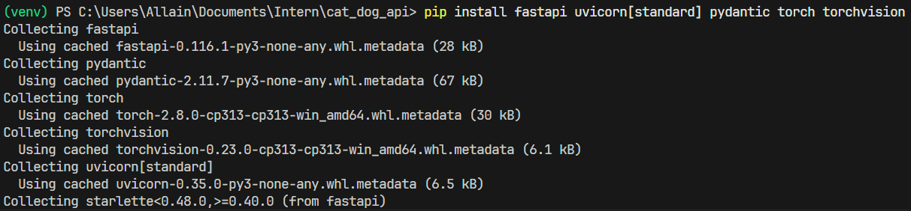
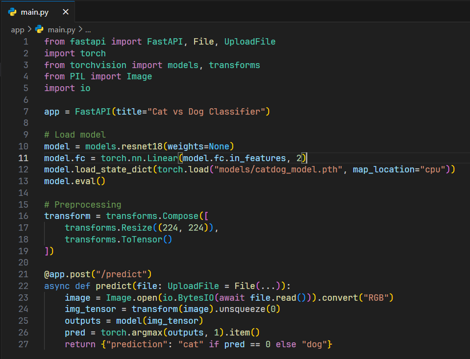
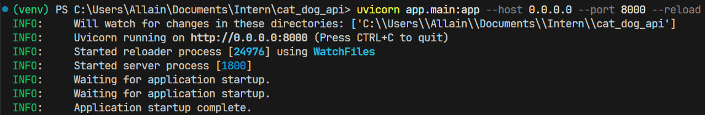
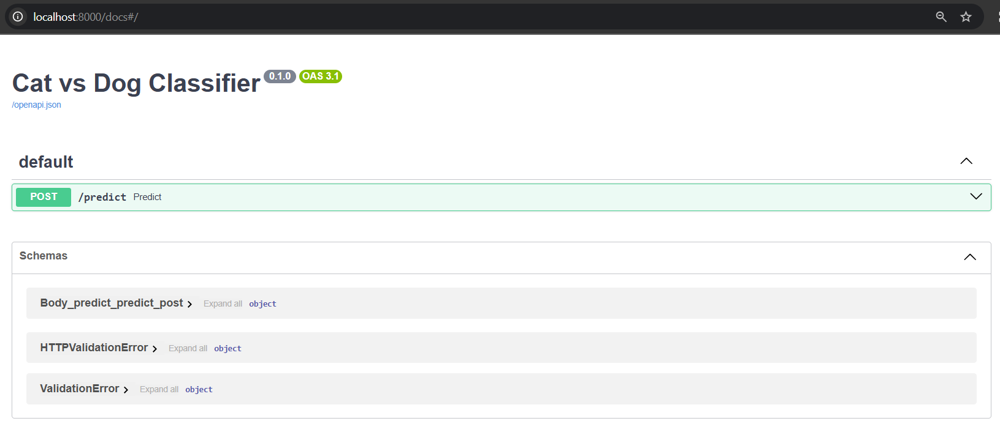
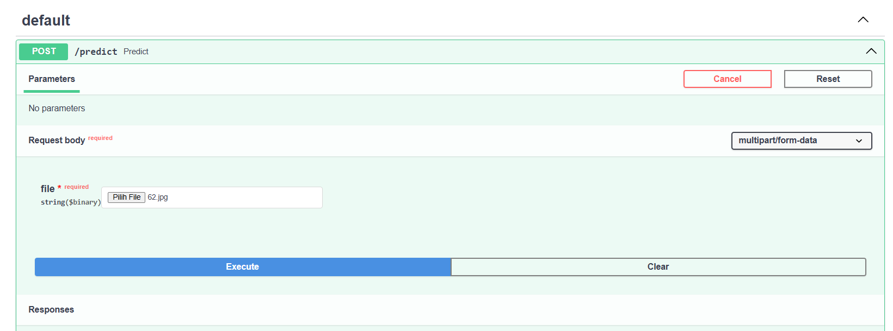
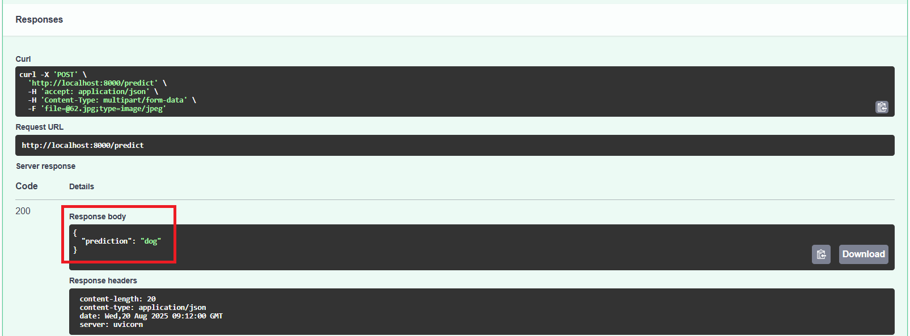
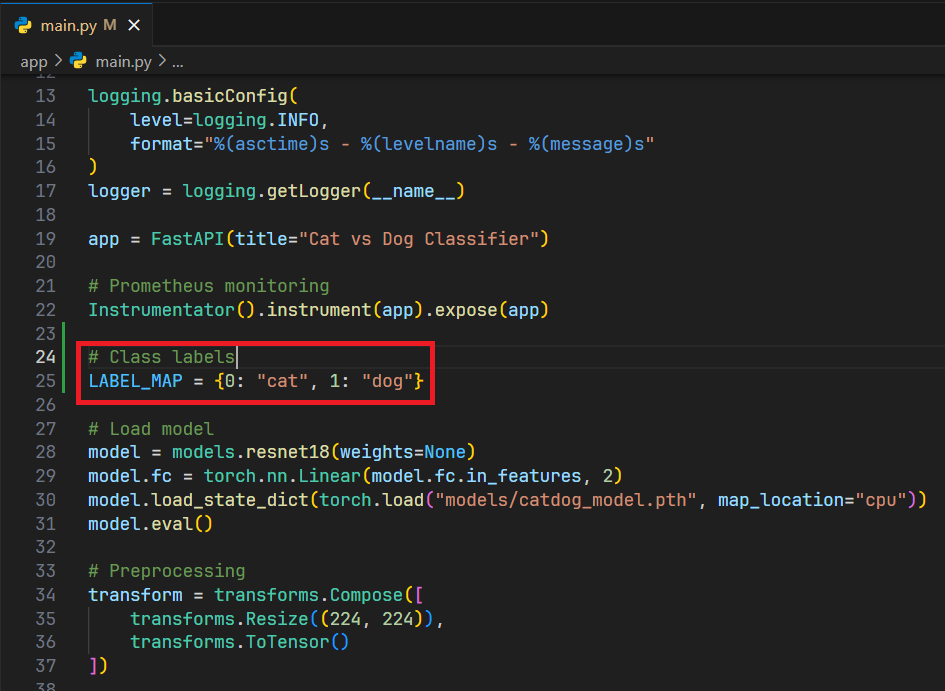
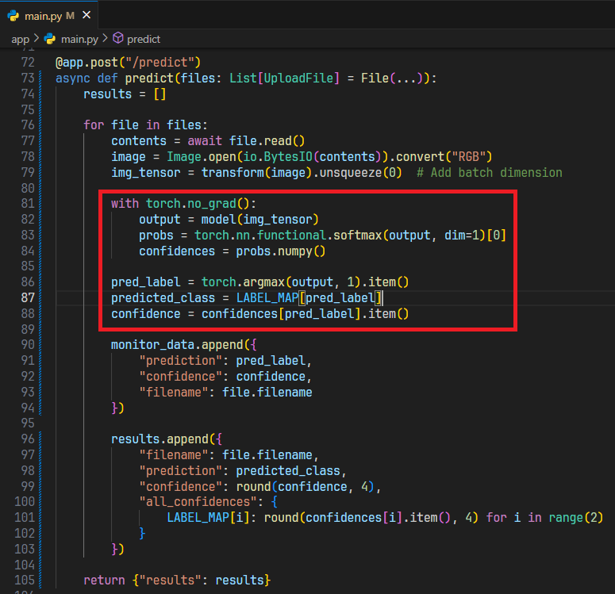
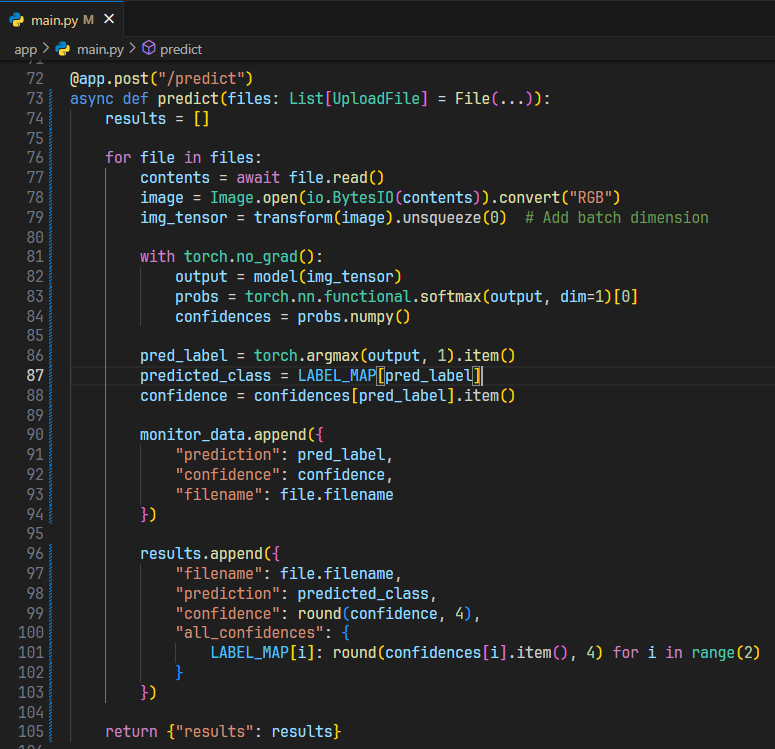
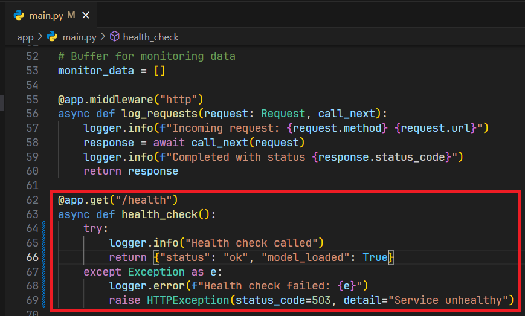

# 1. Model Deployment with FastAPI

## 🎯 Learning Objectives
- Learn how to deploy ML models using FastAPI.  
- Build REST API endpoints for predictions.  
- Test the deployment locally before containerizing.  

---

## 📘 Why FastAPI for ML?

- **Lightweight & Fast**: Async support, high performance.  
- **Easy Documentation**: Auto-generates Swagger/OpenAPI docs.  
- **Pythonic**: Works seamlessly with ML frameworks (PyTorch, TensorFlow, scikit-learn).  

---

## 🛠 Step 1: Install Dependencies

```bash
pip install fastapi uvicorn[standard] pydantic torch torchvision
```



---

## 🛠 Step 2: Create API App

`app/main.py`

```python
from fastapi import FastAPI, File, UploadFile
import torch
from torchvision import models, transforms
from PIL import Image
import io

app = FastAPI(title="Cat vs Dog Classifier")

# Load model
model = models.resnet18(weights=None)
model.fc = torch.nn.Linear(model.fc.in_features, 2)
model.load_state_dict(torch.load("models/catdog_model.pth", map_location="cpu"))
model.eval()

# Preprocessing
transform = transforms.Compose([
    transforms.Resize((224, 224)),
    transforms.ToTensor()
])

@app.post("/predict")
async def predict(file: UploadFile = File(...)):
    image = Image.open(io.BytesIO(await file.read())).convert("RGB")
    img_tensor = transform(image).unsqueeze(0)
    outputs = model(img_tensor)
    pred = torch.argmax(outputs, 1).item()
    return {"prediction": "cat" if pred == 0 else "dog"}
```



---

## 🛠 Step 3: Run the API

```bash
uvicorn app.main:app --host 0.0.0.0 --port 8000 --reload
```



Test in browser: 👉 http://localhost:8000/docs 



---

## 🛠 Step 4: Test with `curl`

```bash
curl -X POST "http://localhost:8000/predict"      -H "Content-Type: application/json"      -d '{"file": "<base64_encoded_image>"}'
```

Or use Swagger UI for interactive testing.

Test in Swagger UI with input dog image.





---

## 🛠 Step 5: Improving the API

- Add **labels** mapping (`0 → cat`, `1 → dog`).



- Add **confidence scores** with `softmax`.



- Handle **batch predictions** (multiple images).



- Add **health check endpoint** (`/health`).



---

## ✅ Summary
- FastAPI provides a clean way to deploy ML models as REST APIs.  
- You created a `/predict` endpoint for Cat vs Dog classification.  
- Next, you will **Dockerize the API** and run it in Docker Compose.  
