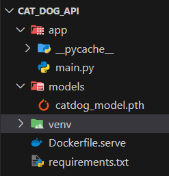
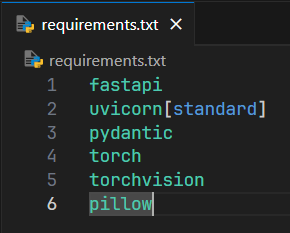
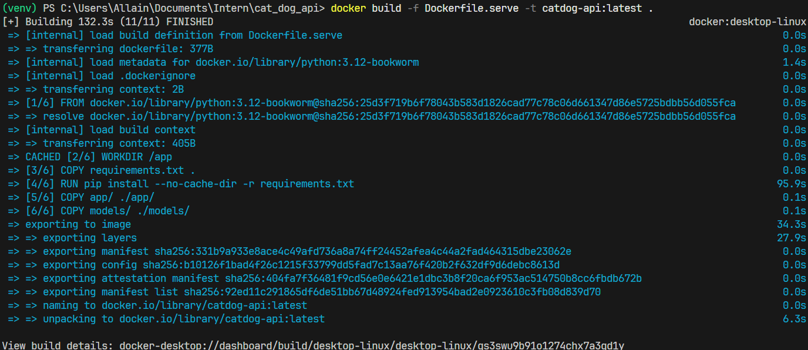
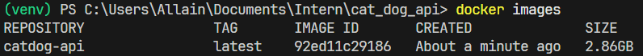
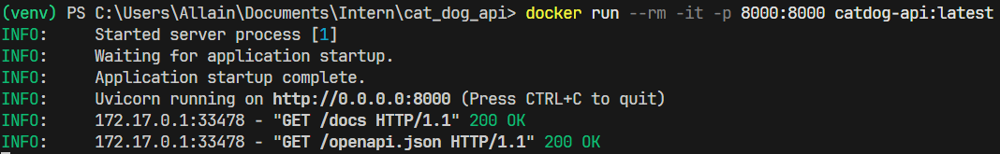
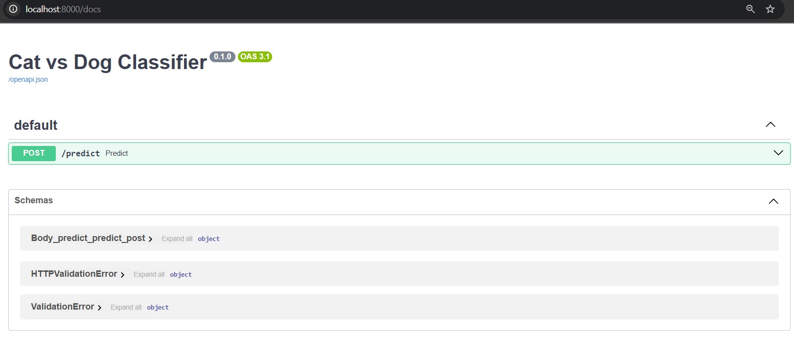
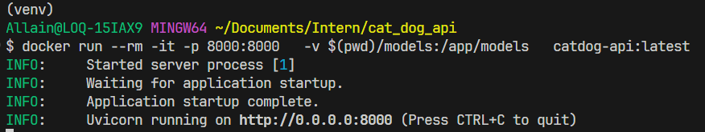
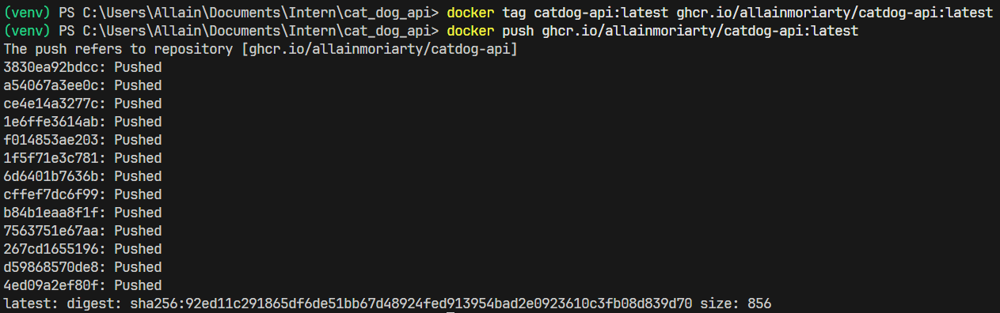

# 2. Dockerizing Model Service

## 🎯 Learning Objectives
- Learn how to package the FastAPI ML model service into a Docker container.  
- Understand how to build and run the container locally.  
- Prepare the image for deployment with Docker Compose.  

---

## 📘 Why Dockerize the Model?

- Guarantees **consistent environment** across machines.  
- Simplifies **deployment** (server, cloud, or on-prem).  
- Enables integration with **Docker Compose** for multi-service orchestration.  

---

## 🛠 Step 1: Project Structure

```
.
├── app/
│   └── main.py
├── models/
│   └── catdog_model.pth
├── requirements.txt
├── Dockerfile.serve
```


`requirements.txt`:
```
fastapi
uvicorn[standard]
pydantic
torch
torchvision
Pillow
```


---

## 🛠 Step 2: Dockerfile for Serving

`Dockerfile.serve`:

```dockerfile
FROM python:3.12-bookworm

# Install dependencies
WORKDIR /app
COPY requirements.txt .
RUN pip install --no-cache-dir -r requirements.txt

# Copy code and model
COPY app/ ./app/
COPY models/ ./models/

# Expose port
EXPOSE 8000

# Run FastAPI app
CMD ["uvicorn", "app.main:app", "--host", "0.0.0.0", "--port", "8000"]
```

---

## 🛠 Step 3: Build the Image

```bash
docker build -f Dockerfile.serve -t catdog-api:latest .
```


Check images:
```bash
docker images
```


---

## 🛠 Step 4: Run the Container

```bash
docker run --rm -it -p 8000:8000 catdog-api:latest
```

Now test the API at 👉 http://localhost:8000/docs  



---

## 🛠 Step 5: Mount Models (Optional)

If you want to update models without rebuilding the image, mount a volume:

```bash
docker run --rm -it -p 8000:8000   -v $(pwd)/models:/app/models   catdog-api:latest
```


---

## 🧩 Step 6: Push to Registry (Optional)

```bash
docker tag catdog-api:latest ghcr.io/<username>/catdog-api:latest
docker push ghcr.io/<username>/catdog-api:latest
```


---

## ✅ Summary
- You created a `Dockerfile.serve` to containerize the FastAPI model API.  
- Built and ran the container locally.  
- Prepared it for deployment via **Docker Compose**.  