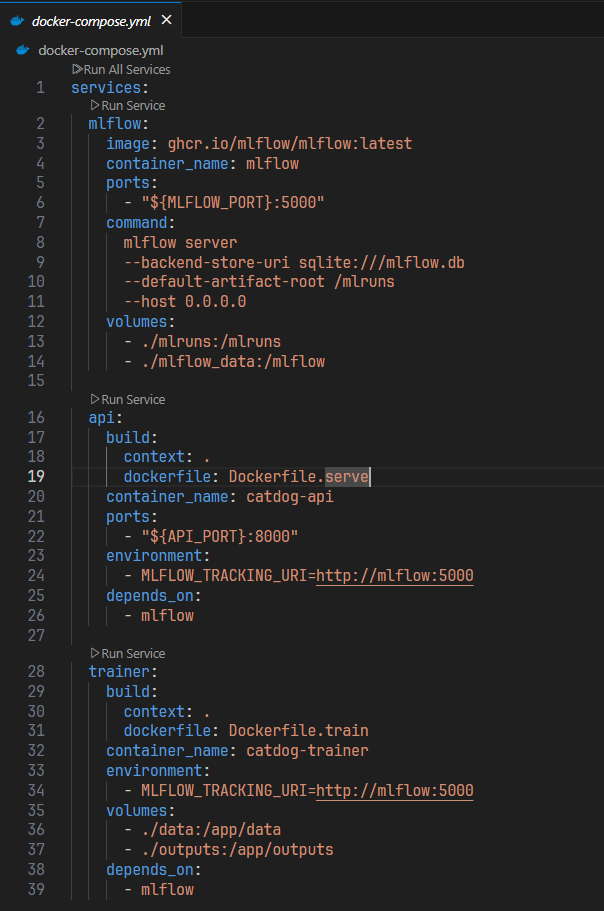

# 3. Docker Compose for ML Services

## 🎯 Learning Objectives
- Learn how to orchestrate multiple ML services with Docker Compose.  
- Run MLflow, API, and training containers together.  
- Use `.env` for configuration management.  

---

## 📘 Why Docker Compose for ML?

- Runs **multiple containers** (training, serving, MLflow) as one system.  
- Simplifies local development and testing.  
- Mirrors production setup in a lightweight way.  

---

## 🛠 Step 1: Example `.env` File

Create `.env` in the project root:

```env
MLFLOW_PORT=5000
API_PORT=8000
```


---

## 🛠 Step 2: `docker-compose.yml`

```yaml
version: "3.9"

services:
  mlflow:
    image: ghcr.io/mlflow/mlflow:latest
    container_name: mlflow
    ports:
      - "${MLFLOW_PORT}:5000"
    command: 
      mlflow server
      --backend-store-uri sqlite:///mlflow.db
      --default-artifact-root /mlruns
      --host 0.0.0.0
    volumes:
      - ./mlruns:/mlruns
      - ./mlflow.db:/mlflow.db

  api:
    build:
      context: .
      dockerfile: Dockerfile.serve
    container_name: catdog-api
    ports:
      - "${API_PORT}:8000"
    environment:
      - MLFLOW_TRACKING_URI=http://mlflow:5000
    depends_on:
      - mlflow

  trainer:
    build:
      context: .
      dockerfile: Dockerfile.train
    container_name: catdog-trainer
    environment:
      - MLFLOW_TRACKING_URI=http://mlflow:5000
    volumes:
      - ./data:/app/data
      - ./outputs:/app/outputs
    depends_on:
      - mlflow
```



---

## 🛠 Step 3: Run Services

Start services:
```bash
docker compose up -d --build
```


Check logs:
```bash
docker compose logs -f
```


Stop services:
```bash
docker compose down
```


---

## 🛠 Step 4: Access Services

- MLflow UI → http://localhost:${MLFLOW_PORT}


- FastAPI docs → http://localhost:${API_PORT}/docs  


---

## 🛠 Step 5: Override for Production

Add `docker-compose.override.yml` for production settings (e.g., restart policies, secrets).

```yaml
services:
  api:
    restart: always
    environment:
      - LOG_LEVEL=info
```


Run with override:
```bash
docker compose -f docker-compose.yml -f docker-compose.override.yml up -d
```


---

## ✅ Summary
- Docker Compose orchestrates **MLflow + Training + Serving API**.  
- `.env` keeps configuration flexible.  
- Override files allow dev/prod differences.  
