# 4. Monitoring and Logging

## 🎯 Learning Objectives
- Learn why monitoring is essential for deployed ML models.  
- Implement structured logging in FastAPI.  
- Use Prometheus + Grafana for monitoring ML services.  

---

## 📘 Why Monitor ML Models?

- **Data Drift**: Input data may change over time → predictions degrade.  
- **Model Decay**: Performance decreases as environment changes.  
- **Service Health**: Track API uptime, latency, errors.  

Monitoring ensures **reliability** and **trust** in ML systems.  

---

## 🛠 Step 1: Structured Logging in FastAPI

Add logging to `app/main.py`:

```python
import logging
from fastapi import FastAPI

logging.basicConfig(
    level=logging.INFO,
    format="%(asctime)s [%(levelname)s] %(message)s"
)
logger = logging.getLogger(__name__)

app = FastAPI()

@app.get("/health")
def health_check():
    logger.info("Health check called")
    return {"status": "ok"}
```

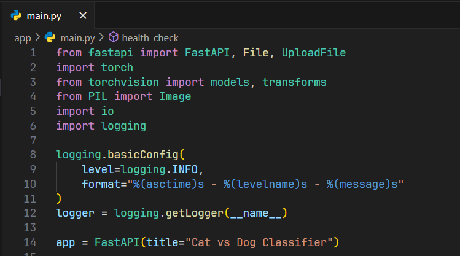

Logs will include timestamps, log levels, and messages.  

---

## 🛠 Step 2: Request Logging Middleware

```python
from fastapi import Request

@app.middleware("http")
async def log_requests(request: Request, call_next):
    logger.info(f"Incoming request: {request.method} {request.url}")
    response = await call_next(request)
    logger.info(f"Completed with status {response.status_code}")
    return response
```

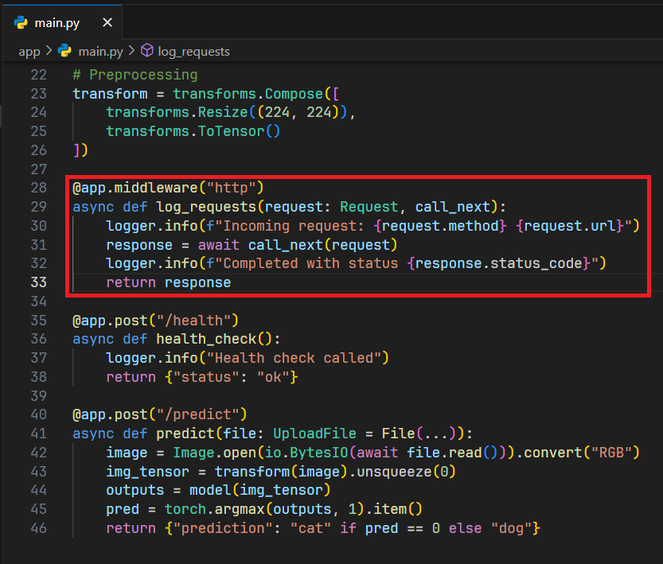

---

## 🛠 Step 3: Expose Metrics with Prometheus

Install:
```bash
pip install prometheus-fastapi-instrumentator
```
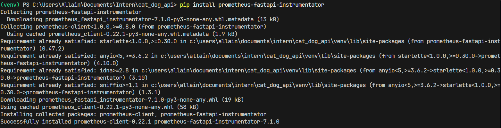

Add to FastAPI app:

```python
from prometheus_fastapi_instrumentator import Instrumentator

Instrumentator().instrument(app).expose(app)
```

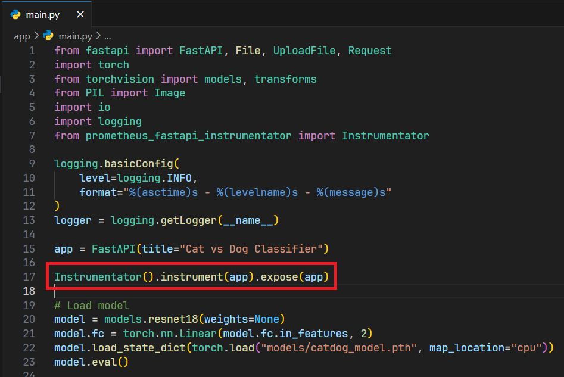

Now metrics available at 👉 `/metrics` (Prometheus format).  

---

## 🛠 Step 4: Docker Compose with Prometheus + Grafana

Add services to `docker-compose.yml`:

```yaml
  prometheus:
    image: prom/prometheus
    container_name: prometheus
    ports:
      - "9090:9090"
    volumes:
      - ./prometheus.yml:/etc/prometheus/prometheus.yml

  grafana:
    image: grafana/grafana
    container_name: grafana
    ports:
      - "3000:3000"
```

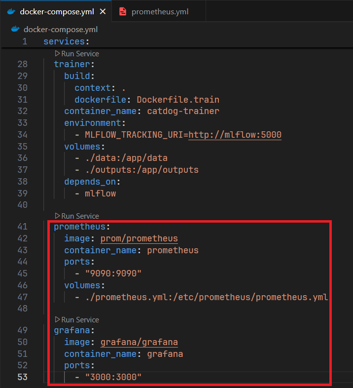

`prometheus.yml` config:
```yaml
scrape_configs:
  - job_name: "fastapi"
    static_configs:
      - targets: ["api:8000"]
```

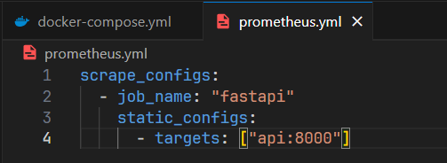

---

## 🛠 Step 5: Visualize in Grafana

- Open 👉 http://localhost:3000

  Login with username and password admin:

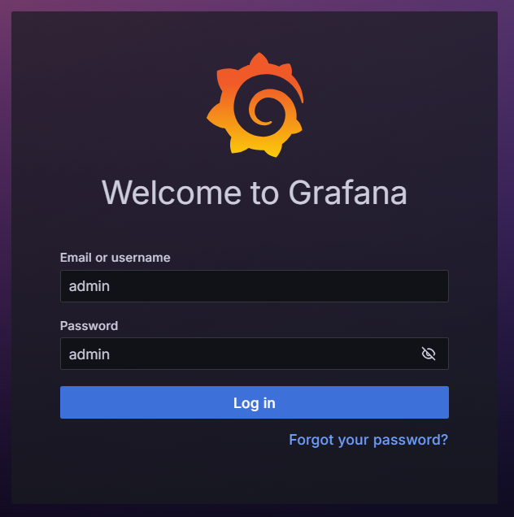

- Add Prometheus as data source (`http://prometheus:9090`).

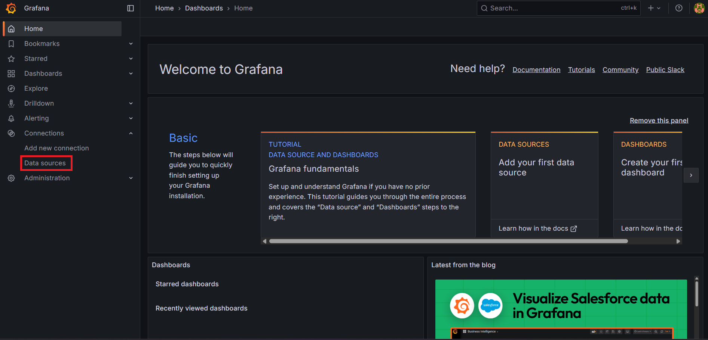

  Add data source, then add Prometheus:

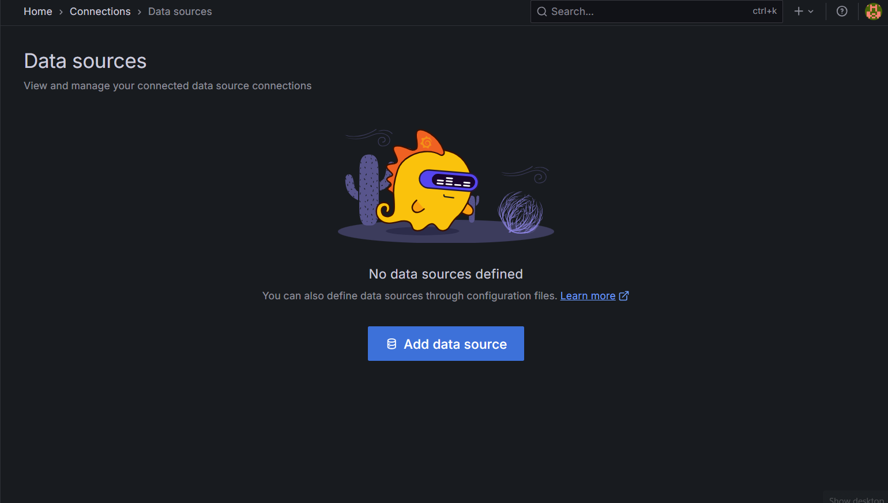

  Add (`http://prometheus:9090`) as connection, then scroll to bottom and save it:

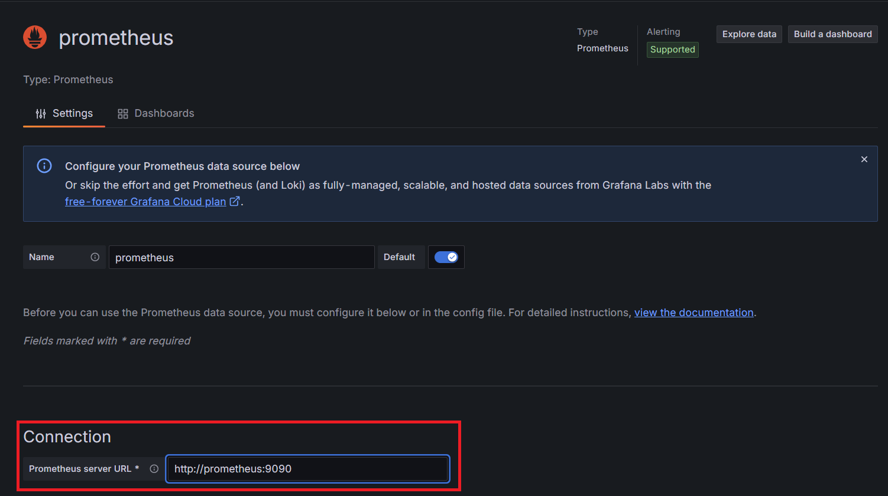

- Import dashboard for FastAPI metrics.

  Select dashboard in sidebar:

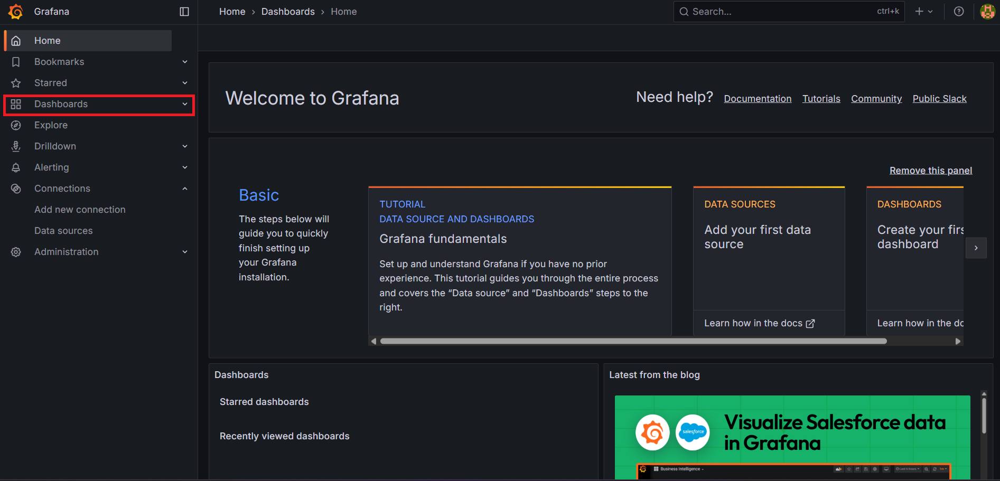

  Click import dashboard:
  
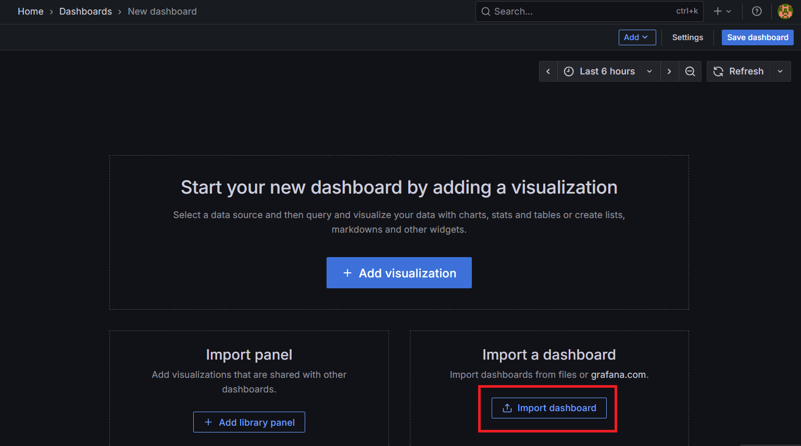

  Load dashboard id 22676:

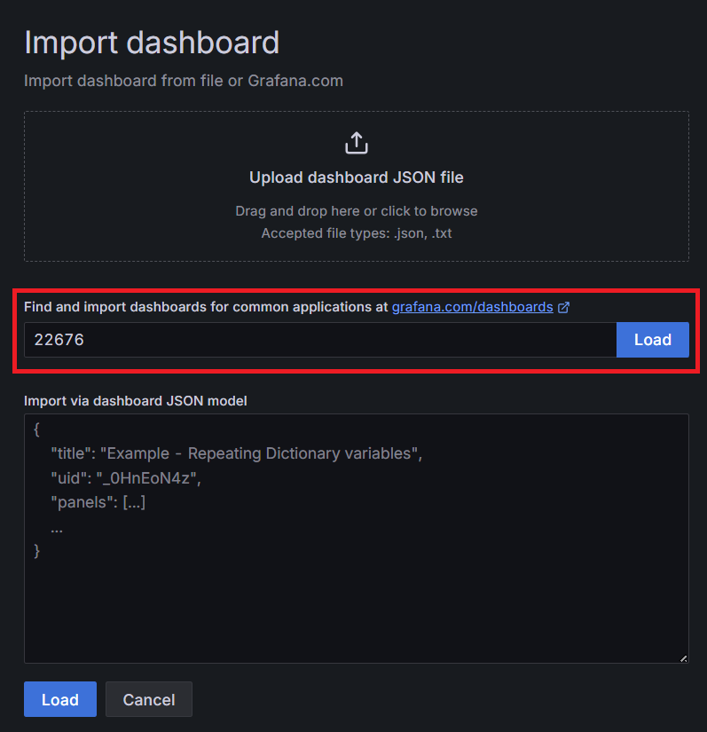

  Import the dashboard:

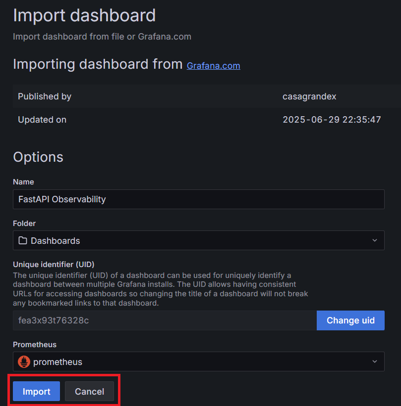

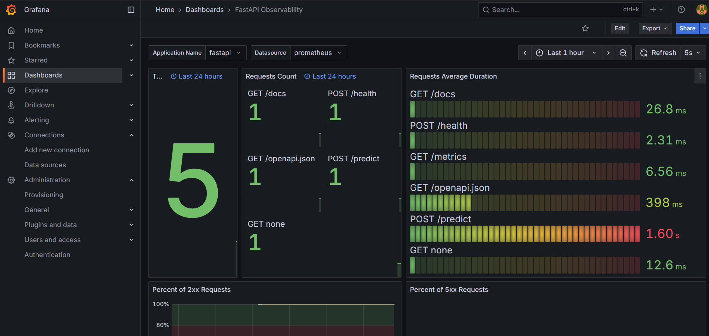

---

## ✅ Summary
- Logging ensures visibility into API calls and system behavior.  
- Prometheus scrapes metrics from FastAPI `/metrics`.  
- Grafana visualizes latency, error rates, and custom ML metrics.  
- Monitoring keeps ML services reliable in production.  